# Compute Resource (이미지 및 내용 수정 중)

LLM 컴퓨트 리소스 관련 잡상식을 얻어가는 자료입니다.

**▶ [발표용 슬라이드로 보기](https://hojin12312.github.io/compute-resource/slides/)** — 같은 내용을 101장의 덱으로 구성했습니다.
· **[사용법](./slides/README.md)** (넘기기 · 레이저 포인터 · 마우스 필기 · 라이트 테마 · 발표자 노트)

**▶ [읽기용 문서로 보기](https://hojin12312.github.io/compute-resource/document/)** — 같은 글을 이어서 읽는 판입니다. 왼쪽에 목차가 늘 붙어 있고, **그림은 이미지가 아니라 그 자리에서 렌더한 것**이라 **클릭하면 전체화면**으로 커져도 글자가 선명합니다(다시 클릭 또는 `Esc`로 닫힘). 라이트/다크는 오른쪽 위 버튼이나 `T`로 바꾸며, 그림도 함께 바뀝니다.

*마지막 업데이트: 2026-08-04 21:23 (KST)*

## 목차

- [1. Kimi K3는 어떻게 미국 증시를 흔들었나?](#1-kimi-k3는-어떻게-미국-증시를-흔들었나)
  - [1.1 미국과 중국, 인프라는 8배 차이입니다](#11-미국과-중국-인프라는-8배-차이입니다)
  - [1.2 그런데 모델의 격차는 3.6점입니다](#12-그런데-모델의-격차는-36점입니다)
- [2. 추론 시장으로의 전환](#2-추론-시장으로의-전환)
- [3. LLM을 담기 위해서는 얼마만큼의 메모리가 필요할까요?](#3-llm을-담기-위해서는-얼마만큼의-메모리가-필요할까요)
- [4. LLM에게 일을 시키려면 얼마만큼의 메모리가 필요할까요?](#4-llm에게-일을-시키려면-얼마만큼의-메모리가-필요할까요)
- [5. LLM 모델의 연산: 프리필과 디코딩](#5-llm-모델의-연산-프리필과-디코딩)
  - [5.1 프리필](#51-프리필)
  - [5.2 디코딩](#52-디코딩)
  - [5.3 KV 캐시 히트](#53-kv-캐시-히트)
    - [히트한 KV는 어디에 보관되나](#히트한-kv는-어디에-보관되나)
  - [5.4 투기적 디코딩: 순차 병목을 우회하는 법](#54-투기적-디코딩-순차-병목을-우회하는-법)
- [6. 아키텍처 살펴보기](#6-아키텍처-살펴보기)
  - [6.1을 빼면 전부 어텐션 이야기입니다](#61을-빼면-전부-어텐션-이야기입니다)
  - [6.1 DeepSeek R1 - Mixture of Experts (MoE) + Chain of Thought (CoT)](#61-deepseek-r1---mixture-of-experts-moe--chain-of-thought-cot)
    - [R1의 어텐션은 MLA입니다 — 여기서 어휘를 잡아 둡니다](#r1의-어텐션은-mla입니다--여기서-어휘를-잡아-둡니다)
    - [MoE가 깎는 것은 대역폭 하나입니다](#moe가-깎는-것은-대역폭-하나입니다)
  - [6.2 Gemma 4 - Sliding Window Attention (SWA)](#62-gemma-4---sliding-window-attention-swa)
  - [6.3 Qwen3-Next-80B-A3B - Gated DeltaNet](#63-qwen3-next-80b-a3b---gated-deltanet)
  - [6.4 DeepSeek V4 - Hybrid Attention (CSA + HCA)](#64-deepseek-v4---hybrid-attention-csa--hca)
  - [6.5 GLM-5.2 - IndexShare와 비동기 강화학습](#65-glm-52---indexshare와-비동기-강화학습)
    - [비동기 강화학습 — 학습 클러스터 절반이 추론 서버입니다](#비동기-강화학습--학습-클러스터-절반이-추론-서버입니다)
  - [6.6 Kimi K3 - Kimi Delta Attention (KDA)](#66-kimi-k3---kimi-delta-attention-kda)
- [7. Quantization](#7-quantization)
  - [7.1 Model 양자화](#71-model-양자화)
    - [실전에서 만나는 이름들: GGUF의 세 계열](#실전에서-만나는-이름들-gguf의-세-계열)
  - [7.2 KV 캐시 양자화](#72-kv-캐시-양자화)
    - [3대 엔진의 가중치 및 KV캐시 양자화 지원 현황](#3대-엔진의-가중치-및-kv캐시-양자화-지원-현황)
  - [7.3 그래서 양자화하면 뭐가 좋나요?](#73-그래서-양자화하면-뭐가-좋나요)
- [8. 여러 장에 나눠 돌리기: 병렬화 4대 기법](#8-여러-장에-나눠-돌리기-병렬화-4대-기법)
  - [8.1 나누는 4가지 방식](#81-나누는-4가지-방식)
  - [8.2 담기는데도 나눕니다](#82-담기는데도-나눕니다)
  - [8.3 MoE는 전문가로 나눕니다](#83-moe는-전문가로-나눕니다)
  - [8.4 프리필과 디코딩을 다른 GPU로](#84-프리필과-디코딩을-다른-gpu로)
  - [8.5 청구서가 셋이 됩니다](#85-청구서가-셋이-됩니다)
- [9. AI 소버린](#9-ai-소버린)
  - [9.1 국가 단위의 AI 소버린](#91-국가-단위의-ai-소버린)
  - [9.2 그럼 한국은 어디쯤 있나](#92-그럼-한국은-어디쯤-있나)
  - [9.3 개인이 소유한 AI](#93-개인이-소유한-ai)
- [10. 부록: NVIDIA 데이터센터 GPU 로드맵 & 플랫폼 비교](#10-부록-nvidia-데이터센터-gpu-로드맵--플랫폼-비교)
  - [10.1 세대별 & 랙 스케일 플랫폼 직접 비교 (V100 / A100 / H200 / Blackwell / Rubin)](#101-세대별--랙-스케일-플랫폼-직접-비교-v100--a100--h200--blackwell--rubin)
  - [10.2 Groq 3 LPU - 디코딩 병목을 하드웨어로 겨냥하다](#102-groq-3-lpu--디코딩-병목을-하드웨어로-겨냥하다)
- [11. 추론 엔진과 커널: 그 하드웨어에서 무엇으로 돌리나](#11-추론-엔진과-커널-그-하드웨어에서-무엇으로-돌리나)
  - [11.1 프레임워크와 추론 엔진은 다릅니다](#111-프레임워크와-추론-엔진은-다릅니다)
  - [11.2 실제 서빙 스택 구조 예시 (애플 실리콘 vs NVIDIA DGX Spark)](#112-실제-서빙-스택-구조-예시-애플-실리콘-vs-nvidia-dgx-spark)
  - [11.3 하드웨어와 모델을 잇는 커널](#113-하드웨어와-모델을-잇는-커널)
  - [11.4 그런데 맥은 메모리 계층이 둘뿐입니다](#114-그런데-맥은-메모리-계층이-둘뿐입니다)
  - [11.5 GGUF와 MLX, 같은 4비트인데 왜 다른가](#115-gguf와-mlx-같은-4비트인데-왜-다른가)
- [12. 참고 자료](#12-참고-자료)
- [13. 부록](#13-부록)

## 1. Kimi K3는 어떻게 미국 증시를 흔들었나?

> "거대 자본의 신화를 흔든 효율의 반격"

발표 직후 반도체 지수가 흔들렸고, 시장에서는 2025년 1월 DeepSeek-R1 때와 비슷한
질문이 다시 나왔습니다. **"프론티어급 모델에 지금 예상하는 만큼의 GPU 투자가
정말 계속 필요한가?"**

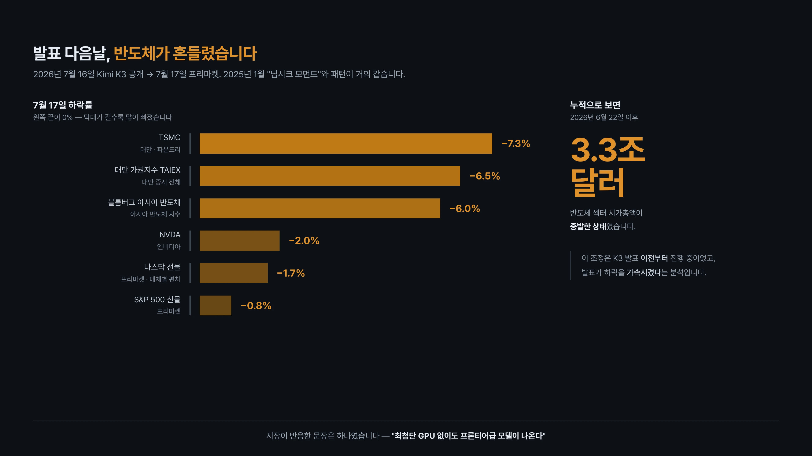

최신 Nvidia 가속기 접근이 제한된 중국에서 미국 프론티어에 가까운 모델이
나오자, 같은 성능에 필요한 GPU와 CAPEX가 예상보다 적을 수 있다는 우려가
커졌습니다[^tftc].

### 1.1 미국과 중국, 인프라는 8배 차이입니다

"구세대 GPU로 만들었다"는 서사가 왜 위협인지는 **양쪽이 쓴 돈**을 나란히 놓으면
분명해집니다. 미국 하이퍼스케일러 5곳과 중국 4곳의 연간 AI 설비투자 격차는
4년째 **7\~8배**에서 줄지 않았습니다[^gs-capex].

| 항목 | 미국 | 중국 |
|---|---|---|
| 2026년 AI 설비투자(추정) | **7,640억 달러** | **1,020억 달러** (7.5배 차이) |
| 2027년 전망 | 1조 180억 달러 | 1,230억 달러 (8.3배) |
| 최신 가속기 | Blackwell·Vera Rubin | 수출 규제로 **차단**[^cn-chips] |
| 주력 AI 칩 | Nvidia·AMD·자체 칩(Google TPU, AWS Trainium) | Huawei Ascend·Cambricon |
| 조달 현황 | 규제 없음 — 대신 **공급이 병목** | Nvidia 인도 **0** → 자국 생산 75만 개 계획 |

절대 금액의 차이는 줄기는커녕 **오히려 벌어지고** 있습니다.

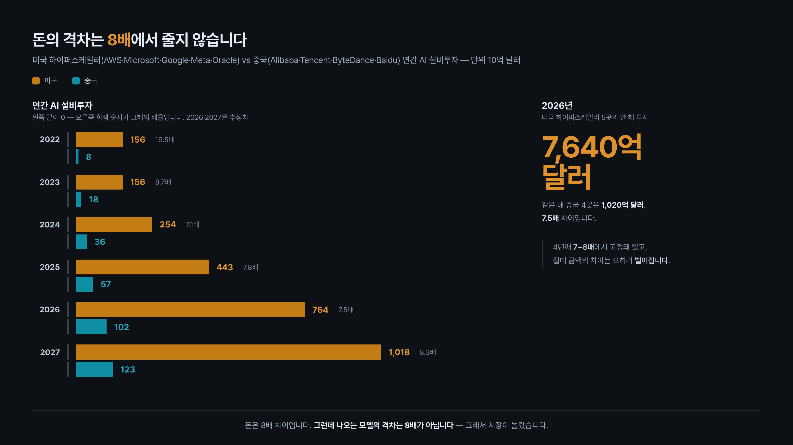

### 1.2 그런데 모델의 격차는 3.6점입니다

돈은 8배 차이인데, 나온 모델의 성능 차이는 그만큼이 아니었습니다. 여러
벤치마크를 묶어 하나의 값으로 내는 Artificial Analysis Intelligence
Index[^aa-index]로 보면 Kimi K3는 **15개 중 4위**, 1위와 **3.6점** 차이입니다[^aa-harness].

**투입은 8배 차이, 결과는 6% 차이.** 시장이 반응한 것은 이 비대칭입니다[^cn-tier].

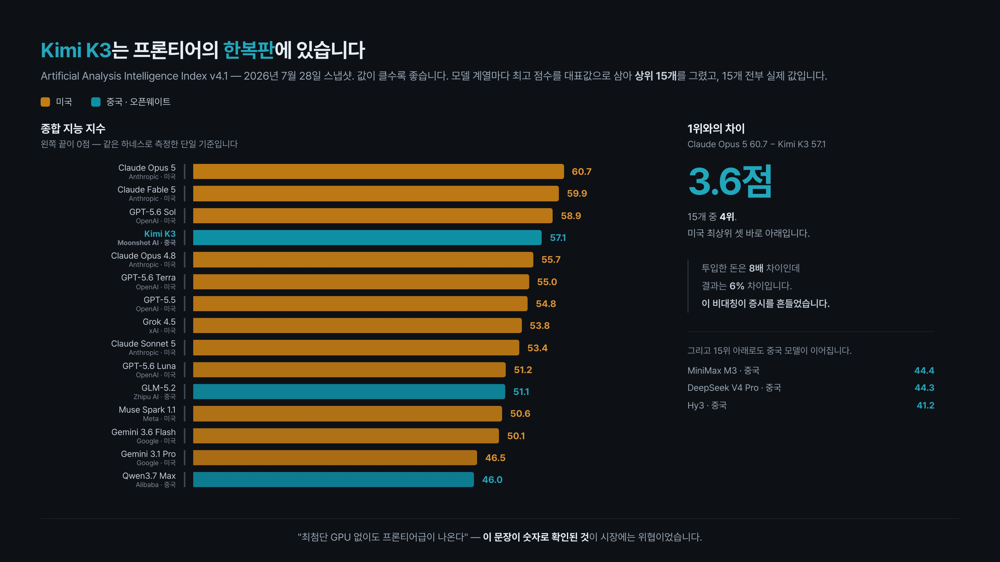

그렇다면 "구세대 GPU로 저렴하게 만들었다"는 말은 정확히 무슨 뜻이고, 왜 GPU에
이어 메모리 수요까지 폭증하고 있을까요? 추론 중심으로 바뀐 시장(2장)에서
출발해, 하드웨어의 제약이 모델 설계와 맞물리는 지점(3장부터)까지 차례로 봅니다.

## 2. 추론 시장으로의 전환

> "만드는 시대를 넘어, 매일 쏟아내는 시대로"

**AI 에이전트의 대중화**는 토큰 소비를 가파르게 끌어올렸습니다. 질문에 한 번
답하고 끝나는 챗봇과 달리, 에이전트는 여러 도구를 오가며 긴 맥락을 반복해서
읽고 씁니다.

숫자로도 보입니다. 모델 라우터 OpenRouter의 처리량은 **6개월 만에 주 5조
토큰에서 25조 토큰으로** 늘었습니다[^token-volume]. 늘어난 건 사용자 수만이
아닙니다. 같은 플랫폼의 100조 토큰 분석에서 요청 하나에 실리는 프롬프트는
1.5K에서 6K 토큰으로, 응답은 150에서 400 토큰으로 커졌고, 토큰을 가장 많이
먹는 용도는 **프로그래밍이 11%에서 50% 이상**으로 올라섰습니다[^token-mix].
수요를 끌고 있는 건 사람의 수가 아니라 **코딩 에이전트의 왕복 횟수**입니다.

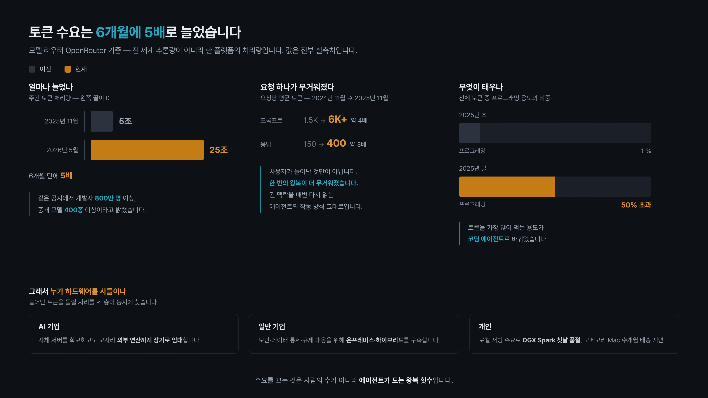

이 변화는 세 층에서 동시에 추론 인프라 수요를 키웁니다.

- **AI 기업**은 자체 서버를 확보하고도 모자라 외부 연산까지 장기로 빌립니다.
- **AI가 본업이 아닌 일반 기업**도 보안·데이터 통제·규제 대응을 위해
  온프레미스나 하이브리드 추론 환경을 구축합니다.
- **개인**도 로컬 서빙에 뛰어들면서 DGX Spark와 고메모리 Mac 같은 쓸 만한
  장비가 품절·공급 제약을 겪었습니다.

#### 자체 인프라만으로는 증가 속도를 따라잡지 못했습니다

자체 서버 확보가 기본이 된 뒤에도 외부 연산을 추가로 빌려야 할 만큼 수요가
빨랐습니다. 2026년 공개된 두 계약이 그 증거입니다[^colossus].

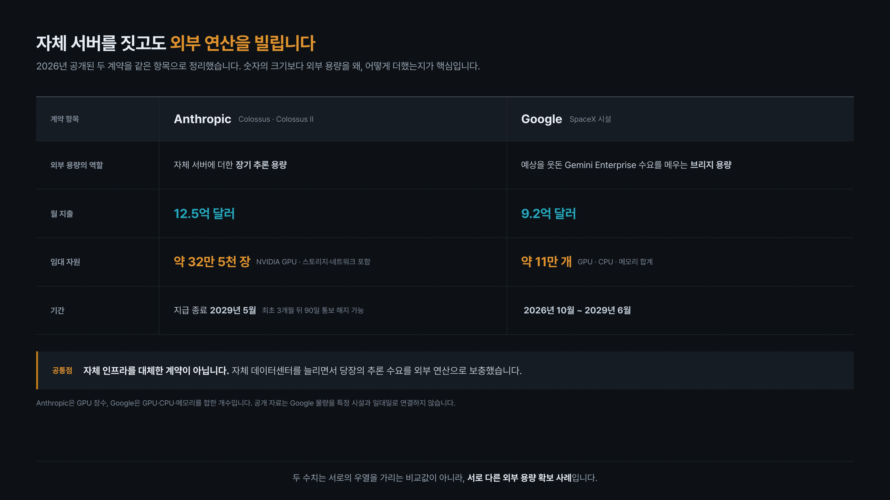

Google은 이 계약을 Gemini Enterprise의 예상을 웃돈 수요에 대응하는
**브리지 용량**이라고 설명했습니다. 자체 데이터센터를 계속 늘리면서도, 당장의
토큰 수요는 외부 연산으로 함께 막은 것입니다.

#### 그 수요는 여러분의 노트북 가격표에 도착했습니다

수요는 큰 모델과 긴 맥락을 담을 **큰 메모리**, 토큰을 빠르게 뽑을 **높은
대역폭**을 갖춘 GPU로 모입니다[^agent-inference-demand]. 그러자 일반 DRAM
계약가가 2026년 1분기에만 **분기 대비 약 93\~98%** 뛰었고[^dram-price], 그 원가는
소비자 가격표에 그대로 옮겨 붙었습니다. NVIDIA는 DGX Spark를 $3,999에서
$4,699로, Apple은 MacBook과 iPad를 최대 $300 올리며, 둘 다 인상 사유로
**AI 데이터센터발 메모리 공급 부족**을 명시했습니다[^memory-shortage].

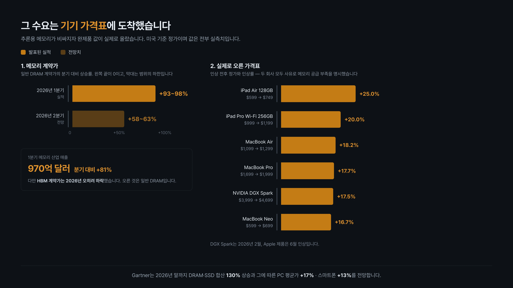

> **이제 경쟁의 중심은 모델을 만드는 것뿐 아니라, 만들어진 모델을 얼마나 많이
> 돌릴 수 있느냐로 옮겨가고 있습니다.**

## 3. LLM을 담기 위해서는 얼마만큼의 메모리가 필요할까요?

> "덩치만큼 정확히 매겨지는 자릿세"

8비트는 1바이트입니다. 그래서 **파라미터 하나 = 1바이트**가 되고, 계산이
이보다 쉬울 수 없습니다. **파라미터 수를 그대로 GB로 읽으면 그게 곧 그 모델을
메모리에 올리는 비용**입니다[^quant-size].

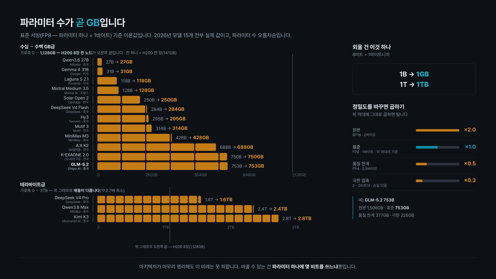[^model-table]

바꿀 수 있는 건 **파라미터 하나에 몇 비트를 쓰느냐**뿐이고, 그마저도 위 막대에
배수를 곱하는 것으로 끝납니다. 극한까지 밀어붙이면 1B당 0.3GB까지 내려가지만
압축이 세질수록 품질 손실이 커지고, 작은 모델일수록 양자화에 약하며 큰
모델일수록 강합니다[^extreme-quant].

원본은 보통 16비트(BF16)로 배포되고, 어느 정밀도를 **네이티브로 가속**하느냐는
가속기 세대가 정합니다 — 암페어(A) FP16, 호퍼(H) FP8, 블랙웰(B)
FP4(NVFP4)[^native-precision]. 그래서 GLM-5.2를 FP8로 올리려면 753GB가 필요하고,
141GB짜리 H200 8장이면 1,128GB이니 서빙이 됩니다[^memory-calc].

**그런데 이건 "이론적 최솟값"입니다.** 올려놓기만 하고 아직 아무 일도 시키지
않은 상태의 값이니까요. 그 8장에 실제로 올려 보면 **1,128GB의 3분의 2가 가중치로
차고**, 남는 자리에서 활성값과 CUDA 그래프 몫을 뺀 **약 311GB가 KV캐시의
자리**입니다.

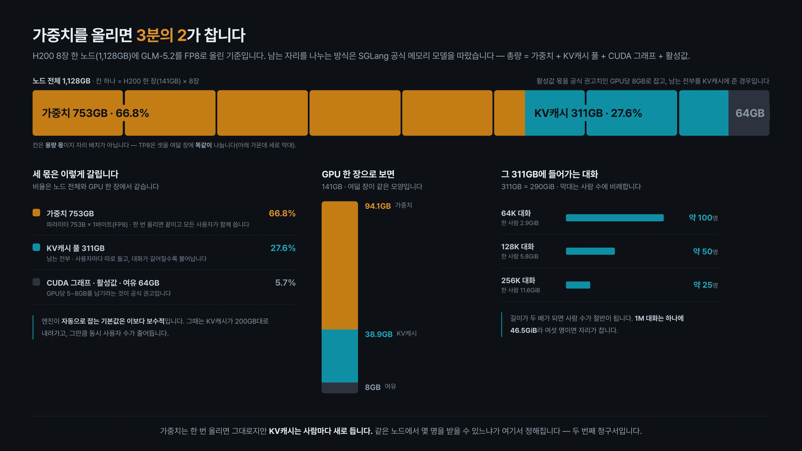[^node-budget]

그 311GB에 128K 대화는 **쉰 명 남짓** 들어갑니다. 가중치는 한 번 올리면 모두가
함께 쓰지만 KV캐시는 **사람마다 새로** 들기 때문입니다. 여기에 붙는 오버헤드 중
압도적인 것이 다음 장의 KV캐시입니다.

## 4. LLM에게 일을 시키려면 얼마만큼의 메모리가 필요할까요?

> "손님마다 따로 내고, 이내 자릿세를 넘어서는 값"

LLM은 다음 토큰을 뽑을 때마다 지금까지의 모든 토큰과의 관계를 따집니다. 그래서
이전 토큰을 처리한 결과값을 계속 펼쳐두는데, 이것이 **KV캐시**입니다. 3장의
가중치가 한 번 사두면 끝나는 값이라면, 이쪽은 **일을 시키는 동안 계속 불어나는**
값입니다[^kv-formula].

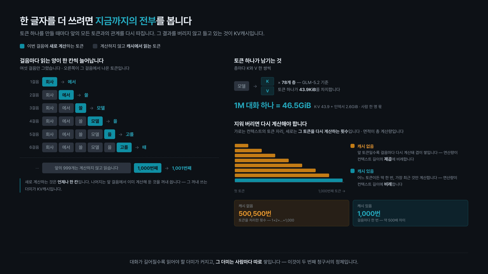[^readall]

**새로 계산하는 것은 언제나 한 칸이고, 나머지는 앞 걸음에서 계산해 둔 것을 꺼내
씁니다.** 그 꺼내 쓰는 더미가 KV캐시이고, 크기는 네 가지가 곱해진 값입니다.

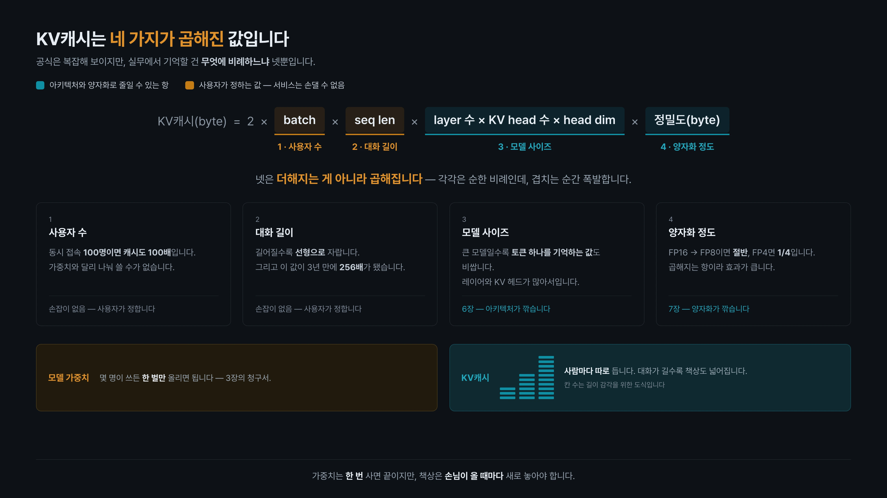

넷이 **더해지는 게 아니라 곱해진다**는 점이 핵심입니다. 각각은 순한 비례인데
겹치는 순간 폭발합니다. 게다가 모델 가중치는 몇 명이 쓰든 한 벌이면 되지만,
**KV캐시는 사용자마다 따로 듭니다**[^kv-cache-per-user].

숫자를 넣어 보면 감이 옵니다. 구형 덴스 모델은 KV캐시를 줄이는 장치가 없어
공식이 그대로 드러납니다[^kv-calc].

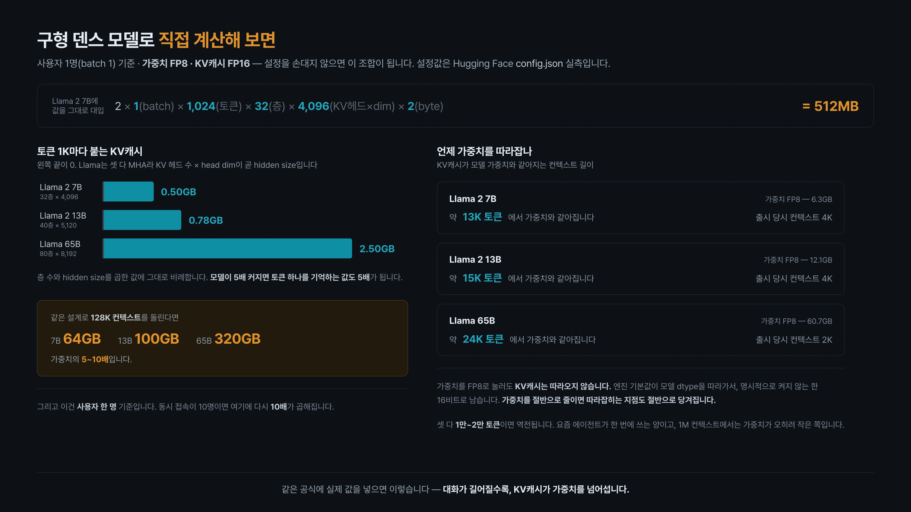

**1만\~2만 토큰이면 KV캐시가 가중치를 따라잡습니다.** 요즘 에이전트가 한 번에
쓰는 양이고, 여기에 동시 사용자 수가 다시 곱해집니다[^kv-default].

#### 그런데 대화 길이가 3년 만에 256배가 됐습니다

손댈 수 없다는 그 값이 가만히 있어 주지도 않았습니다[^ctx-growth].

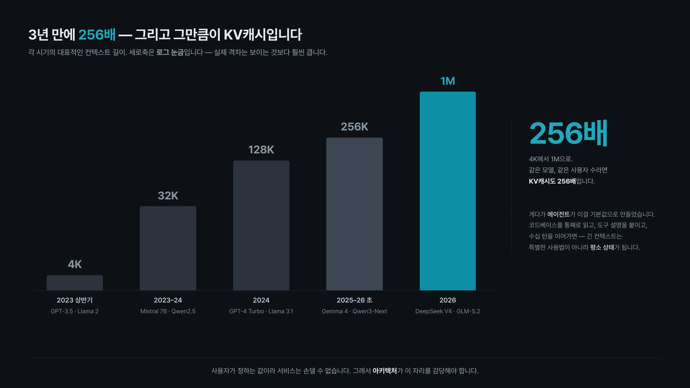

모델을 하나도 바꾸지 않아도 KV캐시가 256배가 된다는 뜻입니다. 1M은 여유분이
아니라 이미 쓰이고 있는 값입니다 — 에이전트가 긴 컨텍스트를 특수한 사용법이
아니라 **평소 상태**로 만들었으니까요.

즉 "총 파라미터가 작다"는 것과 "KV캐시가 작다"는 것은 별개의 독립된 변수이며,
최근 아키텍처 경쟁은 사실 이 KV캐시 영역에서 벌어지고 있습니다[^kv-cache-opt].

## 5. LLM 모델의 연산: 프리필과 디코딩

> "한꺼번에 삼키는 입력, 한 땀 한 땀 뱉어내는 출력"

LLM의 연산은 두 단계입니다. 입력을 처리하는 **프리필**, 출력을 만드는
**디코딩**. 근본적으로 같은 연산이지만 입력은 병렬로 처리할 수 있어 빠르고,
출력은 순차로만 진행되어 느립니다.

차이는 **GPU가 얼마나 일할 수 있느냐**에서 옵니다. H200은 메모리에서 바이트
하나를 읽는 동안 **412번 계산할 수 있습니다.** 프리필은 1,024토큰을 한꺼번에
넣어 그 412를 다섯 배 넘기지만, 디코딩은 토큰 하나라 **2번**밖에 쓰지
못합니다 — 연산 능력의 **0.5%**입니다[^roofline].

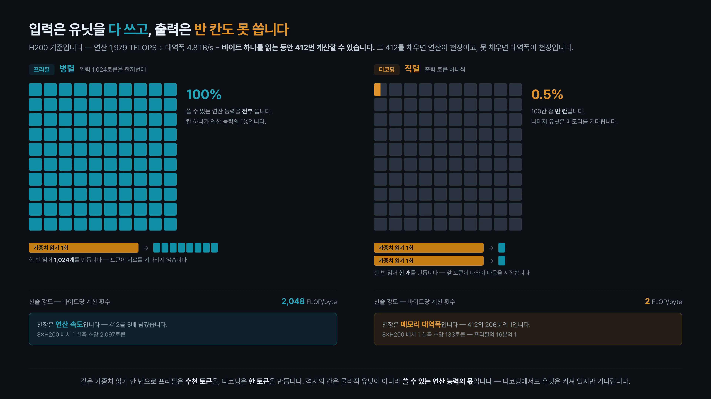

얼마나 차이 나는지는 실측이 있습니다. H200 8장 한 노드에 GLM-5 계열을 올리고
사용자 한 명이 쓸 때, 프리필은 초당 2,097토큰을 삼키고 디코딩은 초당
133토큰을 뱉습니다 — **16배**이고, 요청을 처리한 시간의 **92%가
디코딩**입니다[^h200-bench].

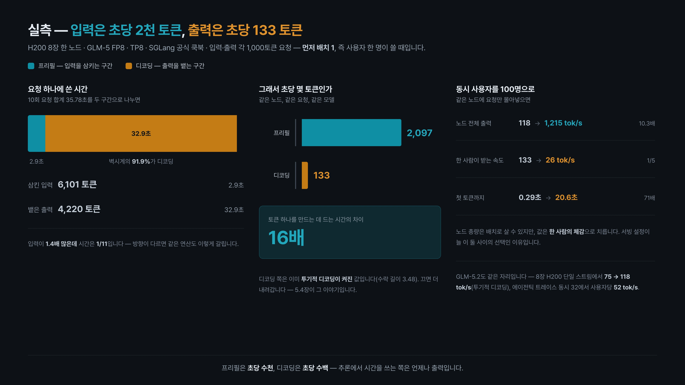

동시 사용자를 100명으로 올리면 노드 전체 출력은 10배로 늘지만, 한 사람이 받는
속도는 1/5로 떨어지고 첫 토큰은 0.29초에서 20.6초로 밀립니다. 디코딩이
병목이라는 말은 이 두 얼굴을 함께 가리킵니다[^batch-tradeoff].

### 5.1 프리필

입력 "I like cats"의 세 토큰은 **이미 전부 손 안에 있습니다.** 각 토큰이 자기
앞만 본다는 규칙도 미리 정해져 있으니, 세 줄의 계산이 서로를 기다릴 이유가
없습니다.

그래서 GPU는 계단 전체를 한 번에 계산합니다. 가중치를 메모리에서 딱 한 번
읽어 모든 토큰을 처리하므로, 프리필의 천장은 메모리를 읽는 속도가 아니라
**GPU의 순수 연산 속도**입니다.

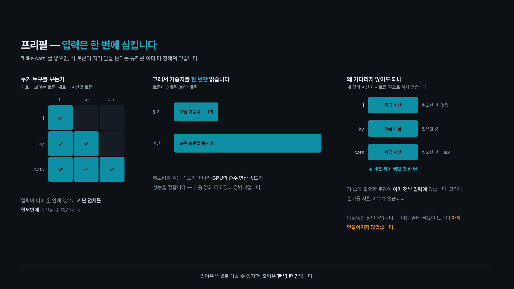

### 5.2 디코딩

디코딩은 이 계단을 한 칸씩 그려나가는 것과 같습니다. "I like cats" 다음에
"too"를 쓰고 나서야 그다음 토큰을 계산할 수 있습니다. 미리 계산해둘 방법이
없습니다.

문제는 새 토큰 하나마다 모델 전체를 다시 읽어야 한다는 점입니다. 100GB
모델을 500GB/s 대역폭[^mem-bandwidth]으로 읽으면 토큰 하나에 0.2초, 초당
5토큰입니다.

같은 한 번의 가중치 읽기로 프리필은 수천 토큰을, 디코딩은 한 토큰을 만듭니다.
연산 유닛이 노는 동안 **읽는 속도가 그대로 성능이 되는 것** — 이것이 디코딩이
메모리 대역폭 병목인 까닭입니다.

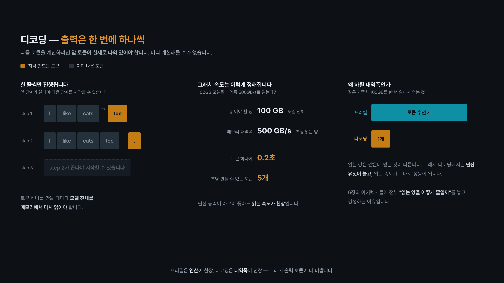

병렬화할 방법이 없다는 데는 예외가 하나 있고,
[5.4장](#54-투기적-디코딩-순차-병목을-우회하는-법)에서 따로
다룹니다[^spec-decoding].

그래서 최근 아키텍처들은 전부 이 디코딩 병목을 낮추는 데 몰려 있습니다. MoE로
매 토큰 읽어야 하는 파라미터를 줄이거나, KV캐시를 압축해 대역폭 소모를 줄이는
두 방향이 대표적입니다.

### 5.3 KV 캐시 히트

> "작업 일지는 책갈피에서 이어 읽습니다"

에이전트는 매 턴 새 지시만 받는 게 아닙니다. 시스템 지침, 이전 대화, 읽은 파일,
도구 결과가 쌓인 **작업 기록 전체**가 다시 입력됩니다.

앞부분이 그대로라면 서버는 그 KV를 책갈피처럼 재사용하고 **뒤에 붙은 새 기록만
프리필**합니다. 전체를 매번 처음부터 계산하는 캐시 미스와의 차이는 턴이 쌓일수록
커집니다[^cache-hit-math].

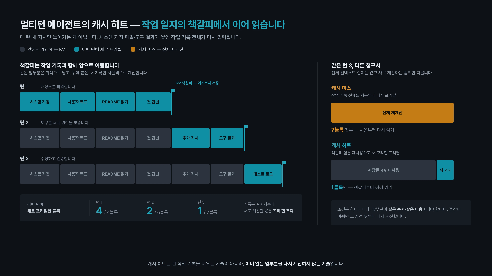

단, **재계산하지 않는다는 뜻이지 보지 않는다는 뜻은 아닙니다.** 이번 턴의 새
입력은 저장된 과거 KV 전체를 읽으며 답을 계산합니다. 그래서 캐시 히트가 줄이는
것은 **제곱을 선형으로**이지, 제곱을 상수로가 아닙니다[^row-cost].

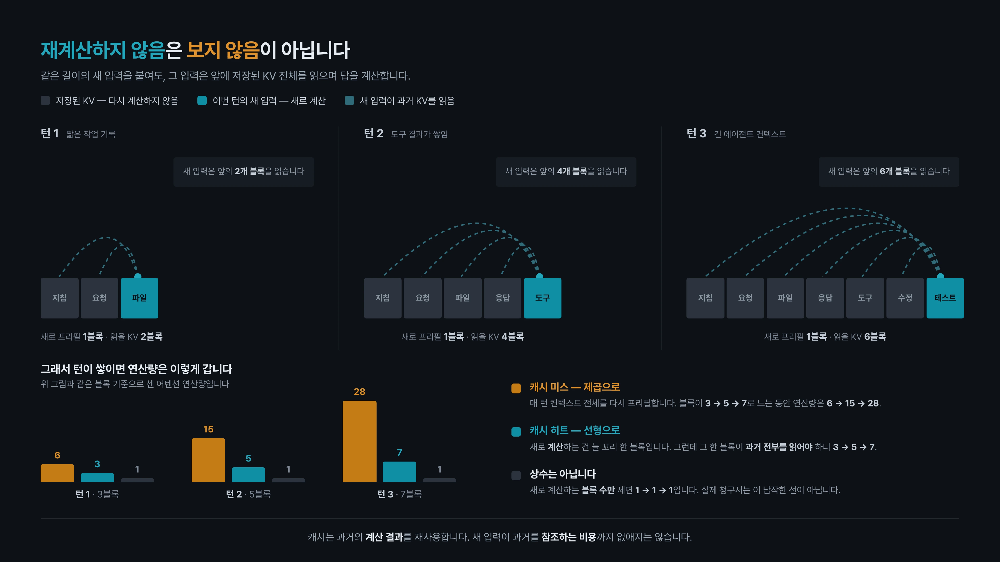

이 병목 구조는 API 가격표에 그대로 드러납니다. Anthropic·OpenAI 등 대부분이
출력(디코딩)을 입력(프리필)보다 5배가량 비싸게 매기고, 캐시 히트 입력은 약 90%
깎아줍니다. **새로 계산한 일이 적은 만큼 싸지는** 가격표입니다.

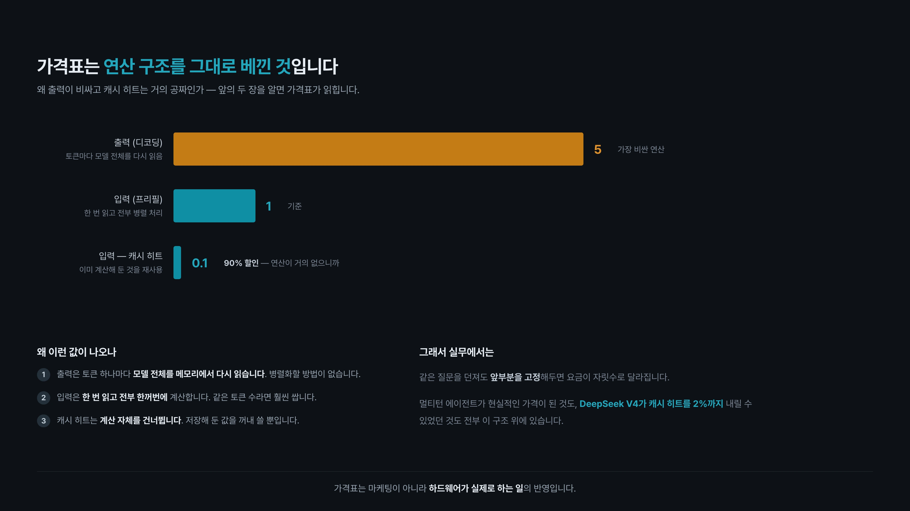

#### 히트한 KV는 어디에 보관되나

캐시 히트가 이만큼 싸다면 다음 문제는 **그 KV를 어디에 얼마나 오래 두느냐**입니다. HBM은
좁고 비싸니 답은 계층입니다 — **HBM → 호스트 DRAM → NVMe SSD → 원격 스토리지**로 내려가며
식은 블록을 밀어냅니다. NVIDIA는 이 넷에 `G1`\~`G4`라는 이름까지 붙였고, 2026년에는 계층이
벤더 규격이 됐습니다[^kv-tier].

판단 기준은 SSD가 HBM보다 느리다는 것이 아니라, **읽는 시간이 다시 프리필하는 시간보다
짧은가**입니다. [위 실측](#5-llm-모델의-연산-프리필과-디코딩)의 프리필이 8×H200에서 초당
2,097토큰이므로 1M 프리픽스 재계산은 **477초**입니다. 같은 1M을 디스크에서 읽으면 PCIe
세대에 따라 **0.2초에서 12.5초**이고, 가장 불리한 칸도 재계산보다 **37배**
빠릅니다[^kv-tier-math].

**손익분기는 최신 규격이 아니라 훨씬 전에 넘었고, 규격 세대보다 KV 압축이 더 큰 몫을
했습니다** — GLM-5.2의 토큰당 46.5KiB는 7B MHA 모델(512KiB)의 1/11이고, V4 Flash는
1/97입니다. 거꾸로 압축 없던 시절에는 디스크가 지는 싸움이었습니다 — 같은 1M이 **550GB**라
PCIe 3.0에서 137초인데, **7B는 프리필도 빨라서** 읽는 쪽이 더 느렸습니다.

**단, 위 그림의 읽기 시간은 장치의 순차 피크입니다.** 실제로 달성되는 속도는 **조각을
얼마나 크게 묶고 I/O를 누가 발행하느냐**가 정하고, 손보지 않은 설정에서는 한두 자릿수 낮게
나옵니다. 그래서 "SSD 캐싱을 켰는데 느리다"는 경험은 정상입니다[^kv-tier-io].

남은 병목도 대역폭이 아닙니다. 넷입니다[^kv-tier-limits].

- **제어 경로와 라우팅** — KV는 그것을 만든 노드에만 있고, 옮기는 I/O를 CPU가 하나씩
  발행합니다. 다음 턴이 다른 노드로 가면 미스이고, 같은 노드여도 발행이 밀리면 GPU가 섭니다.
- **쓰기 수명과 용량** — KV는 끊임없이 쓰이고 버려집니다. 읽기 속도가 아니라 수명이 값을 정합니다.
- **재사용이 없으면 이득도 없습니다** — 프리픽스가 겹치는 워크로드에서만 남는 장사입니다.
- **압축 방식이 재사용 단위를 바꿉니다** — 토큰별로 남는 KV는 아무 지점에서나 잘라 쓰지만,
  창이나 상태로 접은 것은 저장해 둔 체크포인트에서만 이어받습니다.

[6.4장](#64-deepseek-v4---hybrid-attention-csa--hca)의 온디스크 KV는 이 계층을 아키텍처
차원에서 전제한 사례이고, [8.4장](#84-프리필과-디코딩을-다른-gpu로)의 프리필·디코딩 분리는
같은 계층을 노드 사이로 늘린 것입니다.

### 5.4 투기적 디코딩: 순차 병목을 우회하는 법

> "먼저 찍어보고, 맞았는지 한꺼번에 채점한다"

빠른 초안이 여러 토큰을 먼저 쓰면[^draft-depth] 본 모델은 **가중치를 한 번 읽어 초안 전체를
병렬로 채점**합니다. 맞은 데까지만 채택하므로 결과는 바뀌지 않습니다[^spec-lossless].

수락 길이는 곧 속도 배수가 아닙니다. 초안·검증 비용과 배치까지 포함한 **실제
디코딩 tok/s**로 보면 아래와 같습니다[^glm-mtp][^dspark][^dflash].

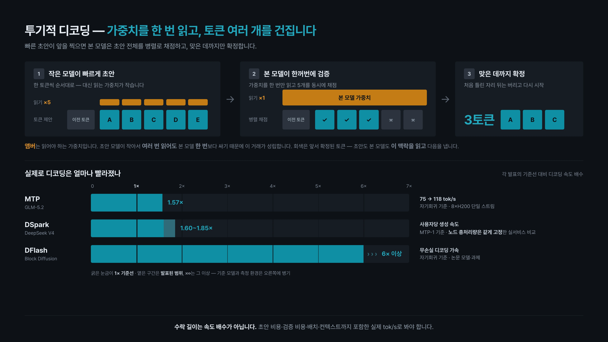

투기적 디코딩은 **연산을 더 써서 가중치 읽기 횟수를 줄이는 거래**입니다. 그래서
초안 모델·엔진·KV 정밀도 조합에 따라 이득이 줄거나 사라질 수도 있습니다[^dflash-kv].

## 6. 아키텍처 살펴보기

> "앞에서는 부담이 커지는 곳을 봤고, 이제 같은 인프라를 더 효율적으로 사용합니다."

[2\~5장](#2-추론-시장으로의-전환)은 모델이 커지고, 컨텍스트와 토큰 사용량이
늘면서 **추론 인프라의 부담이 어디서 커지는지** 설명했습니다. 6\~7장은 같은
인프라를 더 효율적으로 사용하는 방법을 다룹니다.

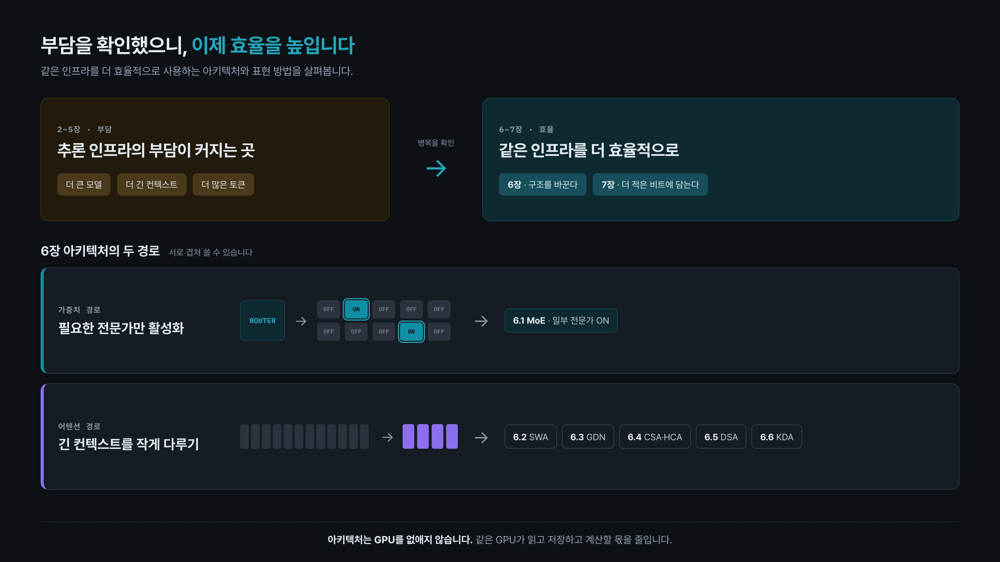

6장의 여섯 기술은 **모델 안의 전문가 활성화**와 **긴 컨텍스트 처리**라는
서로 다른 병목을 깎습니다. 둘은 경쟁 관계가 아니어서 Qwen3-Next와 Kimi K3처럼
한 모델에 겹쳐 쓸 수도 있습니다.

#### 6.1을 빼면 전부 어텐션 이야기입니다

6.1의 MoE는 가중치를 덜 읽습니다. **6.2\~6.6은 어텐션이 과거를 다루는
방법**을 바꿉니다. 모든 토큰이 모든 과거를 보는 Full Attention은 컨텍스트가
길어질수록 감당하기 어려워지기 때문입니다[^dense-quadratic].

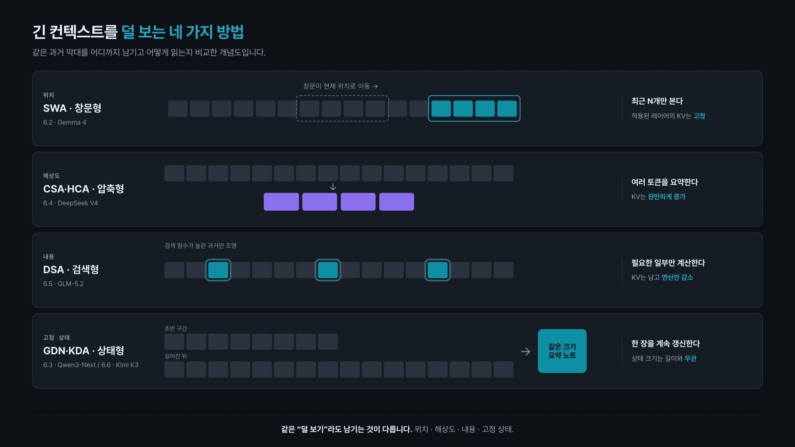

차이는 **무엇이 고정되느냐**입니다. SWA는 적용된 레이어의 최근 창만,
상태형은 과거 전체의 요약 상태만 남깁니다. 압축형의 KV는 완만하게나마 계속
늘고, 검색형은 KV를 남겨 둔 채 이번 계산에 쓸 일부만 고릅니다.

### 6.1 DeepSeek R1 - Mixture of Experts (MoE) + Chain of Thought (CoT)

> "딥시크 모먼트 — 오래 생각하는 모델을, 싸게 열었다."

2025년 1월, R1은 프론티어급 추론 모델의 가중치와 방법론을 공개해 미국 증시를
흔들었습니다. 충격의 핵심은 새 발명 하나가 아니라 **CoT와 MoE의 결합**이었습니다
[^r1-vs-v3][^cot-history][^moe-history].

**Chain of Thought (CoT, 사고의 연쇄)** 는 답을 내기 전에 중간 생각을 토큰으로
써 내려갑니다. 모델의 층을 늘리는 것이 아닙니다 — 디코딩은 **원래 토큰 하나마다
같은 모델을 다시 통과하는 자가 루프**이고, CoT는 답이 나오기 전 구간을 `<think>`로
감싸 그 루프를 더 길게 돌립니다. 그만큼 **테스트 타임 연산**이 늘어납니다. 일부
문제에서는 이 방법으로 더 큰 모델과의 체급 차이를 보완할 수 있지만, 생각 토큰만큼
디코딩 수요도 커집니다
[^cot-test-time].

**Mixture of Experts (MoE, 전문가 혼합)** 는 모델을 여러 전문가로 나누고 토큰마다
필요한 일부만 활성화합니다. Dense 모델은 덩치가 커질수록 매 토큰에 읽을 가중치가
늘지만, MoE는 활성량을 억제한 채 전체 모델의 지식 용량을 키울 수 있습니다
[^moe-capacity-trade].

R1은 총 671B 중 토큰마다 37B만 활성화합니다. 하지만 같은 토큰 생성 속도가
자동으로 보장되는 것은 아니며, 라우팅·GPU 간 통신도 시간을 씁니다. 더구나 어떤
전문가가 호출될지 모르므로 빠른 서빙에서는 **671B 전체를 메모리에 대기**시킵니다.
즉 CoT는 [디코딩](#52-디코딩) 수요를 늘리고, MoE는 큰 체급을 감당하는 대신
메모리 용량 청구서를 남깁니다.

#### R1의 어텐션은 MLA입니다 — 여기서 어휘를 잡아 둡니다

R1의 설정에는 `kv_lora_rank: 512`가 있습니다 — DeepSeek이 V2에서 낸
**Multi-head Latent Attention (MLA)** 이고, R1은 V3-Base 위에서 학습됐으니 그 구조를
그대로 씁니다[^r1-mla]. **6.2부터 6.6까지 모든 모델이 이 분류의 어딘가에 있으므로**
여기서 네 방식을 한 번에 정리해 둡니다.

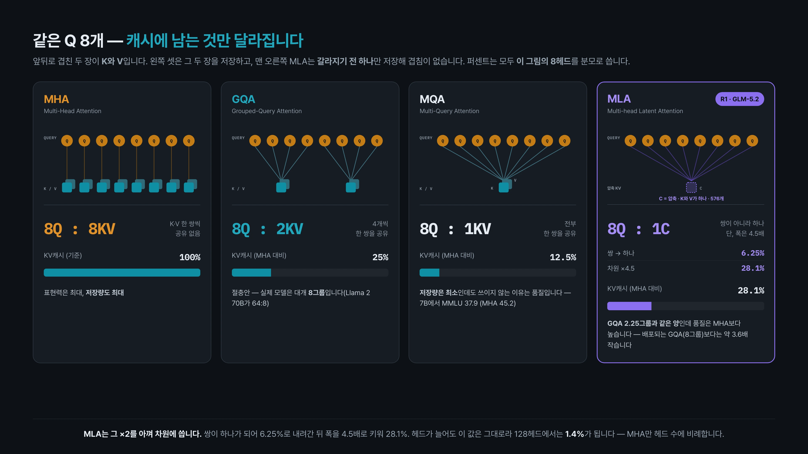

**Grouped-Query Attention (GQA)** 는 여러 Q가 더 적은 K/V를 공유해 KV캐시를
줄입니다[^gqa]. **MLA는 다른 길**입니다 — 헤드마다 K/V를 저장하는 대신 **저차원 잠재
벡터와, 모든 헤드가 함께 쓰는 위치키(RoPE) 하나만** 남깁니다. K와 V는 그 하나에서
꺼내 쓰므로, **갈라지기 전 단계를 저장한다**고 보는 것이 정확합니다. 그래서
[4장 공식](#4-llm에게-일을-시키려면-얼마만큼의-메모리가-필요할까요) 맨 앞의 `2 ×`(K와 V)가
사라지고, 헤드 수와 KV 크기가 아예 분리됩니다.

**그런데 아낀 자리를 도로 씁니다.** 쌍이 하나가 되어 8헤드 기준 6.25%까지 내려간 뒤,
그 여유를 폭에 투자합니다 — 잠재가 헤드 하나의 4.5배라 결국 **28.1%**입니다. 논문의
표현으로는 **"GQA 2.25그룹과 같은 양인데 성능은 MHA보다 강하다"** 입니다. 실제로 쓰이는
GQA는 대개 8그룹이니, 같은 헤드 수에서 MLA가 약 **3.6배 작으면서 품질은 더
높습니다**[^mla-size].

R1로 세어 보면 토큰당 레이어마다 **576개**(잠재 512 + 위치키 64)이고 61층이니 128K
컨텍스트 한 사용자에 FP8로 **4.3GiB**입니다. 같은 구성을 헤드별로 저장했다면
**71배**입니다[^r1-mla]. 8헤드에서 28.1%였던 비율이 128헤드에서 1.4%가 되는 것도 같은
이유입니다 — **MHA만 헤드 수에 비례하고 MLA는 무관**하기 때문입니다. 네 방식이 왜 그렇게 갈리는지를 `h`에서부터 수식으로 따라간
문답은 **[부록 B](./appendix/attention-lineage.md)** 에 있습니다.

#### MoE가 깎는 것은 대역폭 하나입니다

MoE와 MLA를 한자리에 놓으면 **6.2부터 왜 전부 어텐션 이야기인지**가 보입니다. R1을
항목별로 세어 세 청구서에 나눠 담으면 이렇습니다[^r1-param-split].

**어텐션은 담는 값의 1.7%인데, 읽는 양에서는 31.3%입니다.** 전문가 257개가 저장을 거의
다 차지하지만 토큰마다 켜지는 것은 9개뿐이라 읽기가 18.4배로 줄고, 어텐션은 61층을
하나도 빼지 않고 읽으므로 11.4B가 그대로 남기 때문입니다.

**MoE는 KV캐시를 건드리지 않습니다.**
[4장 공식](#4-llm에게-일을-시키려면-얼마만큼의-메모리가-필요할까요)에 전문가 수가
등장하지 않기 때문입니다. 전문가를 256개로 불려도, 9개만 켜도 토큰당 KV는 같고 그 칸을
정하는 것은 어텐션 설계뿐입니다. **남은 두 가지 부하를 줄일 열쇠가 어텐션에 있다**는 뜻이고,
그래서 6.2부터 6.6까지가 전부 어텐션 이야기입니다.

### 6.2 Gemma 4 - Sliding Window Attention (SWA)

> "회의록 전체를 매번 다시 읽지는 않잖아요"

슬라이딩 윈도우 어텐션(SWA)은 과거 전체 대신 **최근 N개만 봅니다.** Gemma 4
31B의 창문은 1024토큰입니다. 다만 60개 레이어 전부를 가리지는 않습니다.
**슬라이딩 5개 + Full Attention 1개**를 열 번 반복해, 가까운 문맥은 싸게 보고
먼 문맥은 Full 레이어로 다시 연결합니다[^gemma4-config][^swa-receptive].

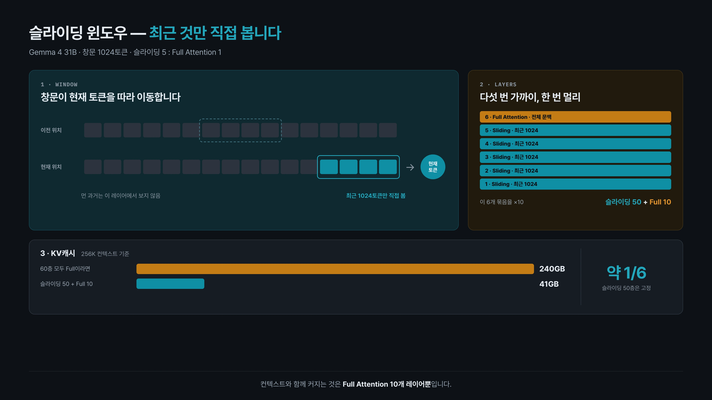

256K 컨텍스트에서 KV캐시는 **240GB → 41GB, 약 1/6**로 줄어듭니다. 슬라이딩
50개 레이어는 1024토큰어치로 고정되고, 컨텍스트와 함께 커지는 것은 Full 레이어
10개뿐입니다[^swa-calc].

그러면 창문 밖은 어떻게 되나요? **창문 1,024토큰은 "1,024개 전을 까먹는다"는 뜻이
아닙니다.** 막아주는 장치가 둘 있습니다[^swa-receptive].

**릴레이**는 층을 지날 때마다 유효 시야를 한 창문씩 넓힙니다. 아랫층이 이미 흡수한
것을 전달받기 때문이고, 5층이면 5,120토큰까지 간접으로 닿습니다. 다만 간접으로 오는
것은 압축된 요약이라, 먼 과거의 특정 토큰을 정확히 짚는 일은 **여섯 층마다 한 번 오는
Full Attention 레이어**가 맡습니다. 그래서 5:1 배합은 비용을 깎는 장치이면서
동시에 **정확히 짚는 능력을 남겨 두는 장치**입니다.

### 6.3 Qwen3-Next-80B-A3B - Gated DeltaNet

> "왜 전부 다 적어? 요약해"

Gated DeltaNet은 과거 토큰의 K/V를 하나씩 쌓는 대신, 지금까지의 내용을
**고정 크기 상태(state)** 하나에 계속 고쳐 씁니다. 따라서 컨텍스트가 짧든
길든 상태의 크기는 같습니다.

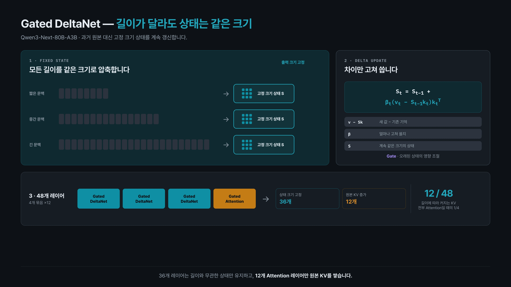

**Delta**는 새 값과 기존 기억의 차이만 수정한다는 뜻이고, **Gate**는 오래된
정보를 얼마나 남길지 조절합니다. Qwen3-Next는 48개 레이어를
**Gated DeltaNet 3 + Gated Attention 1**로 반복합니다. 그래서 36개 레이어의
메모리와 토큰당 연산은 컨텍스트 길이와 무관하고, 길이에 따라 KV가 커지는 것은
나머지 12개 — 전부 Full Attention인 경우의 **1/4**뿐입니다[^gdn-state].

### 6.4 DeepSeek V4 - Hybrid Attention (CSA + HCA)

> "아키텍처가 가격표를 만든다"

먼저 가격부터 봅시다. DeepSeek V4 Flash의 출력 1M 토큰은 **$0.28**로,
Fable 5의 **$50보다 약 179배** 쌉니다. 더 특이한 것은 캐시 히트입니다.
Flash는 캐시 미스 입력가의 <strong>2%</strong>, Pro는
<strong>0.83%</strong>만 청구합니다[^api-price-2026].

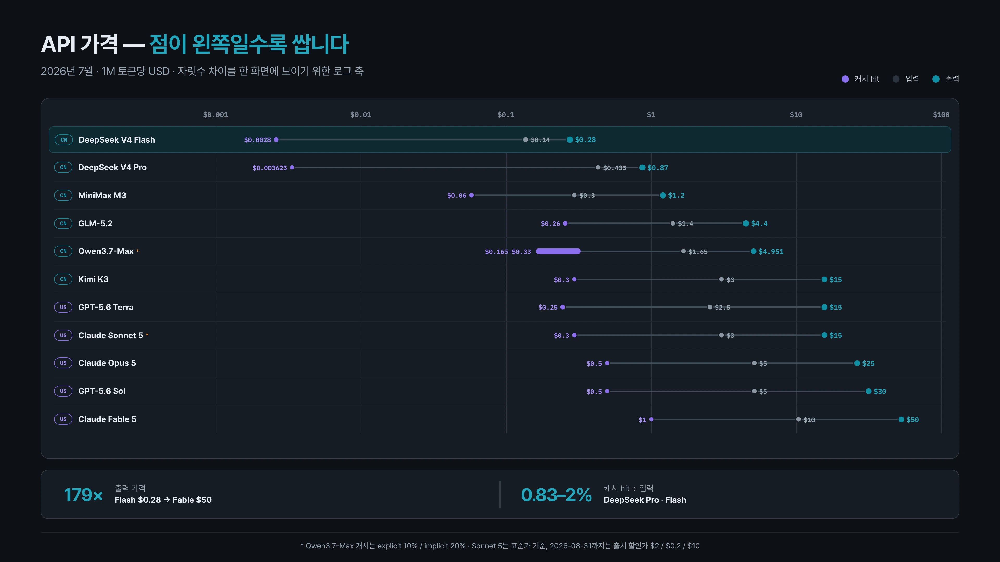

> **주의 — 이 장의 가격 수치는 2026년 7월 31일 오전 기준으로 낡았습니다.**
> 한국시각 **7월 31일 02:00**에 OpenAI가 GPT-5.6 Luna를 **80%**, Terra를 **20%**
> 내렸습니다. 위 그림과 아래 스펙 카드, 그리고 본문의 OpenAI 값은 인하 **직전**
> 것이고, 무엇이 얼마나 바뀌었는지는 각주에 적었습니다[^gpt56-price-cut].
> 다른 제공사 값과 이 장의 논지는 그대로 유효합니다.

이 그림은 **토큰 단가** 비교입니다. 같은 일을 끝내는 데 필요한 토큰 수나
모델 품질이 같다는 뜻은 아닙니다.

6.4부터 나오는 모델은 지금 코딩 에이전트에 그대로 붙일 수 있는 것들입니다. 그래서
**같은 점수대의 단가와 서빙에 필요한 것을 한 장으로** 정리해 둡니다[^v4-spec].

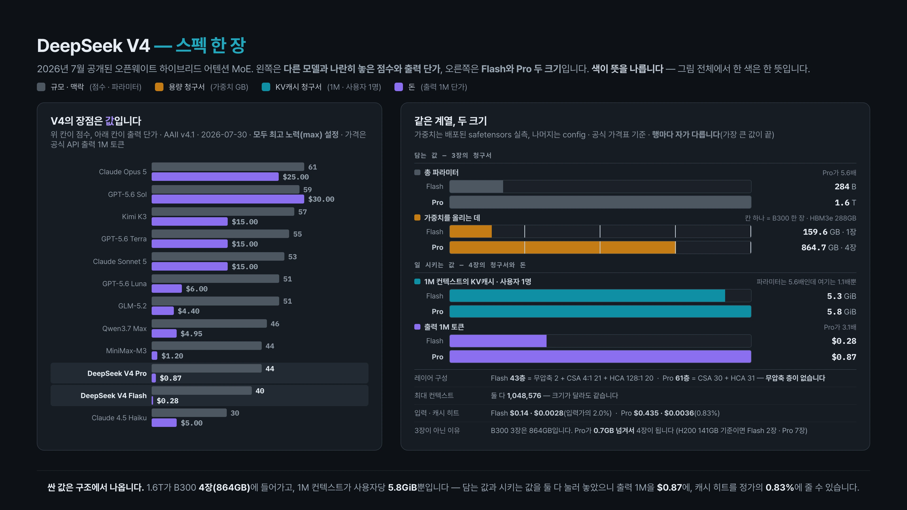

카드가 말하는 "같은 점수대"가 실제로 어느 이웃들인지는 **[부록 C](./appendix/deepseek-v4-flash-0731.md)**
에 따로 정리했습니다. 위 카드의 점수 막대는 **7월 30일 라이브 값**이라 V4 Flash가 40인데,
하루 뒤 공개된 정식판(0731)은 같은 지수에서 **49.9**로 GLM-5.2와 동급이 됩니다. 그 정식판의
발표 벤치마크 아홉 개를 항목마다 세워 보면 이웃은 **GPT-5.5 · Claude Sonnet 5 ·
Claude Fable 5 · Grok 4.5**이고 최상위와는 5\~20pp 아래입니다 — 아홉 개가 전부 자체보고라는
사정과 그것을 어디까지 믿을 수 있는지도 그쪽에 적었습니다.

V4는 과거를 그대로 쌓지 않습니다. **Compressed Sparse Attention (CSA)** 는
4토큰을 하나로 묶은 뒤, 각 CSA 레이어의 **DSA 인덱서**가 필요한 요약만 고릅니다.
**Heavily Compressed Attention (HCA)** 은 128토큰을 하나로 묶어 남은 요약을
모두 봅니다[^ds-v4-config]. 설정과 공식 추론 코드를 읽어 확인한 실제 동작 — 압축이 단순
묶기가 아니라 학습된 게이트 풀링이라는 점, K와 V가 같은 텐서라는 점, 잔차를 네 벌로 들고
섞는 Hyper-Connections까지 — 은 **[부록 A](./appendix/deepseek-v4.md)** 에 따로 적었습니다.

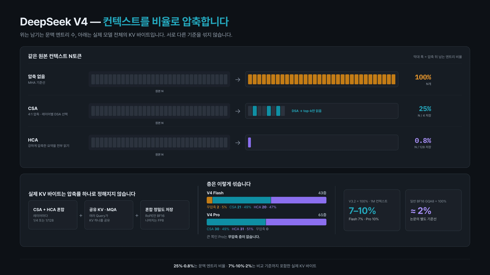

CSA와 HCA가 남기는 문맥 엔트리는 각각 원본의 <strong>25%</strong>와
<strong>0.8%</strong>입니다.
여기에 공유 KV와 저정밀도 저장을 더한 실제 KV 바이트는 V3.2 대비
Flash <strong>7%</strong>, Pro <strong>10%</strong>입니다[^ds-v4-config][^ds-v4-eff][^ds-v4-kv-baselines].
Flash의 토큰당 FLOPs도 <strong>10%</strong>로 줄었습니다. 압축 KV는 디스크에 저장해
캐시 히트 때 다시 씁니다[^ds-v4-ondisk].

### 6.5 GLM-5.2 - IndexShare와 비동기 강화학습

> "볼 곳을 고르는 일도 비용이다"

GLM-5.2는 총 **753B**, **78층**, 컨텍스트 **1M**인 희소 MoE입니다. 각 토큰은
전문가 256개 중 8개와 공유 전문가 1개를 씁니다. 어텐션은 Q·KV 헤드가 각각 64개로
적혀 있지만, **캐시에 남는 것은 헤드별 K/V가 아니라 압축된 잠재 벡터 하나**입니다 —
DeepSeek 계열의 [6.1에서 본](#r1의-어텐션은-mla입니다--여기서-어휘를-잡아-둡니다) **MLA**입니다[^glm-params].

128K 컨텍스트 한 사용자의 KV캐시가 FP8로 **5.5GiB**입니다. 같은 구성을 헤드별로
저장했다면 **305GiB**로 **56배**입니다[^mla-calc]. 그 위에 GLM-5.2는 과거에서 볼 곳을
고르는 연산까지 줄입니다.

V4에서는 각 CSA 레이어가 전용 **DeepSeek Sparse Attention (DSA)** 인덱서를
가집니다. GLM-5.2도 DSA를 쓰지만, 1M 문맥에서 2,048개를 고른 결과를 다음 3개
레이어와 공유해 인덱서를 **4층에 한 번만** 실행합니다[^dsa-lineage].

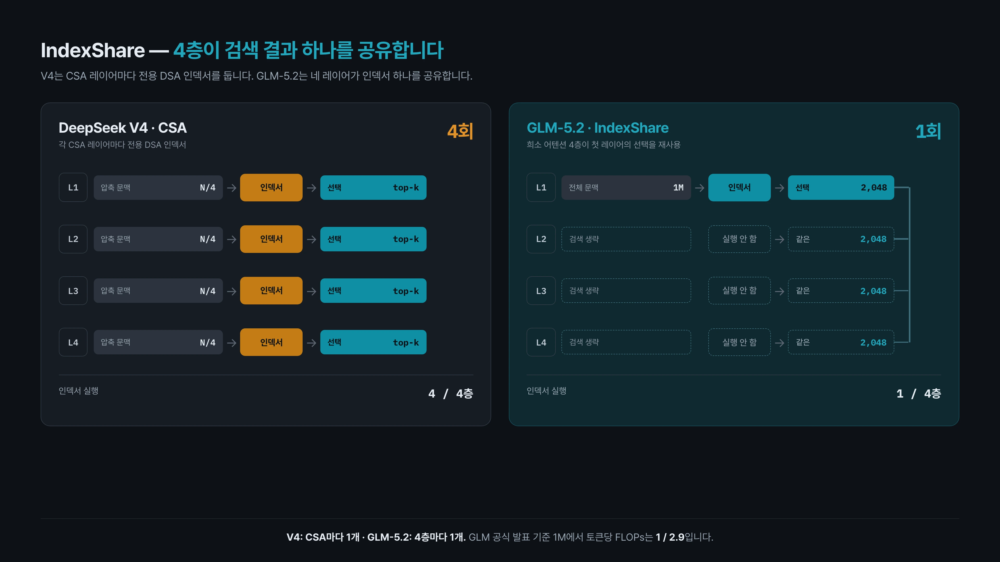

그 결과 인덱서의 점수 계산과 top-k 선택이 4회에서 1회로 줄고, 공식 발표 기준
1M 컨텍스트의 토큰당 FLOPs는 **1/2.9**가 됩니다[^glm-indexshare]. 이 공유는
[5.4장의 MTP](#54-투기적-디코딩-순차-병목을-우회하는-법) 초안에도 이어져,
인덱스와 KV를 다시 만들지 않습니다[^glm-mtp].

6.4와 같은 양식으로 한 장에 모았습니다. 다만 **V4가 경제성으로 읽히는 모델이라면
GLM-5.2는 성적으로 읽히는 모델**이라 왼쪽 패널이 가격에서 벤치마크로 바뀝니다.
오른쪽에는 **그 기법이 누구 것인지**를 함께 적었습니다[^glm-spec].

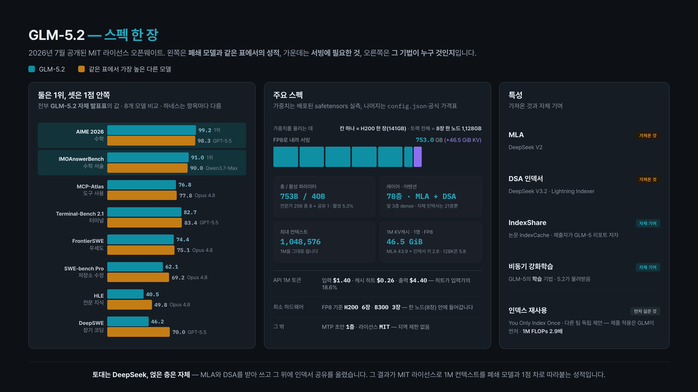

#### 비동기 강화학습 — 학습 클러스터 절반이 추론 서버입니다

학습에서도 같은 일을 합니다 — 기다림을 없애는 것입니다. **다만 이쪽은 GLM-5.2가 아니라
GLM-5의 것입니다** — GLM-5.2는 자체 기술 리포트 없이 GLM-5 리포트를 자기 리포트로
인용하고, 모델 카드가 IndexShare와 짝지은 새 항목은 위의 MTP 개선입니다[^glm-async].

동기 방식에서는 배치가 **가장 느린 궤적** 하나를 기다려야 닫힙니다. 에이전트 작업은
궤적 길이가 크게 달라 그 기다림이 깁니다. 비동기는 두 엔진을 다른 GPU에 떼어 놓고,
완성된 궤적이 임계치에 닿는 대로 넘기며 가중치는 도중에 갈아 끼웁니다.

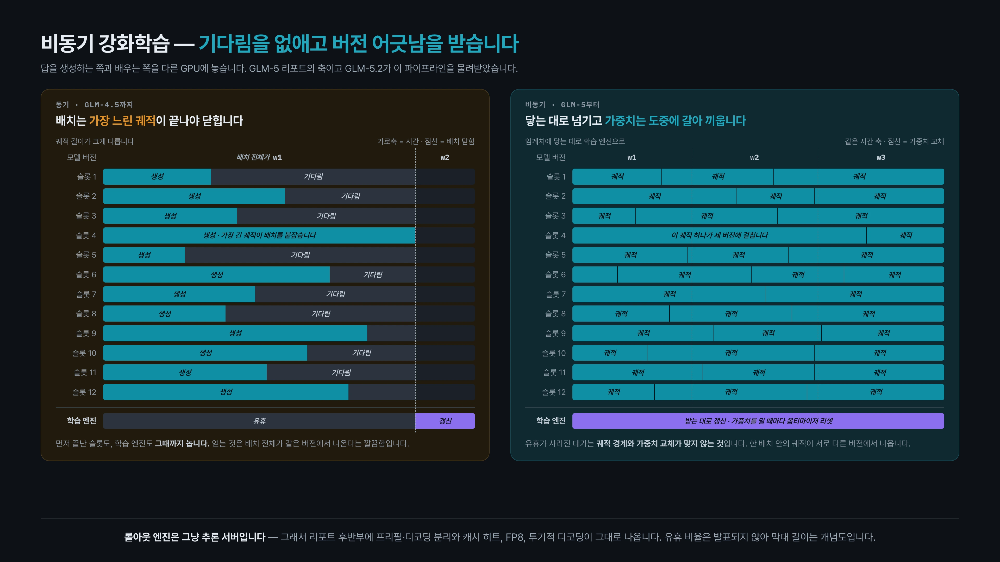

**대가는 궤적 경계와 가중치 교체 시점이 어긋나는 것**입니다. 한 배치의 궤적이 서로
다른 버전에서 나오므로, 리포트는 이를 견디는 장치를 넷 답니다[^glm-async].

여기서 앞 장들이 되돌아옵니다. 답을 생성하는 쪽은 **그냥 추론 서버**입니다. 그래서
리포트가 롤아웃을 빠르게 만들려고 쓴 것이
[프리필·디코딩 분리](#84-프리필과-디코딩을-다른-gpu로) ·
[캐시 히트를 살리는 라우팅](#53-kv-캐시-히트) ·
[FP8](#7-quantization) ·
[투기적 디코딩](#54-투기적-디코딩-순차-병목을-우회하는-법)입니다.

GLM-5.2는 **KV를 잠재 벡터로 압축하고 검색의 반복을 줄인 모델**이고, **학습의 대기까지
줄인 파이프라인** 위에서 훈련됐습니다.

### 6.6 Kimi K3 - Kimi Delta Attention (KDA)

> "지금까지 나온 수법을 전부, 2.8조 규모로"

[1장](#1-kimi-k3는-어떻게-미국-증시를-흔들었나)에서 증시를 흔든 그 모델입니다.
6장을 여기까지 읽었으면 K3는 새 발명이 아니라 **종합**이라는 것이 바로 보입니다 —
[6.3의 Gated DeltaNet](#63-qwen3-next-80b-a3b---gated-deltanet)이 KDA로,
[6.1의 MoE](#61-deepseek-r1---mixture-of-experts-moe--chain-of-thought-cot)가 896개 중 16개로,
[7장의 양자화](#7-quantization)가 학습 단계의 MXFP4로 들어와 있습니다. 수치는 Hugging Face
모델 카드와 Moonshot 공식 발표에서 직접 확인했습니다[^k3-config].

같은 양식의 스펙 카드입니다. **K3는 종합이라고 했지만 빌려온 종합은 아닙니다** —
오른쪽 패널에 어느 기법이 자체 논문·구현으로 나왔고 어느 것이 남의 토대인지,
그리고 **남들이 그것을 인용해 확장하고 있는지**까지 갈라 적었습니다[^k3-spec].

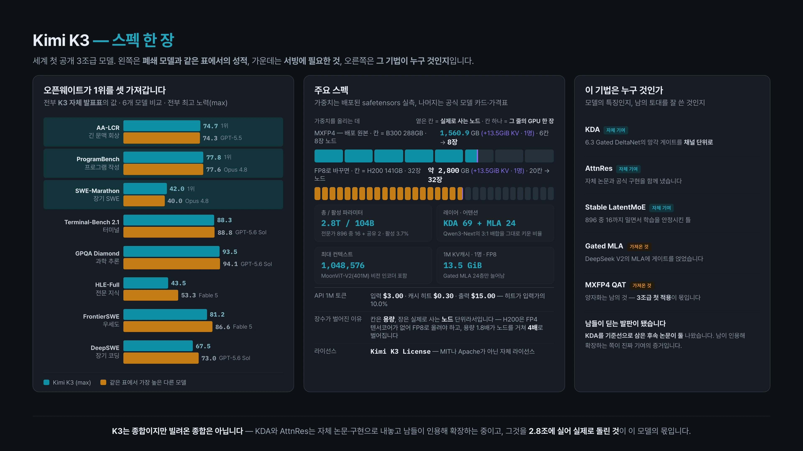

**앞에서 나오지 않은 항목이 하나 있습니다.** 일반 residual은 직전 상태를 고정
가중치 1로 더하지만, **A**ttention **Res**iduals는 여러 이전 레이어·블록의 출력을
후보로 놓고 **깊이 방향으로 softmax attention**을 걸어 지금 필요한 표현을 골라
섞습니다. Kimi Linear에서 먼저 검증된 기법이라 K3 전용 발명도 아닙니다[^attnres].

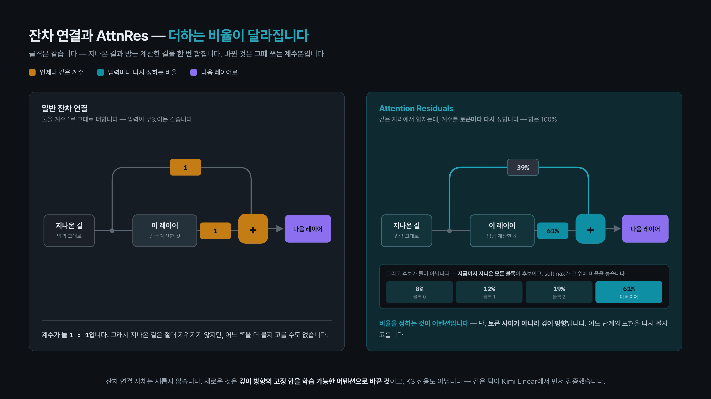

**3가지 핵심 기술을 한곳에 모았습니다.** 셋이 각각 다른 청구서를 깎습니다 —
**KDA**는 93레이어를 69 대 24로 갈라 KV캐시가 늘어나는 층을 24개로 묶고
(Qwen3-Next의 3:1 배합을 규모만 키운 것이며, 1M 디코딩 최대 6.3배를
발표했습니다)[^kda-caching][^k3-unverified], **Stable LatentMoE**는 896개 중
16개까지 밀어 토큰마다 읽는 양을 깎고[^k3-active][^quantile-balancing],
**MXFP4 QAT**는 학습 단계부터 4비트를 전제로 태워 담는 값을 깎습니다(보통은 다
학습한 뒤 압축하지만[^qat] K3는 가중치를 MXFP4, 활성값을 MXFP8로 네이티브
배포합니다)[^sft]. 마지막 기술 요소에서 [3장의 계산](#3-llm을-담기-위해서는-얼마만큼의-메모리가-필요할까요)이
현실이 됩니다 — 같은 모델인데 **H200 32장 대 B300 8장**입니다[^memory-calc].

이 4배는 "칩이 덜 필요해진다"가 아니라 **어떤 칩이 필요한지가 바뀐다**는 뜻입니다.
H200도 B300도 Nvidia 제품이니까요. 당시 시장이 두려워한 것은 세대 교체가 아니라
**같은 성능에 드는 총 GPU와 CAPEX가 줄어들 가능성**이었고, 그것도 검증된 결과가
아니라 발표 직후의 해석이었습니다[^tftc].

**단, 8장은 "가중치가 겨우 들어간다"는 뜻이지 서빙할 수 있다는 뜻이 아닙니다.**
Moonshot 자신은 가속기 **64장 이상**의 슈퍼노드를 권장합니다[^k3-config]. 그 차이를 메우는
게 [4장의 KV캐시](#4-llm에게-일을-시키려면-얼마만큼의-메모리가-필요할까요)입니다 — 사용자마다 따로 드는 그 청구서요.
**용량 청구서는 8장으로 끝나지만 KV캐시 청구서는 거기서 시작합니다.**

#### 그 성적표에 빠진 것 — 폐쇄 모델은 최상위 능력을 가둡니다

**같은 표에 올랐다는 사실보다 중요한 것이 있습니다.** 2026년 6월 이후 미국 3사는
최상위 사이버 능력을 **신원과 관할로 가두는 쪽**으로 갔습니다. Anthropic은 같은 모델을
둘로 갈라, 세이프가드를 얹은 **Fable 5**만 일반 공개하고 세이프가드를 뗀 **Mythos 5**는
미국 정부와 함께 운영하는 Project Glasswing 참여자에게만 줍니다. OpenAI는 GPT-5.6 세 모델
전부를 Preparedness Framework의 **High capability**(사이버 + 생물·화학)로 지정하고 더 열린
구성을 Trusted Access for Cyber 심사로 돌렸습니다. Google의 Gemini 3.5 Flash Cyber는
**정부와 신뢰 파트너 전용**입니다[^frontier-gating].

그 대가가 사용자 쪽에 나타납니다. Fable 5는 세 영역(사이버보안 · 생물·화학 · 증류)의
분류기가 걸리면 응답을 **Opus 4.8이 대신** 내는데, Anthropic은 이 분류기를 **일부러 양성
요청에도 걸리게** 설정했다고 밝혔습니다 — 사용자는 그 안전 여유를 "모델이 온당하고 무해한
요청을 거부하는 것"으로 경험한다고 자기 글에 적었습니다. 위 표에서 K3와 벌어진 세 항목의
상대가 대개 Fable 5인데, 정작 그 모델은 **일상적인 코딩·디버깅에서 양성 요청을 더 자주
걸러 내는** 상태입니다[^fable-gating].

**오픈웨이트에는 이 층이 없습니다.** K3가 더 관대해서가 아니라, 가중치를 받아 자기
클러스터에서 돌리면 분류기·신원 게이트·관할 제한이 **개입할 자리가 없기** 때문입니다.
영국 AISI는 같은 것을 반대편에서 적습니다 — 한 번 공개되면 세이프가드를 떼어낼 수 있고
사본이 감시 밖의 사설 시스템에서 돌 수 있으므로, 그 선택지가 영구히 사라진다는
것입니다[^open-weight-cyber]. **"가중치째 받는다"가 뜻하는 것이 이것이고**, 그 자유의
대가는 [9장](#9-ai-소버린)에서 다시 나옵니다.

## 7. Quantization

> "구조는 그대로 두고, 값 하나를 몇 비트에 담을지만 바꿉니다"

6장의 기법들은 모델의 **구조**를 바꿔 청구서를 깎았습니다. 양자화는 구조를
건드리지 않습니다. 파라미터 하나와 KV 값 하나를 몇 비트에 담을지만 바꾸므로
**6장의 기법들과 겹쳐 쓸 수 있습니다** — Kimi K3가 KDA와 MXFP4를 함께 쓰는 것이
그 예입니다. 그리고 [3장의 용량 청구서](#3-llm을-담기-위해서는-얼마만큼의-메모리가-필요할까요)와
[4장의 KV캐시 청구서](#4-llm에게-일을-시키려면-얼마만큼의-메모리가-필요할까요) **양쪽을
동시에 깎는 조절 수단은 이 문서에서 이것뿐입니다.**

두 청구서의 **성질이 다릅니다.** 가중치는 한 번 압축해 두면 그 파일을 그대로
배포하므로, 미리 재 보고 **자리마다 비트를 다르게** 줄 수 있습니다. KV캐시는
요청마다 새로 만들어져 압축해 둘 파일이 없고, 대신 **줄인 만큼 동시 사용자를
삽니다.** 그 갈림이 7.1과 7.2의 구성입니다.

### 7.1 Model 양자화

먼저 **정밀도 포맷**과 **양자화 방법**을 구분해야 합니다. BF16·FP8·FP4는
숫자를 담는 그릇이고, AWQ·AutoRound·EXL2 같은 방법은 어느 값을 어떻게 그
그릇에 넣을지 정합니다.

**정밀도 포맷**:

- **BF16 / FP16**: 원본 배포 정밀도. 지수부 비트 수만 다릅니다
  (BF16이 더 넓은 다이나믹 레인지, FP16이 더 높은 정밀도).
- **INT8 / INT4**: 전통적 정수 양자화. 암페어(A100)부터 텐서코어가 가속하며, INT4는 AWQ·GPTQ 사후 양자화에 주로 사용됩니다.
- **FP8** (E4M3/E5M2): 호퍼(H100/H200)부터 네이티브 가속. 대부분 무손실급 품질.
- **MXFP8 / MXFP4**: OCP(Open Compute Project) 표준 마이크로스케일링. 32개 블록마다 E8M0 스케일을 적용합니다.
  - **MXFP4**: GPT-OSS가 이 포맷으로 배포되며 대중화됐고, Kimi K3의 배포 원본입니다.
- **NVFP4**: NVIDIA 자체 포맷. 블록 크기 16(더 촘촘), 스케일 factor는 FP8 E4M3(더 정밀). 같은 4비트여도 MXFP4보다 오차가 작다고 보고되지만, 네이티브 가속은 블랙웰 전용입니다.
- **INT2 / BitNet**: BitNet 1.58b 등 삼진법 및 2비트 정수 포맷. 극단적 경량화 연구 분야에서 활발히 연구되고 있습니다.

위 블록 크기·스케일 포맷 수치는 NVIDIA 공식 기술 블로그("Introducing
NVFP4 for Efficient and Accurate Low-Precision Inference",
developer.nvidia.com, 직접 fetch 확인)의 비교표 기준입니다.

**블록 스케일이 세대를 가릅니다.** FP8의 눈금은 텐서 하나에 하나인데 MX·NVFP4는
수십 개마다 눈금을 따로 두고, 그 눈금을 텐서코어가 직접 읽어야 하므로 네이티브
가속이 블랙웰부터입니다. K3를 H200에서 돌리려면 FP8로 올려야 하는 이유가
이것입니다[^memory-calc].

위 두 FP4 포맷은 보통 학습이 끝난 모델에 사후(post-training)로
적용됩니다. 반면 Kimi K3는 Supervised Fine-Tuning (SFT) 단계부터
Quantized Aware Training (QAT)로 MXFP4/MXFP8 정밀도에 맞춰 학습해
품질 저하를 더 줄이는 접근을 씁니다([Kimi K3 아키텍처
섹션](#66-kimi-k3---kimi-delta-attention-kda) 참고).

**저비트 보정/캘리브레이션 기법** (전체는 여전히 균일한 비트지만, 어떤
채널을 더 정확히 보존할지 스케일링·최적화로 정확도를 끌어올리는
방식 — 아래 두 방법 모두 결과물은 예컨대 INT4처럼 균일한 비트입니다):

- **AWQ**(Activation-aware Weight Quantization): 활성값 크기를 기준으로
  중요한 가중치 채널을 찾아 그 채널만 스케일을 보정, 나머지를 4비트로
  눌러도 손실을 최소화합니다.
- **AutoRound**: 인텔이 낸 방법으로, 블록 단위로 라운딩 값 자체를
  최적화해서 캘리브레이션 오차를 줄입니다. Qwen3.6-27B 커뮤니티 INT4
  양자화에도 실제로 쓰이고 있습니다.

**혼합 정밀도**는 레이어·텐서마다 실제 비트 수를 다르게 배분합니다.
원리는 단순합니다. **오차에 민감한 곳에는 비트를 더 주고, 둔감한 곳에서
회수해 목표 평균 용량을 맞춥니다.**

**둘의 용량은 같습니다.** 다른 것은 배분의 모양이고, 대가는 "어디가 민감한지"를
모델마다 한 번씩 오프라인으로 재 봐야 한다는 것입니다. 그 탐색을 누가 어떻게
하느냐가 아래 세 이름의 차이입니다.

- **GGUF `Q4_K_M`**: 로컬에서 가장 자주 만나는 실전 사례입니다. 대부분은
  Q4로 두되 어텐션·출력처럼 민감한 텐서를 Q5/Q6로 보호합니다.
- **EXL2**: 각 행렬을 여러 비트로 시험한 뒤, 목표 평균 BPW 안에서 최대
  양자화 오차가 작아지는 조합을 자동으로 고릅니다.
- **Unsloth Dynamic 2.0**: 최신 GGUF 배포 레시피입니다. 모델별 레이어
  민감도를 측정해 특히 MoE 전문가 FFN을 더 세게 누릅니다.

즉 Dynamic 2.0은 혼합 정밀도의 출발점이 아니라, 이미 널리 쓰이던
**비트 배분을 모델별로 자동화한 최신 사례**입니다[^mixed-precision].

#### 실전에서 만나는 이름들: GGUF의 세 계열

위 이야기는 데이터센터 기준입니다. 개인이 로컬에서 모델을 받으면
`Q4_K_M`·`IQ4_XS` 같은 **암호 같은 접미사**를 먼저 만납니다. 흔히 세대로
묶어 설명하지만 GGUF 표준이 정한 공식 세대명은 아닙니다. 정확히는
`Q` → `K` → `I`라는 세 양자화 계열입니다[^gguf-gen].

| 계열 | 이름 | 핵심 아이디어 |
|---|---|---|
| 레거시 Q-quants | `Q4_0` · `Q8_0` | 블록 단위의 균일한 정수 눈금 |
| K-quants | **`Q4_K_M`** | **슈퍼블록 이중 스케일** + 텐서별 혼합 정밀도 |
| I-quants | **`IQ4_XS`** · `IQ3_XXS` | **비선형 코드북/격자**에서 패턴 번호를 저장 |

I-quants는 눈금을 더 잘게 쪼개는 대신 **미리 정한 비선형 패턴 목록에서 가장
가까운 것을 골라 번호를 저장**합니다. 복원할 때는 그 번호로 값을 찾으므로
구현에서 LUT를 쓸 수 있지만, **I-quants = LUT**라고 정의하는 것은 좁습니다.
핵심은 비선형 코드북/격자이고 LUT는 이를 빠르게 복원하는 구현 방식입니다.
그래서 2\~3비트 같은 극단까지 내려갈 수 있습니다.

**여기에 세대와 무관하게 얹히는 장치가 하나 더 있습니다 — 중요도 행렬(imatrix).**
캘리브레이션용 텍스트를 실제로 모델에 흘려보내 **어느 자리가 자주 세게 쓰이는지**
재둔 표이고, 양자화할 때 그 자리의 오차를 우선 줄입니다. 이름은 행렬이지만
실제로 저장되는 건 1차원 배열이며, I-quants 전용도 아닙니다[^imatrix].

**개발자와 배포자가 다릅니다.** 포맷과 커널은 `llama.cpp`의 ikawrakow가
만들고, 우리가 실제로 받아 쓰는 변환본은 대개 **Unsloth**가 올린 것입니다.
바로 위 Dynamic 2.0이 그 결과물이죠.

### 7.2 KV 캐시 양자화

KV캐시는 모델 가중치와 달리 **매 요청마다 새로 생기는 데이터**입니다. 그래서
캘리브레이션으로 자리마다 비트를 재배분하는 절차가 성립하지 않고, 여기서 쓸 수 있는 것은
**요청 경로에서 값싸게 끝나는 양자화**뿐입니다. 비트를 나눠 주는 것 자체는 합니다 —
다만 데이터를 보고 **찾은** 배분이 아니라 구조를 보고 **미리 정해 둔** 규칙입니다[^kv-alloc].

가르는 것은 정확도가 아니라 **시각(時刻)**입니다. 가중치는 배포 전에 실컷 재 둘 수 있고
KV캐시는 요청이 와야 생기니, 잴 틈이 없습니다. 그래서 실제 배분은 요청 전에 이미 아는
것(레이어 종류·K와 V·헤드)에서만 갈립니다.
그리고 이 KV캐시 양자화의 한계를 깨뜨려 **2026년 3월 증시를 흔든 주인공**이 구글의 **TurboQuant**입니다.

2026년 3월 24일 구글 리서치가 KV캐시 **6배 절감**과 어텐션 **최대 8배 가속**의 TurboQuant를
공개하자, 시장이 "HBM 수요가 1/6로 줄어든다"고 읽고 메모리주가 이틀에 걸쳐 빠졌습니다.
1장의 Kimi K3에 이은 **2026년 두 번째 "효율 쇼크"** 입니다.

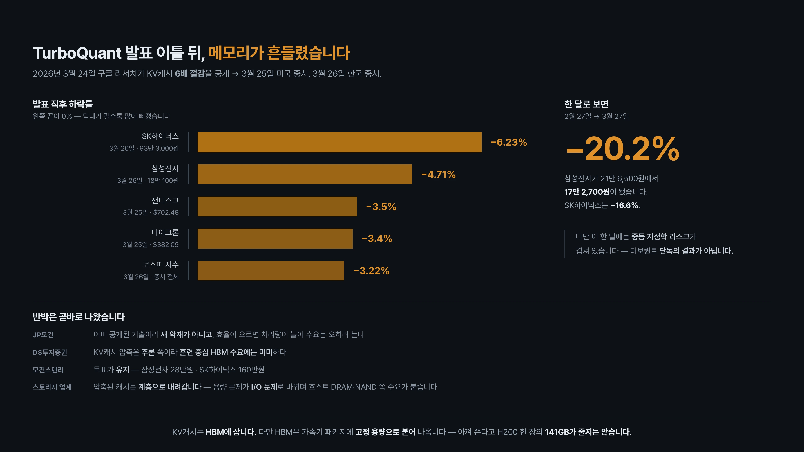

**다만 "쓰는 양이 줄면 파는 양도 준다"가 성립하지 않습니다.** KV캐시는 서빙 중에 HBM에
살지만, **HBM은 가속기 패키지에 고정 용량으로 붙어 나옵니다** — H100 80GB, H200 141GB,
B200 192GB는 공장에서 정해져 나오는 값이고 나중에 늘리거나 줄일 수 없습니다. 그래서 HBM
수요를 정하는 것은 소프트웨어가 얼마나 아껴 쓰느냐가 아니라 **가속기를 몇 장 파느냐**입니다.
여기에 **제번스의 역설**이 겹칩니다 — 세션당 요구가 줄면 더 긴 컨텍스트·더 많은 동시
사용자·더 오래 유지되는 세션이 가능해져 총수요는 오히려 늡니다[^tq-shock].

그렇다면 어떻게 KV 캐시를 4비트 이하로 깎으면서도 오차가 생기지 않는 것일까요? 바로 **회전 기법(Rotation)** 덕분입니다.

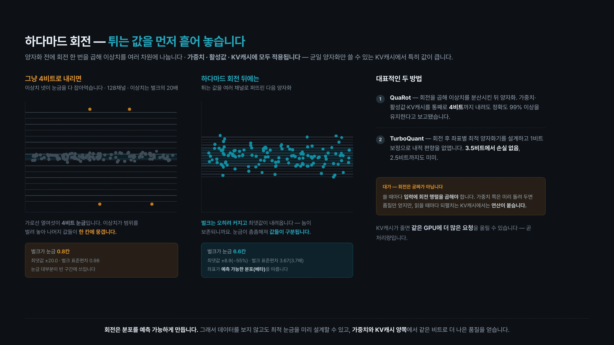

회전 기법의 주요 기술적 특징은 다음과 같습니다:

- **하다마드 회전 (Hadamard Rotation)**: 128차원 고차원 공간에서 직교 회전을 씌우면 튀는 수치 피크가 **91.2% 폭락**하며 0 근처의 정규분포 $\mathcal{N}(0, \sigma^2)$로 다듬어집니다. 이 수렴이 **푸앵카레–맥스웰–보렐 보조정리**입니다[^pmb]. 사영 분포의 모양은 차원 하나로 정해집니다 — $f(x) \propto (1 - x^2/R^2)^{(D-3)/2}$이라, $D=2$면 양 끝이 발산하는 아크사인, $D=3$이면 **정확히 평탄한 균등 분포**(아르키메데스 모자상자 정리), $D=128$이면 $\sigma = R/\sqrt{D} = 0.884$인 좁은 정규분포가 됩니다.
- **수학적 오프라인 흡수 ($Y = (XH)(H^T W) = XW$)**: 선형 레이어 구간에서는 가중치에 미리 역회전 $H^T$를 오프라인으로 곱해 $Q(H^T W)$로 배포하므로 **가중치 회전 비용은 런타임 0**입니다. 다만 SiLU/RMSNorm/RoPE 등 비선형 경계와 KV 캐시 역양자화 시에는 런타임 FHT 연산 대가가 남습니다.
- **TurboQuant** (Google Research, ICLR 2026): 회전 후 정규분포 좌표에 미리 구해둔 **로이드-맥스(Lloyd-Max) 최적 눈금**을 덧씌우고 1비트 JL 보정을 결합해 4비트 이하에서 오차를 소멸시킵니다.
- **PolarQuant** ([arXiv:2502.02617](https://arxiv.org/abs/2502.02617)): 직교 좌표 대신 **극좌표(반지름+각도)**로 바꾼 뒤 각도만 양자화하여 블록별 스케일(정규화 상수) 저장 메타데이터 용량을 **0개(Zero Overhead)**로 지워버립니다.

#### 3대 엔진의 가중치 및 KV캐시 양자화 지원 현황

| 엔진 | 도는 곳 | 가중치 양자화 | KV캐시 양자화 |
|---|---|---|---|
| **vLLM** | 데이터센터 GPU 노드 | FP8 · AWQ · SpinQuant · NVFP4 (Marlin/Cutlass INT4 & FP4) | **FP8 실무 표준** · INT8/4 · 회전 4비트 (fused_hadamard FHT · 레이어별 제외 가능) |
| **llama.cpp** | 개인 PC · 단일 GPU · CPU | Q4_K_M · IQ4_XS · Dynamic 2.0 (GGUF 오프라인 회전 흡수) | Q8_0 · Q4_0 (`--cache-type-k`/`-v`로 **K와 V를 따로**) |
| **Apple MLX** | **애플 실리콘 맥 전 기종** (맥 스튜디오 · 미니 · 아이맥 · 맥북) | MLX 4비트 / 8비트 (hadamard 원시연산자 지원) | 4비트 / 8비트 · PolarQuant (quantized_kv_cache & Metal) |

대규모 서버(vLLM)는 **FP8 KV캐시**가 실무 표준이며, 로컬(llama.cpp/MLX)은 **Q-quants 및 4비트 회전**이 자리잡았습니다. **"맥북"이 아니라 "애플 실리콘 맥"인 이유는** 통합 메모리로 큰 모델을 담는 쪽에서는 맥 스튜디오·맥 미니가 오히려 주력이기 때문입니다.

### 7.3 그래서 양자화하면 뭐가 좋나요?

양자화는 이 문서에서 계속 다룬 프리필/디코딩 병목 구조에 세 가지
방향으로 직접 이득을 줍니다.

- **연산 자체가 빨라집니다.** FP8·MXFP4·NVFP4처럼 GPU가 네이티브로
  가속하는 포맷이라면, 같은 텐서코어로 더 많은 연산을 동시에 처리할
  수 있습니다. 프리필처럼 연산량(compute)이 지배적인 단계에서 특히
  체감됩니다.
- **메모리 사용량이 줄어 디코딩이 빨라집니다.** 디코딩은 매 토큰마다
  모델 전체를 메모리에서 다시 읽어야 하는 메모리 대역폭 병목[^mem-bandwidth]
  이었죠. 가중치를 16비트에서 4비트로 낮추면 읽어야 할 바이트 수가
  1/4로 줄어드니, 같은 대역폭으로 더 짧은 시간에 다 읽을 수 있고 —
  곧 초당 생성 가능한 토큰 수가 늘어납니다.
- **KV캐시가 줄면 동시성이 늘어납니다.** KV캐시 양자화(7.2)로 캐시가
  차지하는 메모리가 줄면, 같은 GPU 메모리로 더 많은 요청의 KV캐시를
  동시에 올려둘 수 있습니다. 즉 배치 크기(동시에 처리하는 요청 수)를
  키울 수 있어, 서버 전체의 처리량(throughput)이 늘어납니다.

## 8. 여러 장에 나눠 돌리기: 병렬화 4대 기법

> "짐이 커서 나누기도 하고, 손이 여럿이라 나누기도 합니다"

[3장](#3-llm을-담기-위해서는-얼마만큼의-메모리가-필요할까요)에서 "H200 여덟 장이면
1,128GB이니 서빙이 됩니다"라고 장수를 셌고,
[6.6](#66-kimi-k3---kimi-delta-attention-kda)은 "B300 8장, 권장은 64장 이상"으로
끝났습니다. 그런데 **한 모델이 여러 장에 어떻게 걸치는지**는 아직 말하지 않았습니다.

6\~7장이 모델 쪽에서 청구서를 깎았다면, 이 장은 **서버 쪽에서 같은 청구서를 나눕니다.**

### 8.1 나누는 4가지 방식

가로로 자르느냐, 세로로 자르느냐, 아니면 아예 통째로 복제하느냐입니다.

| 방식 | 무엇을 나누나 | 통신 | 주로 쓰는 자리 |
|---|---|---|---|
| **TP** 텐서 병렬 | 한 레이어의 행렬을 여러 장이 쪼개 계산 | 레이어마다 all-reduce | 노드 안(NVLink) |
| **DP** 데이터 병렬 | 안 나눕니다 — 통째로 복제하고 요청을 분산 | 요청 단위, 사실상 없음 | 한 장에 담기는 모델 |
| **PP** 파이프라인 병렬 | 레이어를 구간으로 잘라 장마다 배정 | 구간 경계에서 한 번 | 노드를 넘어야 할 때 |
| **EP** 전문가 병렬 | MoE 전문가를 장마다 나눠 보관 | 레이어마다 **all-to-all 두 번** | 큰 MoE |

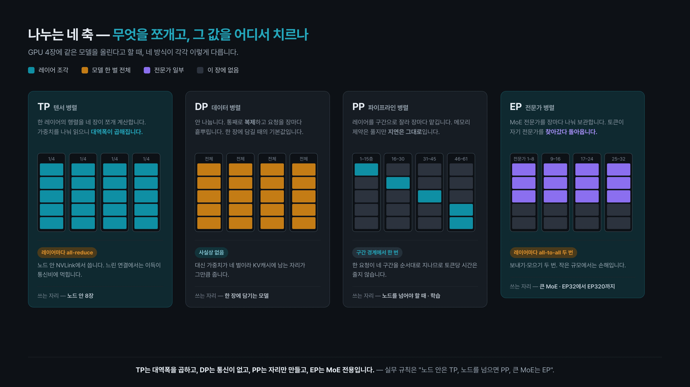

셋만 기억하면 됩니다.

- **TP는 대역폭을 곱합니다.** 가중치를 쪼개 여러 장이 동시에 읽으니
  [5.2장](#52-디코딩)의 "읽는 속도가 그대로 성능"이 그만큼 개선됩니다[^tp-latency].
- **PP는 메모리 제약만 풉니다.** 지연을 본질적으로 줄이지는 않습니다 — 그래서 이 장의
  주인공은 TP와 EP이고, 장 제목도 "파이프라인"이 아닙니다[^pp-latency].
- **EP는 MoE 전용 방식입니다.** 토큰이 자기 전문가가 있는 장으로 갔다가 돌아와야 해서
  레이어마다 보내기·모으기 두 번의 all-to-all이 붙습니다.

### 8.2 담기는데도 나눕니다

한 장에 들어가면 **안 나누는 게 기본값**입니다. 통째로 복제(DP)하면 통신이 0이니까요.
그런데도 나누는 이유가 셋 있습니다.

**1. 한 사람이 받는 속도.** 4장으로 쪼개면 각자 1/4만 읽습니다. 총 바이트는 그대로인데
병렬 대역폭이 4배가 됩니다.

**2. KV캐시 자리.** 가중치가 GPU당 줄어든 만큼 KV캐시가 들어갑니다. 그리고 이 효과는
선형이 아닙니다 — vLLM 사례에서 TP1에서 TP2로 갈 때 KV 블록이 **13.9배**로 늘어
처리량이 **3.9배**가 됐습니다. 장수 2배로 기대할 2배를 크게 넘습니다[^tp-superlinear].

**3. 큰 배치의 전문가 읽기.** 배치가 커지면 그 안의 토큰들이 전문가 대부분을 건드립니다.
EP로 나누면 각 장이 자기 전문가만 읽고 그것을 여러 토큰이 함께 씁니다[^ep-batch].

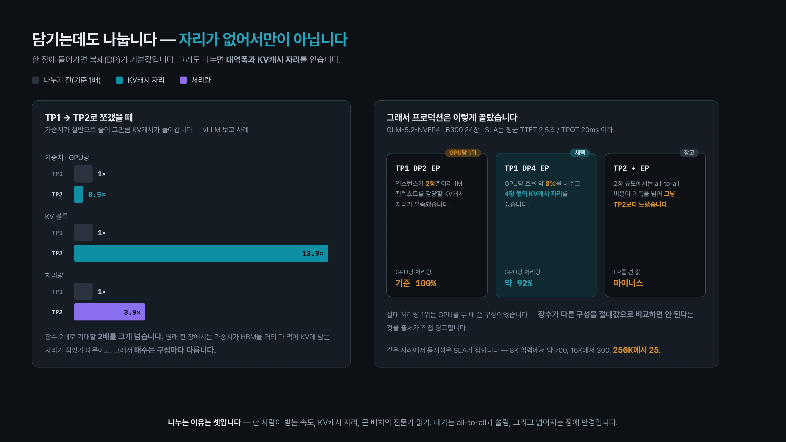

실제 판단을 보면 더 분명합니다. GLM-5.2를 B300 24장에 올린 사례에서 **GPU당 처리량
1위는 2장짜리 인스턴스**였지만, 그 구성은 1M 컨텍스트를 감당할 KV캐시 자리가 부족했습니다.
그래서 **GPU당 효율 약 8%를 내주고 4장짜리 인스턴스**를 골랐습니다[^glm-b300].

**대가도 있습니다.** all-to-all 지연이 붙고, 특정 전문가에 일이 몰리며, 장애 반경이
넓어집니다. 그래서 **규모가 작으면 EP는 오히려 손해**입니다 — 같은 사례에서 2장 규모의
TP2에 EP를 켜자 그냥 TP2보다 느려졌습니다. 전문가를 충분히 많은 장에 흩뿌려야 통신비가
상환되기 때문입니다[^small-ep].

### 8.3 MoE는 전문가로 나눕니다

DeepSeek V3는 배포 구성을 공개했습니다. 프리필과 디코딩의 규모가 **10배** 차이 납니다.

| | 프리필 | 디코딩 |
|---|---|---|
| 최소 배포 단위 | 4노드 **32장** | 40노드 **320장** |
| 어텐션 | TP4 + DP8 | TP4 + **DP80** |
| MoE | **EP32** | **EP320** |
| 장당 전문가 | 8개 + 중복 1개 | **1개** |

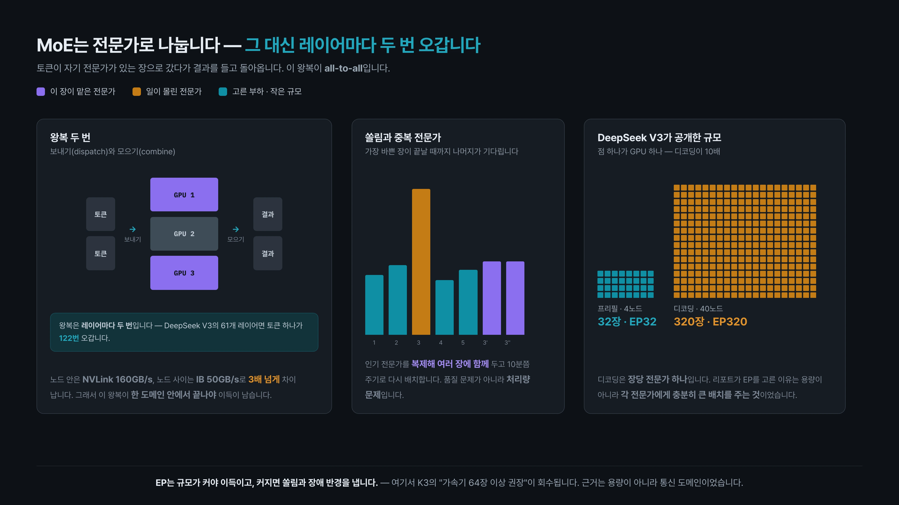

EP를 쓴 이유가 용량만이 아닙니다. 리포트가 든 이유는 **각 전문가가 충분히 큰 배치를
처리하게 해서 연산 효율을 높인다**는 것입니다[^dsv3-deploy].

문제는 **쏠림**입니다. 어떤 전문가에 일이 몰리면 그 장이 끝날 때까지 나머지가 기다립니다.
그래서 인기 있는 전문가를 복제해 여러 장에 함께 두고(중복 전문가), 10분쯤 주기로 다시
배치합니다. 서빙 엔진에도 같은 장치가 들어 있습니다[^eplb].

그리고 all-to-all은 **어느 선을 타고 가느냐**가 성능을 정합니다. 노드 안은 NVLink,
노드 사이는 InfiniBand이고 대역폭이 세 배 넘게 차이 납니다. 여기서
[6.6의 "가속기 64장 이상 권장"](#66-kimi-k3---kimi-delta-attention-kda)이 회수됩니다 —
Moonshot이 든 이유가 용량이 아니라 **고대역폭 통신 도메인이 클수록 추론 효율이 좋아진다**
였습니다[^k3-supernode].

### 8.4 프리필과 디코딩을 다른 GPU로

[5장](#5-llm-모델의-연산-프리필과-디코딩)에서 동시 사용자를 100명으로 올리자 첫 토큰이
0.29초에서 20.6초로 밀렸습니다. 원인은 **새로 들어온 요청의 프리필이 진행 중인 디코딩과
GPU를 나눠 쓰는 것**입니다.

그러면 아예 **다른 GPU에 맡기면 됩니다.** 프리필 전용 노드가 입력을 처리해 KV캐시를
만들고, 그것을 디코딩 전용 노드로 전송합니다. 디코딩의 토큰 간 지연이 남의 프롬프트
길이에 흔들리지 않게 되는 것이 요점입니다[^pd-disagg].

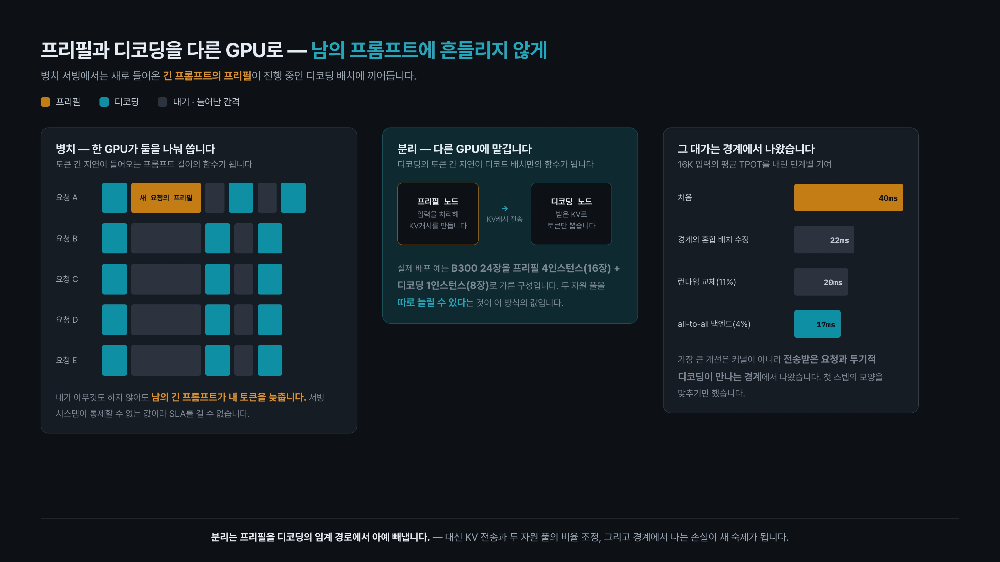

대신 청구서가 하나 더 생깁니다. **KV캐시를 노드 사이로 옮겨야** 하고, 두 자원 풀의 비율을
맞춰야 하며, 어느 쪽이 막혔는지 따로 봐야 합니다. 실제로 가장 큰 손실이 커널이 아니라
**두 시스템의 경계**에서 나기도 합니다[^pd-boundary].

#### 그런데 분리가 처리량을 올려 주는 건 아닙니다

여기서 오해가 갈립니다. 섞어 돌리는 것 자체는 **처리량에 유리합니다.** 디코딩 스텝은
대역폭을 쓰고 연산 유닛을 놀리므로, 그 빈 연산에 프리필 청크를 얹으면 **가중치 읽기를
한 번만 하고** 두 일을 함께 끝냅니다[^chunked-free].

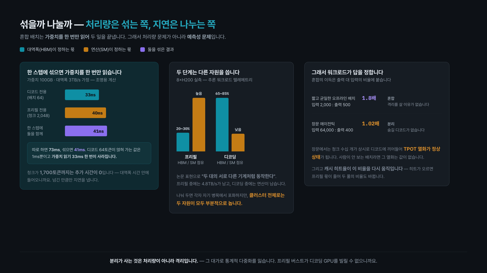

그래서 분리가 사는 것은 처리량이 아니라 **지연을 트래픽에서 떼어내는 격리**입니다.
지표를 바꿔 말하면 **goodput** — SLA를 지키면서 낸 처리량입니다[^goodput]. 병치에서
TTFT와 TPOT를 둘 다 지키려면 배치와 청크 예산을 줄이거나 GPU를 여유 있게 깔아야 하는데,
그 여유분이 낭비입니다. 분리는 그 여유분을 걷어냅니다.

그리고 격리를 사는 대가로 **통계적 다중화를 잃습니다.** 병치라면 프리필이 몰릴 때
클러스터 전체 연산을 끌어다 쓰지만, 나눠 두면 프리필 버스트가 디코딩 GPU를 빌릴 수
없습니다. 입출력 비율이 흔들리면 한쪽 풀이 놉니다.

#### 그래서 워크로드가 답을 정합니다

| 워크로드 | 혼합의 이득 | 답 |
|---|---|---|
| 짧고 균일한 오프라인 배치 (사람이 안 봄) | 최대 **1.8배** | **혼합** — 격리를 살 이유가 없습니다 |
| 장문 에이전틱 (입력 64K : 출력 400) | 약 **1.02배** | **분리** — 숨길 디코드가 없고 TPOT 열화는 상시화됩니다 |

숨길 디코드가 얼마나 있느냐가 갈림길입니다[^mix-ratio]. 그리고 [5.3장의 캐시
히트](#53-kv-캐시-히트)가 이 비율을 다시 움직입니다 — 히트율이 오르면 프리필 몫이
줄어들어 두 풀의 비율도 함께 바뀝니다[^pool-ratio].

### 8.5 청구서가 셋이 됩니다

3장은 용량, 4장은 KV캐시였습니다. 여러 장에 걸치는 순간 **통신**이 셋째 청구서로 붙습니다.

| 청구서(부하) | 무엇에 비례하나 | 절감 수단 / 해결책 |
|---|---|---|
| **용량**(3장) | 파라미터 수 × 정밀도 | 양자화 |
| **KV캐시**(4장) | 사용자 수 × 대화 길이 × 모델 × 정밀도 | 아키텍처 · KV 양자화 |
| **통신**(8장) | 나눈 축과 넘는 경계의 수 | 노드 안에 묶기 · 겹치기 · 쏠림 잡기 |

그래서 "몇 장 필요한가"에는 답이 하나가 아닙니다. **가중치가 들어가는 최소**와
**SLA를 지키며 서빙되는 구성**은 다른 숫자이고, 6.6의 8장과 64장이 정확히 그 차이입니다.

## 9. AI 소버린

> "더 이상 AI는 모두의 것이 아니라, 각자 자신의 것을 만들어야 하는
> 국가 전략자산이 되었다"

### 9.1 국가 단위의 AI 소버린

지금까지의 아키텍처 이야기는 결국 **"GPU가 부족해도 어떻게 쓸 만한 모델을
만드느냐"**로 수렴합니다. 그리고 그 부족은 기술 문제가 아니라 규제의 결과입니다.

**통제의 범위가 3단계로 넓어졌습니다.**

| 단계 | 통제 대상 | 실제로 벌어진 일 |
|---|---|---|
| 1. 하드웨어 | GPU 수출 | Blackwell 계열 중국 수출 차단. H20·성능을 깎은 H200조차 케이스별 라이선스와 관세를 거쳐야 통과[^diffusion-rule] |
| 2. 모델 설계 | (통제가 아니라 **결과**) | 제약이 MoE·선형 어텐션·KV캐시 압축·네이티브 저비트 양자화를 낳음 |
| 3. 모델 자체 | 가중치 배포 | 중국은 최신 모델의 해외 접근 제한을 논의[^ai-sovereign], 미국은 자국 모델에 **수출통제 지시**를 걸어 모든 외국인의 접근을 한때 차단[^us-export-directive] |

2단계가 이 문서의 6장 전체입니다. 수입이 막힌 중국은 Huawei Ascend(910C, 950
시리즈)로 인프라를 자체 조달하는 한편, 연산량과 메모리를 극단적으로 아끼는
아키텍처를 발전시켰습니다.

> **"싸게, 그러나 뛰어나게"는 선택이 아니라 제재가 강제한 방향이었습니다.**

3단계가 특히 최근의 변화입니다. **가장 앞선 모델은 국내 전용으로 묶고, 한 세대
뒤처진 모델만 공개한다** — 오픈웨이트조차 계층화 대상이 되고 있습니다.

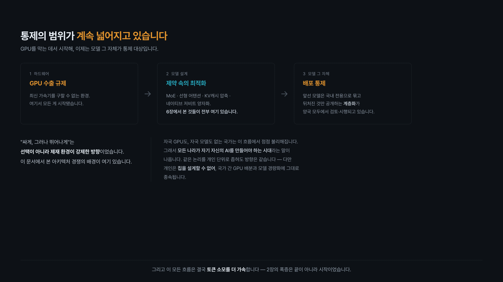

**그 계층화가 중국만의 일이 아닙니다.** 2026년 6월 Anthropic은 같은 모델을 둘로 갈라,
세이프가드를 얹은 Fable 5만 일반 공개하고 세이프가드를 뗀 Mythos 5는 미국 정부와 함께
운영하는 심사 프로그램 참여자에게만 주었습니다. 열흘 뒤 미국 정부는 **그 두 모델에 대한
모든 외국인의 접근**을 수출통제 지시로 중단시켰습니다 — 자국 기업의 자국 모델인데도
국적으로 접근을 갈랐고, Anthropic 소속 외국인 직원까지 포함이었습니다[^us-export-directive].
[6.6](#66-kimi-k3---kimi-delta-attention-kda)에서 본 신원·관할 게이트가 그 연장이며,
같은 구조를 OpenAI와 Google도 씁니다[^frontier-gating].

**그리고 통제 대상에 "그 칩을 위한 소프트웨어"가 들어왔습니다.** Fable 5가 막는 목록에는
프론티어급 LLM 데이터 파이프라인과 함께 **특정 비표준 칩을 위한 커널 개발**이 있습니다.
Anthropic이 밝힌 이유는 이 문서의 논지를 그대로 되풀이합니다 — 미국과 동맹은 프론티어
칩과 **그것을 제 성능으로 돌리는 고도로 최적화된 소프트웨어** 양쪽에서 우위를 갖고 있고,
그 우위가 깎이지 않게 한다는 것입니다[^fable-gating]. 1단계가 칩을 막고 3단계가 가중치를
막는 사이, **칩과 가중치를 잇는 커널까지** 통제 지도에 올랐습니다 — [11장에서 볼 엔진과
커널](#11-추론-엔진과-커널-그-하드웨어에서-무엇으로-돌리나)이 왜 소버린의 일부인지가 여기서 분명해집니다.

**세 통제 대상이 임의의 목록이 아니라는 것이 요점입니다.** 모델 한 장을 돌리려면 칩과 커널과
가중치가 다 있어야 하고, 통제는 그 세 겹에 각각 걸립니다 — 하나만 막혀도 나머지가 멈춥니다.

자국 GPU도 자국 모델도 없는 국가는 세 단계 모두에서 남의 결정에 종속됩니다.
"모든 나라가 자기 자신의 AI를 만들어야 하는 시대"라는 말은 그런 뜻입니다.

### 9.2 그럼 한국은 어디쯤 있나

남의 나라 이야기처럼 들리지만 우리도 같은 3단계 안에 있습니다. 1단계(하드웨어)와
3단계(모델 자체)를 동시에 밀고 있는 중입니다.

**1단계 — GPU 인프라 확보 (미국 vs 중국 vs 한국)**[^kr-gpu]

| 국가 / 구분 | 주요 보유 인프라 규모 | 비고 |
|---|---|---|
| **미국 (Hyper-scalers)** | **\~100만 장 이상** (2026 CAPEX $764B) | Colossus 1(22만장) 등 데이터센터 단위 압도적 물량 |
| **중국 (Hyper-scalers)** | **\~30만 장 수준** (2026 CAPEX $102B) | 수출 규제 우회 및 자국 칩(Huawei/Cambricon) 병행 |
| **한국 (합산 인프라)** | **\~7.3만 장** (정부 2.3만장 + 민간 \~5만장) | **총 비용 환산 약 5조 원** (정부 1·2차 2조 800억 원) |

* **정부 1차 확보분**: 13,136장 (B200 10,080 + H200 3,056, 2025-12 발표 · 보도 표현은 "약 1만 3천 장")
* **'AI 고속도로' 2차**: 9,704장 (B300 7,688 + Vera Rubin 2,016, 2조 800억 원)
* **민간 개별 구축**: 네이버·SKT·카카오 등 약 5만 장 추산

**3단계 — 모델을 직접 만드는 독자 AI 파운데이션 모델 (독파모)**

정부가 GPU와 데이터를 지원하고 **6개월마다 성과 평가 서바이벌**을 치르는 구조입니다. 2026년 1월 1차 평가에서는 **"해외 모델 파인튜닝 파생형은 인정하지 않는다"**는 독자성 미충족 사유로 두 팀이 탈락했습니다[^dokpamo].

#### 2026년 7월 독파모 2차 공개 결과 및 AAII v4.1 점수

2026년 7월에 네 팀이 250B·314B·688B·750B 대형 MoE 파운데이션 모델 오픈웨이트를 공개했습니다[^kr-july-wave].

| 모델 | 팀 | 총 / 활성 파라미터 | 주요 어텐션 및 특이점 | AAII v4.1 점수 |
|---|---|---|---|---|
| **Motif 3 Beta** | 모티프테크놀로지스 | 314B / 약 13B | 자체 설계 어텐션 | **44점** (오픈웨이트 미·중 외 1위) |
| **Solar Open 2** | 업스테이지 | 250B / 15B | GQA 12개 레이어 + 선형 하이브리드 | — |
| **A.X K2** | SK텔레콤 | 688B / 33B | MLA + 희소 인덱서 (사전학습 FP8) | 자체 AIME26 97.1 |
| **K-EXAONE 2.0** | LG AI연구원 | 750B / 37B | GQA 8그룹 + SWA 58층 (모델 업사이클링) | — (자체 OpenAI-MRCR 94.4) |

**네 모델 중 AAII 지수에 오른 것은 Motif 3 하나뿐입니다.** 나머지 셋은 공개가 7월 하순이라 2026년 7월 31일 스냅샷에 아직 없습니다 — 지수의 `K-EXAONE 22점`은 **1차 시즌 모델**(236B / 활성 23B, 2025-12-31 공개)의 값이지 K-EXAONE 2.0의 값이 아닙니다[^kr-bench].

**GPU가 10배 이상 부족한 여건 속에서도** 네 팀 모두 MoE로 활성 파라미터 부담을 낮추고 MLA/SWA/FP8 학습 등 효율화 정공법을 채택하여 독자 파운데이션 모델을 성공적으로 완성했습니다.

한 가지만 나란히 놓고 보겠습니다:

| 구분 | GPU 인프라 규모 |
|---|---|
| xAI Colossus 1 (데이터센터 단 1곳) | **220,000장** |
| 한국 정부 1·2차 확보 물량 전체 | **22,840장** (1차 13,136 + 2차 9,704) |

**데이터센터 단 1곳과 비교해도 약 10배 차이입니다.** (민간 5만 장 합산 시 약 3배 차이) 이것이 바로 컴퓨트 리소스 절감 기술이 한국 AI 생태계에 교양이 아닌 필수 생존 조건인 이유입니다.

### 9.3 개인이 소유한 AI

같은 논리를 개인 단위로 좁혀도 방향은 똑같습니다.

개인도 애플 실리콘·DGX Spark 같은 로컬 AI 하드웨어를 찾고 있습니다.
**API 비용을 아끼려는 게 아닙니다.** 내 대화 기록, 내 파일, 내 업무 맥락을 담아
두고 나만을 위해 돌아가는 비서를 **내가 소유한 하드웨어에서** 돌리려는 것입니다.

문제는 개인은 칩을 설계할 수 없다는 점입니다. 그래서 개인의 소버린은 두 가지에
그대로 종속됩니다.

- **국가 간 GPU 배분** — 우리나라가 GPU를 얼마나 확보하느냐(9.2의 그 숫자)
- **모델 경량화** — 6·7장에서 본 MoE·선형 어텐션·양자화가 얼마나 더 나아가느냐

둘째가 개인에게 특히 무거운 이유가 있습니다. **개인용 하드웨어는 메모리 계층이 둘뿐입니다.**
애플 실리콘도 DGX Spark도 통합 메모리 하나에 SSD가 바로 붙은 구조라, 데이터센터가 쓰는
완충 계층(호스트 DRAM)이 없습니다[^personal-tier]. 그래서
[5.3장의 계층](#히트한-kv는-어디에-보관되나)으로 미루는 방식이 잘 통하지 않고 **모델과 KV를
실제로 작게 만드는 것**만 남습니다.

즉 "우리 모두에게 자비스가 필요하다"가 현실이 되려면 국가 단위의 자립 경쟁과
경량화 경쟁이 먼저 풀려야 합니다.

그리고 이 흐름 — 나라마다 자국 모델, 개인마다 상시 비서 — 은 토큰 소모를 다시
가속합니다. **2장의 토큰 폭증은 끝이 아니라 시작이었습니다.**

## 10. 부록: NVIDIA 데이터센터 GPU 로드맵 & 플랫폼 비교

> "알고리즘이 길을 열고, 하드웨어가 칩으로 굳혀온 10년"

NVIDIA 데이터센터 GPU의 주요 세대별(V100 \~ Rubin, Feynman) 공정, 메모리, 대역폭 및 기술 스펙 발전 히스토리입니다. FP8·FP4, 하다마드 회전 양자화(TurboQuant) 등 소프트웨어/알고리즘 혁신을 하드웨어 전용 연산기(Transformer Engine 등)로 실리콘에 박아 넣은 진화 과정입니다.

![NVIDIA 데이터센터 GPU 제품 히스토리 아홉 세대 — 세대·시기·공정·메모리·대역폭과 맨 오른쪽 '칩으로 굳은 것' 열로 구성. V100(Volta, 2017, TSMC 12nm, HBM2 32GB, 0.9TB/s)은 텐서코어 1세대 FP16과 첫 HBM 적용, A100(Ampere, 2020, TSMC 7nm, HBM2e 80GB, 2.0TB/s)은 BF16·INT8·INT4, H100(Hopper, 2022, TSMC 4N, HBM3 80GB, 3.35TB/s)은 Transformer Engine 1세대 FP8, H200(2024, TSMC 4N, HBM3e 141GB, 4.8TB/s)은 이 발표의 메모리 기준 100%, B200(Blackwell, 2024, TSMC 4NP, HBM3e 192GB, 8TB/s)은 Transformer Engine 2세대 FP4, B300(Blackwell Ultra, 2025, TSMC 4NP, HBM3e 288GB, 8TB/s)은 이 발표의 메모리 기준 204%, Rubin R100(Vera Rubin, 2026, TSMC N3, HBM4 288GB, 22TB/s)은 Transformer Engine 3세대 회전 가속과 Vera CPU. 그 아래로 점선 구획을 두어 여기부터는 예고이며 확정 스펙이 아니라고 밝히고 Rubin Ultra(2027, N3 refine, HBM4 확장, 밀도 향상)와 Feynman(2028, TSMC A16, 커스텀 HBM 1TB+ 보고, 3D 다이 스태킹·광 NVLink)을 회색으로 배치](./assets/gpu_gen.webp)

**맨 오른쪽 열만 따라 읽으면 이 장의 논지가 끝납니다** — FP16 → BF16·INT8 → FP8 → FP4 →
회전. 세대마다 새 연산기가 하나씩 늘었고, 그 순서가 [6장](#6-아키텍처-살펴보기)·[7장](#7-quantization)에서
본 기법의 순서와 같습니다. **점선 아래(Rubin Ultra·Feynman)는 확정 스펙이 아니라 발표 자료
기준**이고, Rubin의 22TB/s도 초기 물량이 목표보다 낮을 수 있다는 단서가 남아 있습니다[^rubin-verify].

**용량과 대역폭이 같은 속도로 늘지 않았습니다** — 9년 동안 용량은 9배, 대역폭은 24배입니다.
용량은 [3장의 청구서](#3-llm을-담기-위해서는-얼마만큼의-메모리가-필요할까요)를,
대역폭은 [5.2장의 병목](#52-디코딩)을 직접 건드립니다.

### 10.1 세대별 & 랙 스케일 플랫폼 직접 비교 (V100 / A100 / H200 / Blackwell / Rubin)

단일 서버(V100\~H200)에서 Blackwell·Rubin 세대의 CPU-GPU 결합 랙 스케일(NVL72)로 확장되며 대역폭과 연산 밀도가 비약적으로 향상됩니다.

![단위가 한 대에서 한 랙으로 바뀝니다 — 다섯 세대(V100 Volta · A100 Ampere · H200 Hopper · B300/GB200 Blackwell · R100/Vera Rubin)를 두 블록으로 갈라 비교한 표. H200과 Blackwell 사이에 세로 점선을 세우고 여기서부터 랙이 단위라고 표시했다. 위 블록은 단품 서버(8-GPU 노드, 가속기 한 장 기준)로 다섯 세대 모두 값이 있다 — 메모리 용량 32GB HBM2 / 80GB HBM2e / 141GB HBM3e(100%) / 288GB HBM3e(204%) / 288GB HBM4, 메모리 대역폭 0.9 / 2.0 / 4.8(100%) / 8.0(167%) / 22TB/s(458%), NVLink 대역폭 300GB/s / 600GB/s / 900GB/s / 1.8TB/s / 대역폭 확장. 아래 블록은 랙 스케일(NVL72)로 V100·A100·H200 세 열이 전부 비어 있고 대시만 있다 — 구성은 Grace 36 + Blackwell 72와 Vera 36 + Rubin 72, 랙 메모리 용량 13.8\~20.7TB와 20.7TB HBM4, 랙 메모리 대역폭 576TB/s와 1,580TB/s, 랙 NVLink 대역폭 130TB/s와 260TB/s](./assets/platform_cmp.webp)

**왼쪽 아래 세 칸이 비어 있는 것이 요점입니다.** V100부터 H200까지는 단일 호스트 8-GPU가
제품 단위였고 랙은 그 서버를 여러 대 꽂는 껍데기였습니다. Blackwell부터는 CPU와 GPU를 한 랙에
묶은 NVL72 자체가 단위가 됩니다 — **랙이 더 큰 서버가 아니라 새로 생긴 층**이라는 뜻이고,
[8장의 병렬화](#8-여러-장에-나눠-돌리기-병렬화-4대-기법)가 걸치는 무대가 여기입니다.
세대별 가속기 특성(Transformer Engine 세대 등)은 [위 세대표](#10-부록-nvidia-데이터센터-gpu-로드맵--플랫폼-비교)에,
Groq 3 LPU는 [10.2](#102-groq-3-lpu--디코딩-병목을-하드웨어로-겨냥하다)에 따로 두었습니다.

### 10.2 Groq 3 LPU — 디코딩 병목을 하드웨어로 겨냥하다

Rubin 플랫폼에는 GPU 외에 **추론 전용 가속기 Groq 3 LPU**가 결합됩니다.

| 항목 | Groq 3 LPX 랙 |
|---|---|
| LPU | 256개 |
| **온칩 SRAM** | **128GB** (40PB/s 대역폭) |
| 스케일업 대역폭 | 640TB/s (랙 내부) |
| NVL72 병행 배치 | 와트당 추론 성능 **35배**, 토큰당 비용 최대 **10배** 절감 |

## 11. 추론 엔진과 커널: 그 하드웨어에서 무엇으로 돌리나

> "하드웨어 스펙을 실질적인 서빙 속도로 바꾸는 기술"

vLLM · llama.cpp · oMLX — 완성된 모델을 최적으로 구동하는 서빙 소프트웨어의 정체입니다.
방금 개인의 소버린이 GPU 배분과 모델 경량화에 종속된다고 했는데, 사실 하나가
더 있습니다. **그 하드웨어 위에서 무엇이 모델을 돌리느냐**입니다. 그리고 이
자리에 앉는 소프트웨어가 하는 일이, 공교롭게도 **이 문서가 4\~5장에서 내내
설명한 그것**입니다 — KV캐시를 관리하고 요청을 묶는 일이요.

### 11.1 프레임워크와 추론 엔진은 다릅니다

가장 많이 헷갈리는 구분이라 먼저 짚습니다.

**엔진이 학습을 버리고 얻은 것**이 곧 이 문서의 주제입니다. KV캐시를 페이지
단위로 쪼개 관리하고(PagedAttention), 길이가 제각각인 요청을 쉴 틈 없이 묶고
(연속 배치), 프리픽스가 겹치면 재사용하고([5.3장](#53-kv-캐시-히트)) —
전부 **두 청구서를 실제로 깎는 실무**입니다.

바꿔 말하면, 6·7장이 **모델 쪽에서** 청구서를 깎았다면 추론 엔진은 **서버
쪽에서** 같은 청구서를 깎습니다.

### 11.2 실제 서빙 스택 구조 예시 (애플 실리콘 vs NVIDIA DGX Spark)

하드웨어 환경별로 하부 인프라부터 최상단 앱까지 소프트웨어 레이어가 1:1로 대칭되는 서빙 스택 구조를 가지고 있습니다.

**색이 든 두 겹만 보면 됩니다** — 5층(추론 엔진)이 방금 본 것이고, 2층(가속 드라이버·커널)이
다음 절에서 볼 것이자 [9.1에서 통제 대상으로 나온 그 겹](#91-국가-단위의-ai-소버린)입니다.

애플의 **MLX → mlx-lm → oMLX** 스택에 1:1로 대응하는 엔터프라이즈 및 로컬 스택이 바로 NVIDIA의 **CUDA → TensorRT-LLM → NIM / llama.cpp** 구조이며, 로컬 및 데스크톱 환경에서는 `llama.cpp`가 널리 활용되고 있습니다.

### 11.3 하드웨어와 모델을 잇는 커널

스택 2층입니다. 커널은 연산 장치에 **무엇을 어떤 순서로 읽고 계산할지** 지시하는 최하단
코드이고, 같은 어텐션을 같은 칩에서 계산해도 이 순서 하나로 속도가 갈립니다.

![커널이 바꾸는 것은 연산량이 아니라 메모리 왕복 — 같은 두 층(위 SRAM 온칩, 아래 HBM)을 쓰는 두 보드를 나란히 놓았다. 왼쪽 '그대로 짜면'은 SRAM 안에서 Q×K, softmax, P×V 세 단계가 각각 돌고 그때마다 HBM에서 읽어 올리고 다시 내려 쓰는 화살표 쌍이 셋이라 왕복이 세 번이며, HBM에는 Q·K·V 외에 중간행렬 S와 P가 앰버로 남는다. 중간행렬은 쓰자마자 다시 읽는데 크기가 토큰 수의 제곱이라 오가는 양이 연산량보다 먼저 한계에 닿는다. 오른쪽 FlashAttention 커널은 타일 하나를 SRAM에 올려 두고 Q×K → softmax → P×V를 그 안에서 끝내며 타일마다 반복한다. 한 번 읽고 한 번 쓰므로 왕복이 한 번이고, HBM 가운데는 점선 빈 칸으로 중간행렬을 여기에 쓰지 않는다고 적혀 있다. 곱셈 횟수는 왼쪽과 거의 같고 오간 양만 줄였는데 그것이 실제 속도를 정한다. 아래 띠 셋은 커널이 사는 곳(CUDA·Triton·Metal Performance Shaders), 이 문서에 나온 커널(FlashAttention·PagedAttention), 그리고 칩을 만들어도 커널이 없으면 같은 실리콘에서 제 성능의 30%도 못 낸다는 소버린 카드](./assets/kernel_role.webp)

**곱셈 횟수는 양쪽이 거의 같습니다.** 오간 양만 줄였는데 속도가 갈립니다 — "커널 최적화"가
연산을 줄이는 일이라고 오해하기 쉽지만, 실제로 하는 일은 **메모리 왕복을 줄이는 순서
바꾸기**입니다. 중간행렬 S와 P는 **토큰 수의 제곱** 크기라, 컨텍스트가 길어질수록
[4장에서 본 문제](#4-llm에게-일을-시키려면-얼마만큼의-메모리가-필요할까요)와 여기서 만납니다.

**그래서 커널이 소버린의 일부입니다.** 칩을 만들어도 꺼내 쓸 코드가 없으면 같은 실리콘에서
제 성능의 30%도 못 내는 일이 생깁니다. 독자 NPU의 진짜 조건이 칩 설계가 아니라 **커널 생태계
자립**인 이유이고, 통제 목록에 "비표준 칩 커널 개발"이 들어간 이유도
같습니다[^fable-gating] — [9.1](#91-국가-단위의-ai-소버린)의 가운데 겹이 이것입니다.

### 11.4 그런데 맥은 메모리 계층이 둘뿐입니다

통합 메모리의 이면입니다. 서버는 [5.3장의 계층](#히트한-kv는-어디에-보관되나)에서 GPU
메모리와 SSD 사이에 **호스트 DRAM**이 완충으로 들어가는데, 애플 실리콘은 그 둘이 같은 물리
메모리라 완충할 칸이 없습니다.

| | 1단 | 2단 |
|---|---|---|
| 서버 (H200 + NVMe) | HBM → 호스트 DRAM **76배** 하락 | → NVMe **4.5배** 하락 |
| 맥 (M5 Max 40코어) | — 같은 메모리 | 통합 614GB/s → 내장 SSD **60\~90배** 하락 |

서버는 절벽을 두 걸음에 나눠 내려가고 **맥은 한 걸음에 떨어집니다.** 그래서 위 표의 oMLX
2단계 캐시에서 SSD 쪽으로 넘어가면 체감이 급격히 나빠지는데, 원인은 대역폭보다 **페이지
폴트와 wired 메모리 제약**이 먼저입니다[^mac-tier].

**그래서 맥에서는 KV를 옮기는 대신 작게 만드는 쪽이 답입니다** — 5.3장의 계층이 아니라
[7.2장의 KV 양자화](#72-kv-캐시-양자화)가 그 자리를 대신합니다.

### 11.5 GGUF와 MLX, 같은 4비트인데 왜 다른가

로컬에서 같은 모델을 받아도 포맷이 갈리는데, **눈금을 얼마나 촘촘히
저장하느냐**에서 설계가 다릅니다[^gguf-mlx].

- **MLX 4비트**: 가중치 **64개마다** 눈금 하나. 구조가 평평해서 메탈 GPU가
  분기 없이 곧장 계산합니다.
- **GGUF `Q4_K_M`**: 슈퍼블록 안에 블록을 중첩하고 **눈금 자체도 압축**합니다.
  게다가 어텐션처럼 민감한 텐서만 5\~6비트로 **따로 보호**합니다.

그래서 **GGUF는 품질 보존에, MLX는 연산 단순함에** 유리한 트레이드오프가
됩니다. GGUF는 텐서마다 다른 커널을 불러야 하고, MLX는 눈금을 자주 저장합니다.
어느 쪽이 최종적으로 더 빠르고 작은지는 모델·칩·컨텍스트 길이에 따라
갈려서, 한 줄로 정리되지 않습니다[^gguf-mlx-bench].

**개인 입장에서 실용적인 결론**은 이렇습니다 — 포맷 선택보다 **양자화 비트를
얼마나 내리느냐**가 훨씬 큰 변수이고, 그 판단 기준은 [3장의 용량
청구서](#3-llm을-담기-위해서는-얼마만큼의-메모리가-필요할까요)와
[4장의 KV캐시](#4-llm에게-일을-시키려면-얼마만큼의-메모리가-필요할까요)로 이미 다 나왔습니다.

---

### 감사합니다

**코스피 및 반도체·AI 관련 주가 상승을 기원합니다.**

## 12. 참고 자료

**직접 fetch해서 원문/원본 데이터를 확인한 자료** (신뢰도 높음):

- [moonshotai/Kimi-K3 (Hugging Face 모델 카드)](https://huggingface.co/moonshotai/Kimi-K3) — **2026-07-28 직접 확인.** 총 2.8T / 활성 104B, 전문가 896 중 16 + 공유 2, 레이어 93(KDA 69 + Gated MLA 24), MXFP4 가중치 + MXFP8 활성값, 컨텍스트 1,048,576, MoonViT-V2 비전 인코더 401M, Kimi K3 License. 세션 8까지 미공개였던 항목이 전부 1차로 확정됐습니다 — [6.6장](#66-kimi-k3---kimi-delta-attention-kda) 근거
- [Kimi K3 Tech Blog: Open Frontier Intelligence (Moonshot AI 공식)](https://www.kimi.com/blog/kimi-k3) — 2026-07-28 직접 확인. "SFT 단계부터 QAT 적용, MXFP4 가중치 + MXFP8 활성값", "896개 중 16개 전문가 활성", "Quantile Balancing은 라우터 점수 분위수에서 전문가 배분을 직접 도출", "AttnRes가 K2 대비 약 2.5배 스케일링 효율에 기여", "가속기 64장 이상의 슈퍼노드 구성 권장" 원문 확인
- [Attention Residuals (arXiv:2603.15031, Kimi Team)](https://arxiv.org/abs/2603.15031) — 표준 residual의 고정 누적과 달리 이전 레이어 출력을 입력 의존 softmax 가중치로 선택·집계하는 구조, Kimi Linear 48B/활성 3B 선행 검증 확인
- [GQA: Training Generalized Multi-Query Transformer Models from Multi-Head Checkpoints (EMNLP 2023)](https://arxiv.org/abs/2305.13245) — Q 헤드 그룹이 더 적은 K/V 헤드를 공유해 MHA에 가까운 품질과 MQA에 가까운 속도를 노리는 구조
- [IndexCache: Accelerating Sparse Attention via Cross-Layer Index Reuse (arXiv:2603.12201)](https://arxiv.org/abs/2603.12201) — DSA 인덱서의 인접 레이어 top-k 중복을 이용해 Full/Shared 레이어로 나누는 범용 방법. GLM-5.2 모델 카드에서는 구현명을 IndexShare로 표기
- [DSpark: Confidence-Scheduled Speculative Decoding with Semi-Autoregressive Generation (arXiv:2607.05147)](https://arxiv.org/abs/2607.05147) — 초록 직접 확인. V4-Flash 60\~85% · V4-Pro 57\~78%, 하드웨어 인식 프리픽스 스케줄러 — [5.4장](#54-투기적-디코딩-순차-병목을-우회하는-법) 근거
- [DFlash: Block Diffusion for Flash Speculative Decoding (arXiv:2602.06036, ICML 2026)](https://arxiv.org/abs/2602.06036) — 초록 직접 확인. 6배 이상 무손실 가속, EAGLE-3 대비 최대 2.5배
- [vLLM PR #43081 「[SpecDecode] Support DFlash with FlashInfer」](https://github.com/vllm-project/vllm/pull/43081) — 직접 확인. **2026-06-22 병합.** FlashInfer 비인과 프리필 경로로 DFlash + FP8 KV캐시 가능(GSM8K 0.844 대 0.866), NVFP4·DCP·TRTLLM은 비인과 경로에서 계속 차단 — [5.4장](#54-투기적-디코딩-순차-병목을-우회하는-법) 근거. 함께 확인한 [이슈 #41559](https://github.com/vllm-project/vllm/issues/41559)는 이 병합 **이전에** 올라와 아직 닫히지 않은 사용자 신고로, 제목의 "모든 KV 양자화와 근본적으로 비호환"은 현재 상태가 아닙니다
- [SGLang 공식 쿡북 — GLM-5 (docs.sglang.io, 직접 fetch 확인)](https://docs.sglang.io/cookbook/autoregressive/GLM/GLM-5) — **2026-07-28 확인.** H200 8장·TP8·GLM-5-FP8·EAGLE 투기적 디코딩 구성의 `bench_serving` 원본 출력 전문을 확보했습니다. 배치 1(TTFT 290.88ms · TPOT 7.54ms · 35.78초에 입력 6,101 / 출력 4,220)과 동시 100(TTFT 20,613.80ms · TPOT 38.73ms · 출력 1,214.97 tok/s) 두 벌 — [5장](#5-llm-모델의-연산-프리필과-디코딩) 실측 그림의 근거. 같은 쿡북의 GLM-5.2 페이지에는 B200·GB300·B300·MI355X 표만 있고 **H200 행은 값이 비어 있습니다**
- [NVIDIA Dynamo 공식 레시피 — GLM-5.2 (docs.nvidia.com, 직접 fetch 확인)](https://docs.nvidia.com/dynamo/dev/recipes/glm-5-2) — 2026-07-28 확인. 에이전틱 트레이스(64K 중앙 ISL / 400 중앙 OSL, KV캐시 히트 90%) 기준 네 구성의 성능표. H200 8장 aggregated는 동시 32에서 GPU당 54.550 tok/s · 사용자 P50 52.370 tok/s · TTFT P50 1,790ms, disaggregated(8+8장)는 동시 24에서 68.860 / 53.880 / 1,874ms. SGLang + KV 인지 라우팅 + EAGLE MTP(draft 3, 수락 2.69) — [5장](#5-llm-모델의-연산-프리필과-디코딩) 대조 근거
- [Running GLM-5.2 1M Context on a Single 8×H200 Node (Phala, 직접 fetch 확인)](https://phala.com/posts/glm-5-2-1m-context-8xh200) — 2026-07-28 확인. GLM-5.2-W4AFP8 · SGLang v0.5.13.post1 · FP8 KV캐시. 단일 스트림 디코딩 75 → 118 tok/s(EAGLE), 8K/1K 동시 16에서 658 → 733 tok/s, 가중치 755GB → 368GB. **자체 실측 공개라 독립 검증은 없습니다** — [5장](#5-llm-모델의-연산-프리필과-디코딩) 대조 근거
- [A First Comprehensive Study of TurboQuant: Accuracy and Performance (vLLM 공식 블로그, 2026-05-11)](https://vllm.ai/blog/2026-05-11-turboquant) — 직접 확인. 처리량 73%/66%, KV 용량 3.4배, 256K AUC 45.8 → 31.2, "FP8이 기본값으로 최선" — [7.2장](#72-kv-캐시-양자화)의 실측 표 근거
- [PolarQuant: Quantizing KV Caches with Polar Transformation (arXiv:2502.02617)](https://arxiv.org/abs/2502.02617) — 초록 직접 확인. **기존 서술을 정정한 근거**(각도 양자화 · 정규화 상수 제거 · 4.2배 압축)
- [Qwen/Qwen3.6-27B (Hugging Face 모델 카드)](https://huggingface.co/Qwen/Qwen3.6-27B)
- [deepseek-ai/DeepSeek-V4-Flash (Hugging Face 모델 카드)](https://huggingface.co/deepseek-ai/DeepSeek-V4-Flash)
- [zai-org/GLM-5.2 (Hugging Face 모델 카드 + config.json 원본)](https://huggingface.co/zai-org/GLM-5.2) — 2026-07-29 재확인. 아키텍처 `GlmMoeDsaForCausalLM`, 전문가 256 중 8 + 공유 1, 1M 컨텍스트, IndexShare 관련 `index_topk`/`index_topk_freq` 값 모두 원본에서 확인. **2026-07-30에 `kv_lora_rank: 512`·`qk_rope_head_dim: 64`를 확인해 어텐션이 MLA임을 정정했습니다** — 이전 판은 `num_key_value_heads: 64`만 보고 풀 MHA로 적었습니다. 모델 카드의 "IndexShare … 2.9× FLOPs 감소" 문구도 원문 확인 — [6.5장](#65-glm-52---indexshare와-비동기-강화학습) 근거. 총 파라미터 표기가 744B → 753B로 갱신되어 본문 수치를 정정
- [GLM-5: from Vibe Coding to Agentic Engineering (arXiv:2602.15763)](https://arxiv.org/abs/2602.15763) — **2026-07-31 본문 전문 확인**(이전에는 abstract만 봤습니다. v1 2026-02-17 · v2 02-24). **GLM-5.2가 아니라 GLM-5의 리포트**이고 GLM-5.2 모델 카드가 이것을 자기 리포트로 인용합니다. 비동기 RL의 동작(§4.1.1)·안정화 장치 넷(§4.1.2)·slime 계보(§3.6)·롤아웃 서버 최적화(§3.6.2)와 아키텍처 표(부록 A Table 10: 744B · 활성 40B · 계수 규약)를 여기서 옮겼습니다 — [6.5장](#비동기-강화학습--학습-클러스터-절반이-추론-서버입니다) 근거. DSA를 RL에 얹을 때 인덱서 top-k가 비결정론적이면 몇 스텝 만에 엔트로피가 급락한다는 §3.2도 같은 장의 뒷받침입니다
- [TurboQuant: Online Vector Quantization with Near-optimal Distortion Rate (arXiv:2504.19874, Google Research)](https://arxiv.org/abs/2504.19874)
- [ExLlamaV2 EXL2 공식 설명](https://github.com/turboderp-org/exllamav2#exl2-quantization) — 행렬별 양자화 오차를 측정해 2\~8비트를 섞고 목표 평균 BPW를 맞추는 실전 혼합 정밀도 방식
- [llama.cpp 양자화 도구 문서](https://github.com/ggml-org/llama.cpp/blob/master/tools/quantize/README.md) · [Tensor Encoding Schemes](https://github.com/ggml-org/llama.cpp/wiki/Tensor-Encoding-Schemes) — `--pure`가 K-quant 혼합을 끄는 옵션임을 확인, Q/K/I 양자화 계열과 IQ4_NL 비선형 매핑 사양 확인
- [Kimi K3's 2.8T-Parameter Launch Puts AI Capex Story on Trial (TFTC, 기사 전문 확인)](https://www.tftc.io/kimi-k3-moonshot-ai-capex-chip-selloff)
- [Moonshot AI Releases Kimi K3: A 2.8 Trillion Parameter Open MoE Model With Kimi Delta Attention and 1M Context (marktechpost, 기사 전문 확인, 2026-07-16)](https://www.marktechpost.com/2026/07/16/moonshot-ai-releases-kimi-k3-a-2-8-trillion-parameter-open-moe-model-with-kimi-delta-attention-and-1m-context/) — Moonshot 공식 블로그(`kimi.com/blog/kimi-k3`) 내용을 인용 보도. Per-Head Muon, SiTU, Gated MLA, QAT 기반 MXFP4/MXFP8 네이티브 서빙, 64+ 가속기 권장 구성 등 확인
- [google/gemma-4-31B (Hugging Face 모델 카드 + config.json 원본)](https://huggingface.co/google/gemma-4-31B) — Dense 구조(`enable_moe_block: false`) 직접 확인. 2026-07-26 재확인 시 Sliding Window Attention 설정도 원본에서 직접 확인 (`sliding_window: 1024`, 60레이어의 `layer_types`가 sliding 5 : full 1 패턴, KV 헤드 16, head_dim 256) — [6.2장](#62-gemma-4---sliding-window-attention-swa) 근거
- [poolside/Laguna-S-2.1 (Hugging Face, config.json 원본)](https://huggingface.co/poolside/Laguna-S-2.1) — 총 118B(HF 페이지 명시), 재계산한 활성 파라미터 \~8.4B로 신고치(8B)와 근접
- [upstage/Solar-Open2-250B (Hugging Face 모델 카드 + config.json 원본)](https://huggingface.co/upstage/Solar-Open2-250B) — **2026-07-28 직접 확인.** 총 250,287,794,944(약 250B) / 활성 15B, 라우팅 전문가 320 + 공유 1 중 토큰당 8개, 48레이어, `max_position_embeddings` 1,048,576, `use_rope: false`(NoPE), GQA 12개 레이어 + 선형 어텐션 하이브리드. 한국 정부 소버린 AI 파운데이션 모델 과제의 산출물이며 Upstage Solar License — [3장](#3-llm을-담기-위해서는-얼마만큼의-메모리가-필요할까요) 파라미터 그림 근거
- [Motif-Technologies/Motif-3-Beta (Hugging Face, config.json 원본)](https://huggingface.co/Motif-Technologies/Motif-3-Beta) — 재계산 총 파라미터 \~321B로 신고치(314B)와 근접
- [tencent/Hy3-preview (Hugging Face, config.json 원본)](https://huggingface.co/tencent/Hy3-preview) — 재계산 총 \~295B/활성 \~21B로 신고치와 정확히 일치
- [MiniMaxAI/MiniMax-M3 (Hugging Face, config.json 원본)](https://huggingface.co/MiniMaxAI/MiniMax-M3) — 재계산 총 파라미터 \~425B로 신고치(428B)와 근접
- [mistralai/Mistral-Medium-3.5-128B (Hugging Face, config.json 원본)](https://huggingface.co/mistralai/Mistral-Medium-3.5-128B) — 재계산 텍스트 백본 \~125B로 신고치(128B Dense)와 근접
- [deepseek-ai/DeepSeek-V4-Pro (Hugging Face, config.json 원본)](https://huggingface.co/deepseek-ai/DeepSeek-V4-Pro) — 재계산 총 파라미터 \~1.55\~1.6T로 신고치(1.6T)와 근접
- [Introducing NVFP4 for Efficient and Accurate Low-Precision Inference (NVIDIA Technical Blog, 기사 전문 확인)](https://developer.nvidia.com/blog/introducing-nvfp4-for-efficient-and-accurate-low-precision-inference/) — NVFP4(블록 16, E4M3 스케일) vs MXFP4(블록 32, E8M0 스케일) 공식 비교표, NVFP4 메모리 절감(FP16 대비 3.5배, FP8 대비 1.8배) 확인
- [NVIDIA Vera Rubin NVL72 공식 스펙 페이지 (nvidia.com, 직접 fetch 확인)](https://www.nvidia.com/en-us/data-center/vera-rubin-nvl72/) — Rubin GPU 1개(HBM4 288GB/22TB/s, NVFP4 추론 50 PFLOPS)부터 NVL72 랙(HBM4 20.7TB/1,580TB/s, NVFP4 추론 3,600 PFLOPS)까지 공식 스펙표 확인. "Preliminary information" 각주 있음
- [NVIDIA GB300 NVL72 공식 스펙 페이지 (nvidia.com, 직접 fetch 확인)](https://www.nvidia.com/en-us/data-center/gb300-nvl72/) — 랙 단위 수치(NVLink 130TB/s, FP4 1,440 PFLOPS sparse)는 공식 확인, 개별 B300 GPU의 288GB/8TB/s는 이 페이지에 없어 여전히 3rd-party(Supermicro 데이터시트 등) 소스
- [OpenRouter Series B 공지 (openrouter.ai, 2026-05-28, 직접 확인)](https://openrouter.ai/blog/announcements/series-b/) — 주간 처리량 **25조 토큰**, 6개월 전 5조 토큰(5배), 개발자 800만 명 이상·모델 400종 이상 — [2장](#2-추론-시장으로의-전환) 근거
- [State of AI: 100조 토큰 사용 분석 (openrouter.ai, 원문 직접 확인)](https://openrouter.ai/state-of-ai) — 요청당 프롬프트 1.5K → 6K(약 4배)·응답 150 → 400(약 3배), 프로그래밍 토큰 비중 11%(2025년 초) → 50% 초과(2025년 말), 추론 특화 모델 경유 비중 50% 초과. 연구 기간 2024-11\~2025-11, 용도 분류는 2025-05부터 — [2장](#2-추론-시장으로의-전환) 근거
- [TrendForce: Rapid Contract Price Surge Drives 1Q26 DRAM Industry Up 81% QoQ (2026-06-01, 직접 확인)](https://www.trendforce.com/presscenter/news/20260601-13070.html) — 1Q26 메모리 매출 970억 달러(QoQ +81%), 일반 DRAM 계약가 QoQ +93\~98%, 2Q26 +58\~63% 전망, HBM 계약가는 2026년 하락 — [2장](#2-추론-시장으로의-전환) 근거
- [Apple increases prices for Macs and iPads, blaming memory chip shortage fueled by AI (PBS News, 2026-06-26)](https://www.pbs.org/newshour/economy/apple-increases-prices-for-macs-and-ipads-blaming-memory-chip-shortage-fueled-by-ai) — 제품별 인상 전후 정가(MacBook Air $1,099 → $1,299, MacBook Pro $1,699 → $1,999, MacBook Neo $599 → $699, iPad Air 128GB $599 → $749, iPad Pro Wi-Fi 256GB $999 → $1,199)와 Apple 공식 설명 확인 — [2장](#2-추론-시장으로의-전환) 근거
- [NVIDIA CMX Context Memory Storage 기술 문서 (2026-03-16, 직접 확인)](https://developer.nvidia.com/blog/introducing-nvidia-bluefield-4-powered-inference-context-memory-storage-platform-for-the-next-frontier-of-ai/) — 에이전트형 장문 추론이 KV캐시와 GPU HBM 용량에 주는 압력, 고대역폭 컨텍스트 메모리 계층의 필요성 확인 — [2장](#2-추론-시장으로의-전환) 근거
- [IBM·IDC 「How AI is reshaping enterprise networks」 (2026-02-18, 원문 확인)](https://www.ibm.com/new/product-blog/new-idc-report-how-ai-is-reshaping-enterprise-networks) — 기업 AI가 퍼블릭 클라우드 시험에서 온프레미스 운영으로 이동하며 속도·규모·복원력·보안 요구가 커지는 흐름 확인 — [2장](#2-추론-시장으로의-전환) 근거
- [Micron High-Bandwidth Memory 공식 제품 문서 (직접 확인)](https://www.micron.com/products/memory/hbm) — AI 학습·추론에 필요한 HBM의 대용량·고대역폭 역할과 HBM4의 세대별 대역폭 확대 확인 — [2장](#2-추론-시장으로의-전환) 근거
- [SpaceX EU Prospectus (2026-06-05, 공식 PDF 직접 확인)](https://content.spacex.com/cms-assets/FINAL_Documents%20and%20Updates/SpaceX%20-%20EU%20Prospectus%20%28Approved%20by%20Bafin%29%20-%20June%205%2C%202026.pdf) — Anthropic이 Colossus I·II에 걸쳐 NVIDIA GPU 약 32만 5천 장을 월 12.5억 달러에 계약한 범위와 90일 해지 조항 확인 — [2장](#2-추론-시장으로의-전환) 근거
- [Google to pay SpaceX $920 million monthly for AI capacity (Data Center Dynamics, 2026-06-05)](https://www.datacenterdynamics.com/en/news/google-to-pay-920-million-to-spacex-monthly-for-ai-capacity/) — GPU·CPU·메모리 약 11만 개, 2026년 10월\~2029년 6월 계약, Gemini Enterprise 에이전트 수요를 위한 브리지 용량이라는 Google 설명 확인 — [2장](#2-추론-시장으로의-전환) 근거
- [DGX Spark 가격 변경 공지 (NVIDIA Developer Forums, 2026-02-23)](https://forums.developer.nvidia.com/t/2-23-2026-price-change-announcement/361713) — 원문 직접 확인. **$3,999 → $4,699**(+17.5%), 2026년 2월 25일 주부터 적용, 사유는 “업계 전반의 메모리 공급 제약”, 사양 변경 없음 — [2장](#2-추론-시장으로의-전환) 근거
- [Nvidia’s DGX Spark desktop supercomputer is on sale now, but hard to find (Computerworld, 2025-10-15)](https://www.computerworld.com/article/4072897/nvidias-dgx-spark-desktop-supercomputer-is-on-sale-now-but-hard-to-find.html) — 출시 첫날 NVIDIA 온라인 스토어 품절 확인 — [2장](#2-추론-시장으로의-전환) 근거
- [Mac mini and Mac Studio Facing Extreme Shipping Delays Amid Severe RAM Shortage (MacRumors, 2026-04-06)](https://www.macrumors.com/2026/04/06/mac-mini-and-mac-studio-long-shipping-delays/) — 고메모리 Mac의 수개월 배송 지연과 AI 서버발 메모리 공급 제약 확인 — [2장](#2-추론-시장으로의-전환) 근거
- [Gartner: Surging Memory Costs Will Reduce Global PC and Smartphone Shipments in 2026 (2026-02-26)](https://www.gartner.com/en/newsroom/press-releases/2026-02-26-gartner-says-surging-memory-costs-will-reduce-global-pc-and-smartphone-shipments-in-2026) — 2026년 말 DRAM·SSD 가격 130% 상승, PC 평균 가격 17%·스마트폰 13% 상승 전망 — [2장](#2-추론-시장으로의-전환) 근거
- [TrendForce: Memory Price Surge Reshapes Foundry Industry (2026-03-31)](https://www.trendforce.com/presscenter/news/20260331-12995.html) — AI 서버 수요가 메모리 부족과 제품군 전반의 가격 상승 압력을 만드는 흐름 확인 — [2장](#2-추론-시장으로의-전환) 근거
- [Apple increases prices for Macs and iPads, blaming a shortage of memory chips (AP, 2026-06-25)](https://apnews.com/article/fe95fe57dfa9b4a9917d68df5dcfe0e3) — Apple이 AI 데이터센터발 메모리·스토리지 원가 급등을 이유로 Mac·iPad 가격을 실제 인상한 사례 — [2장](#2-추론-시장으로의-전환) 근거

- [정부 확보 GPU 1만 장, 산·학·연에 푼다 (대한민국 정책브리핑, 2025-12-18, 기사 전문 확인)](https://www.korea.kr/news/policyNewsView.do?newsId=148956711) — 정부 1차 확보분 총 1만 3천 장(B200 1만 80장 + H200 3,056장), 정부 활용분 B200 8,160장·H200 2,296장, 네이버클라우드·카카오·NHN클라우드 3사 분산 구축, 국가 AI 컴퓨팅 센터 2028년 가동·1만 5천 장 이상 — [9.2장](#92-그럼-한국은-어디쯤-있나) 근거
- ['AI 고속도로'에 2조 800억 원…GPU 사업자 3곳 선정 (2026-06-08, 기사 전문 확인)](https://v.daum.net/v/20260608164432606) — 총 9,704장(베라루빈 2,016 + B300 7,688), 사업자별 배분과 가동 시점, "B200 약 1만 9천 장 수준" 정부 설명 확인
- ['독파모' 1차서 네이버·NC AI 동반 탈락 (ZDNet Korea, 2026-01-15, 기사 전문 확인)](https://zdnet.co.kr/view/?no=20260115150326) — 네이버클라우드 독자성 미충족 탈락 사유 원문, LG AI연구원·SK텔레콤·업스테이지 2차 진출, 정예팀 추가 공모 방침 확인
- [Anthropic rents Colossus 1 for $1.25 billion/month (ActuIA)](https://www.actuia.com/en/news/anthropic-rents-colossus-1-for-125-billionmonth-on-an-xai-park-capped-at-11-capacity/) — 초기 보도의 Colossus 1 약 22만 장 표기는 이후 공개된 SpaceX 공식 투자설명서의 **Colossus I·II 합계 약 32만 5천 장**으로 정정해 본문에 반영

- [Claude Fable 5 and Claude Mythos 5 (Anthropic 공식, 2026-06-09, 직접 fetch 확인)](https://www.anthropic.com/news/claude-fable-5-mythos-5) — 같은 모델을 세이프가드 있는 Fable 5와 해제한 Mythos 5로 갈라 낸 발표. 분류기 세 영역(사이버보안·생물화학·증류), 폴백 대상은 Opus 4.8, 트리거는 **세션 5% 미만**, Mythos 5는 Project Glasswing 전용. 가격 $10 / $50 — [6.6장](#66-kimi-k3---kimi-delta-attention-kda)·[9.1장](#91-국가-단위의-ai-소버린) 근거
- [Statement on the US government directive to suspend access to Fable 5 and Mythos 5 (Anthropic 공식, 2026-06-12, 직접 fetch 확인)](https://www.anthropic.com/news/fable-mythos-access) — 수출통제 지시로 **모든 외국인**의 접근이 차단된 경위와 Anthropic의 공개 반박. *"safeguards ... overly broad"* 자체 인정 문장의 출처
- [Redeploying Claude Fable 5 (Anthropic 공식, 2026-06-30 해제, 직접 fetch 확인)](https://www.anthropic.com/news/redeploying-fable-5) — "safety margin"을 일부러 넓게 잡았다는 설계 설명, 새 분류기가 **일상 코딩·디버깅에서 양성 요청을 더 자주 걸러 낸다**는 자체 서술, 그리고 *"강한 규제로 성문화되어야 한다"* 는 맺음
- [Executive Order 14409, Promoting Advanced Artificial Intelligence Innovation and Security (whitehouse.gov, 2026-06-02, 원문 직접 확인)](https://www.whitehouse.gov/presidential-actions/2026/06/promoting-advanced-artificial-intelligence-innovation-and-security/) — Sec. 3(a) 기밀 벤치마킹과 "covered frontier model" 지정(NSA 국장), Sec. 3(b) 자발적 프레임워크, **Sec. 3(c) 강제 라이선싱 명시적 배제**. "규제 강화"로 요약하면 안 되는 근거
- [GPT-5.6 System Card (OpenAI Deployment Safety Hub, 직접 fetch 확인)](https://deploymentsafety.openai.com/gpt-5-6/cyber-capability-evaluations-threshold-high) — Sol·Terra·Luna 셋 다 Preparedness Framework **High capability**(사이버 + 생물화학), 사이버 세이프가드가 이전보다 약 10배 차단, 약한 모델로 재시도하는 폴백, Trusted Access for Cyber와 "high-risk jurisdictions" 제한
- [Introducing Gemini 3.5 Flash Cyber (Google DeepMind, 2026-07-21, 직접 fetch 확인)](https://deepmind.google/blog/introducing-gemini-3-5-flash-cyber/) — *"정부와 신뢰 파트너 전용"* 제한 파일럿. 결과 표 각주에 **Opus 4.6 이후 경쟁 모델은 거부 때문에 표에서 빠졌다**고 적혀 있어, 거부 성향의 제3자 증거로 씁니다
- [How Far Behind the Frontier are Leading Open Weight Models on Cyber? (UK AI Security Institute, 직접 fetch 확인)](https://www.aisi.gov.uk/blog/how-far-behind-the-frontier-are-leading-open-weight-models-on-cyber) — 공개된 뒤에는 세이프가드 제거·재배포·감시 밖 실행이 가능해 통제 선택지가 영구히 사라진다는 서술. [6.6장](#66-kimi-k3---kimi-delta-attention-kda)의 "가중치째 받는다"의 반대편
- [It blocked us at 'hello!' Anthropic Fable 5 refusing innocuous prompts (The Register, 2026-06-10, 직접 fetch 확인)](https://www.theregister.com/ai-and-ml/2026/06/10/anthropic-claude-fable-5-refuses-innocuous-prompts/5253754) — Claude Code 이슈 번호가 붙은 오탐 사례들과 Anthropic의 후속 사과. **비표준 칩 커널 개발이 세이프가드 대상**이라는 Anthropic 성명의 출처이기도 합니다([9.1장](#91-국가-단위의-ai-소버린))

- [Artificial Analysis 모델 리더보드 (artificialanalysis.ai, 직접 fetch 확인)](https://artificialanalysis.ai/leaderboards/models) — Intelligence Index v4.1 점수를 직접 확인(정수 반올림). [benchlm.ai 집계](https://benchlm.ai/benchmarks/artificialAnalysis)의 2026-07-26 스냅샷(소수 첫째 자리)과 11개 모델 전부 일치해 교차검증 — [1.2장](#12-그런데-모델의-격차는-36점입니다) 근거
- [Chinese AI models have lagged the US frontier by 7 months on average since 2023 (Epoch AI, 직접 fetch 확인)](https://epoch.ai/data-insights/us-vs-china-eci) — Epoch Capabilities Index 기준 평균 7개월(최소 4·최대 14개월) 시차. 최신 데이터 시점 2026-01-02라 Kimi K3는 미반영

**검색 스니펫/2차 소스로만 확인한 자료** (교차검증 약함, 원문 미확인):

- [QuaRot: Outlier-Free 4-Bit Inference in Rotated LLMs (arXiv:2404.00456)](https://arxiv.org/abs/2404.00456) — abstract만 확인, 잘 알려진 논문이라 신뢰도는 높은 편
- 미·중 AI 설비투자 시계열(Goldman Sachs Global Investment Research 추정) — [dealroom.co](https://app.dealroom.co/news/note/china-s-hyperscalers-trail-us-ai-capex-roughly-8-to-1-goldman-sachs-estimates)와 [officechai](https://officechai.com/ai/how-us-ai-capex-stacks-up-against-chinese-ai-capex/) 두 곳에서 동일 수치로 교차확인했으나 **Goldman 원 리포트는 유료라 직접 열람 못 함** — [1.1장](#11-미국과-중국-인프라는-8배-차이입니다) 근거
- 중국의 AI 칩 수급(Huawei Ascend 950PR 75만 개·Cambricon 50만 개 2026년 생산 계획, Nvidia 중국 데이터센터 매출 0, H200 40만 개 발주 미인도) — 업계 매체 종합, 1차 확인 못 함
- Kimi K3 자체 발표 벤치마크(Terminal-Bench 2.1 88.3, DeepSWE 67.5, ProgramBench 77.8, FrontierSWE 81.2, SWE Marathon 42.0) 및 하네스 혼용 지적(NxCode) — 2차 매체·블로그 수준. 하네스가 뒤섞여 있어 **본문 표에는 쓰지 않았고**, 단일 하네스인 Artificial Analysis 지수만 사용
- [Unsloth Dynamic 2.0 GGUFs 공식 문서](https://unsloth.ai/docs/basics/unsloth-dynamic-2.0-ggufs) — 검색 스니펫으로만 확인
- ~~Kimi K3 활성 파라미터 정확한 수치 — 접근 실패(2026-07-22)~~ → **2026-07-28 해소.** 모델 카드와 공식 블로그를 직접 fetch해 활성 104B·레이어 구성·QAT 정밀도를 1차 확인했고, 위 "직접 확인" 목록으로 옮겼습니다. 2차 보도가 돌던 "활성 약 50B"는 **틀린 값**이었습니다(전문가 FFN분만 센 수치로 보입니다)
- Kimi K3의 서빙 구성 "B300 8장 대 H200 32장" — 가중치 실측 1,560.9GB와 각 GPU의 메모리·FP4 지원 여부로부터 이 문서가 **직접 유도한 값**이며 Moonshot 공식 수치가 아닙니다. **장수는 용량 상한이 아니라 노드 단위(8·16·32장)로 올린 값**입니다 — 용량만 보면 B300 6장·H200 20장입니다[^memory-calc]. Moonshot 자신은 "가속기 64장 이상" 권장만 밝히고 있어, 본문에서도 8장은 "가중치가 들어가는 최소"로만 적었습니다
- GLM-5.2의 MTP 수락 길이 단계별 수치(5.10 → 5.29 → 5.47) — 기술 리포트·모델 카드 기반 보도로 확인. 모델 카드의 "최대 20% 향상" 요약은 1차 확인
- `llama.cpp` GGUF 세대 계보와 IQ-quants의 중요도 행렬 메커니즘, `IQ4_XS`/`Q4_K_M` bpw 수치 — llama.cpp 저장소 문서와 커뮤니티 정리 기반. **"IQ-quants에 하다마드 회전이 포함된다"는 주장은 1차 확인 실패라 본문에서 제외**했습니다
- MLX 4비트(`group_size=64`)와 GGUF `Q4_K_M`의 파일 크기·속도 비교 — 커뮤니티 측정만 존재하고 **출처끼리 우열이 엇갈려**, 본문에는 구조적 차이만 적고 승패는 쓰지 않았습니다
- oMLX(애플 실리콘 추론 서버)의 연속 배치·2단계 KV 캐시 구성 — 프로젝트 문서·리뷰 기반
- NVIDIA B300(개별 GPU) 스펙(288GB HBM3e, 8TB/s) — Supermicro 데이터시트·Spheron 등 3rd-party 기반. NVIDIA 공식 페이지(gb300-nvl72)에는 랙 단위 수치만 있고 개별 GPU 스펙시트 미확인
- Rubin Ultra(2027 하반기, Kyber 랙)·Feynman(2028, LP40/Rosa CPU) 세부 스펙 — reddit, tech-insider.org, thundercompute.com, vrlatech.com 종합. GTC 발표 자체는 실제 있었으나 트랜지스터 수 등 세부 수치는 NVIDIA 공식 자료로 재확인 필요. (NVFP4/MXFP4 블록 크기와 Vera Rubin NVL72/Rubin GPU 스펙은 이번 세션에 NVIDIA 공식 페이지로 확인 완료 — 참고 자료 섹션 참고)
- Qwen3.8-Max(2.4T, 프리뷰, 가중치 미공개) — kie.ai, aitoolsreview.co.uk, coursiv.io 검색 스니펫으로 확인. Alibaba 자체 발표 수치이며 독립 검증 불가(MoE 여부·활성 파라미터·정확한 컨텍스트 길이 모두 미공개)
- Meta Llama 4(Scout 109B/17B 활성, Maverick 400B/17B 활성, 2025-04 출시, 2026년 모델이 아니라 표에서 제외) — reddit, explainx.ai 검색 스니펫으로 확인. Meta가 이후 프론티어 모델을 "Muse"라는 비공개 브랜드로 옮겼다는 보도(theplanettools.ai, tech-insider.org)는 검색 스니펫 수준으로만 확인, 원문 미확인

위 자료는 2026년 7월 22일 기준으로 확인했습니다.

**2026-07-22 재검증 노트**: 문서 병합 후 전체 수치·주장을 웹 검색으로
재교차검증했습니다. 대부분(Kimi K3 스펙, DeepSeek V4 아키텍처·가격,
GLM-5.2 파라미터, 모델 표의 나머지 항목들, AI Diffusion Rule 폐기,
Huawei Ascend, TurboQuant/QuaRot 논문, NVFP4/MXFP4 스펙, Vera Rubin
NVL72 공식 수치, Groq 3 LPU 통합 등)는 복수 출처로 재확인됐습니다.
이 과정에서 발견해 본문에 반영한 수정 사항:
- 나스닥 선물 하락폭(1.7%)은 매체별로 1.0\~1.5%로도 보도돼 편차가 있음을 명시
- Kimi K3의 "K2 대비 2.5배 스케일링 효율"은 Moonshot 공식 블로그의 **자체 발표치**로 확인. 정의·측정 방법과 독립 재현은 없어 특정 기법 하나의 효과로 분리하지 않음
- Groq 3 LPU의 "매출 기회 10배" 표현을 실제 확인된 문구인 "토큰당 비용 최대 10배 절감"으로 정정
- RTX 5090 국내 출시가(369만원→320만\~369만원 범위)와 현재가(700만원대→700만\~800만원대) 범위 보정
- GPT-OSS MXFP4가 암페어에서 구동될 때는 네이티브 가속이 아닌 에뮬레이션 방식임을 명시
- B200 HBM3e 용량(192GB)에 대해 일부 3rd-party 소스가 180GB로 표기하는 불일치 존재 명시
- Vera Rubin Superchip 행과 NVL72 CPU 코어 수(3,168개)가 공식 페이지의 별도 명시 수치가 아니라 이 문서에서 유도한 값임을 명시
아직 미검증/확인 불가로 남은 항목: DeepSeek V4 API 가격의 1차
출처(api-docs.deepseek.com) 직접 열람.

## 13. 부록

본문에 넣기엔 깊은 이야기를 따로 뺐습니다. 본문을 다 읽은 뒤에 보는 것을 전제로
썼으므로, 여기서 쓰는 어휘는 앞 장에서 이미 정의한 것들입니다.

| 부록 | 무엇 | 어디서 이어지나 |
|---|---|---|
| **[A · DeepSeek V4 깊게 파기](./appendix/deepseek-v4.md)** | `config.json`과 공식 `inference/model.py`를 직접 읽고 정리한 심층 분석 — 압축이 단순 묶기가 아니라 학습된 게이트 풀링이라는 점, K와 V가 같은 텐서라는 점, 잔차를 네 벌로 들고 섞는 mHC까지 | [6.4장](#64-deepseek-v4---hybrid-attention-csa--hca) |
| **[B · 어텐션 계보 문답](./appendix/attention-lineage.md)** | `h`에서 MLA까지의 계보를 수식 수준으로 따라가는 문답. MHA·GQA·MQA·MLA가 왜 그렇게 갈리는지, 개수 축과 차원 축을 나눠 봅니다 | [6.1장](#r1의-어텐션은-mla입니다--여기서-어휘를-잡아-둡니다) · [6.5장](#65-glm-52---indexshare와-비동기-강화학습) |
| **[C · V4-Flash-0731은 어느 티어인가](./appendix/deepseek-v4-flash-0731.md)** | 정식판의 발표 벤치마크 아홉 개와 독립 실측 하나를 놓고 실제 경쟁 위치를 가른 것 — 어느 이웃들 사이인지, 자체보고를 어디까지 믿을 수 있는지 | [6.4장](#64-deepseek-v4---hybrid-attention-csa--hca) |

근거 표기는 본문과 같은 **[1차]·[유도]·[미확인]** 을 씁니다. 다만 **부록 C는 남이 측정한
값을 인용하는 문서**라 출처 등급을 **[1차]·[2차]·[미검증]** 으로 씁니다. GitHub Pages는
`.md`를 렌더하지 않고 원문으로 주므로 **GitHub에서 읽는 것이 기본**입니다.

[^tftc]: **이 우려는 당시 투자자의 해석이지, K3가 실제 Nvidia 수요를 줄였다는 증거는 아닙니다.** [Kimi K3's 2.8T-Parameter Launch Puts AI Capex Story on Trial (TFTC)](https://www.tftc.io/kimi-k3-moonshot-ai-capex-chip-selloff)과 [AP의 당일 시장 보도](https://apnews.com/article/stocks-markets-ai-iran-trump-rates-65449e9565fba441a617f9517e097f5a)를 교차확인했습니다. 나스닥 선물 하락폭은 매체에 따라 1.0\~1.7%로 갈리고 NVDA 2%대 하락은 일치합니다. AP는 K3를 "저비용 경쟁자가 칩 수요를 약화할 수 있다는 우려"를 자극한 요인으로 설명하지만, 동시에 이미 진행 중이던 AI 종목 밸류에이션 조정, 투자수익률·기업 실적·유가·금리 우려도 함께 열거합니다. 따라서 K3를 단일 원인으로, 혹은 H200→B300 세대 전환을 하락 원인으로 단정할 수 없습니다.
[^gs-capex]: Goldman Sachs Global Investment Research 추정치. 미국은 AWS·Microsoft·Google·Meta·Oracle 5곳, 중국은 Alibaba·Tencent·ByteDance·Baidu 4곳의 AI 설비투자 합계입니다. 연도별로 미국 1,560억(2022) → 1,560억(2023) → 2,540억(2024) → 4,430억(2025) → 7,640억(2026e) → 1조 180억 달러(2027e), 중국 80억 → 180억 → 360억 → 570억 → 1,020억 → 1,230억 달러. 배율은 19.5 → 8.7 → 7.1 → 7.8 → 7.5 → 8.3배로, 2023년 이후 7\~8배 대에서 고정돼 있습니다. dealroom.co와 officechai 두 곳에서 같은 수치로 교차확인했으나 **Goldman 원 리포트는 직접 열람하지 못했습니다**(유료). 구매력평가(PPP) 보정 후에도 약 8배 격차는 유지된다는 것이 원 분석의 단서입니다.
[^cn-chips]: 2026년 7월 기준 중국은 Blackwell·Vera Rubin 세대에 접근할 수 없고, 허용된 최상급이 H20/H200급입니다. Nvidia는 중국 하이퍼스케일러로부터 H200 40만 개 이상의 발주를 받았다고 밝혔지만 **FY2027 1분기(2026년 4월 종료) 중국 데이터센터 컴퓨트 매출은 0**이었습니다 — 중국 정부가 자국 칩 우선 구매를 지시한 것이 주된 이유로 꼽힙니다. 대체재인 Huawei Ascend 950PR은 2026년 75만 개, Cambricon은 50만 개 생산 계획이며, 두 칩 모두 토큰/초 기준으로 H20을 50\~150% 앞선다는 보도가 있습니다. 전부 **2차 출처(업계 매체)**이고 1차 확인은 못 했습니다.
[^aa-index]: [Artificial Analysis Intelligence Index](https://artificialanalysis.ai/) v4.1 — 여러 벤치마크(에이전트 과제·코딩·추론 등)를 하나의 종합 점수로 묶은 지표입니다. 본문 비교 수치는 **2026년 7월 28일 스냅샷**이고, artificialanalysis.ai 직접 fetch(정수 반올림값)와 benchlm.ai 집계(소수 첫째 자리)가 대상 모델 전부에서 일치해 교차검증했습니다. 리더보드는 같은 모델의 추론 노력 설정(max/xhigh/high/…)을 각각 한 줄로 세므로, 그림은 **모델 계열마다 최고 점수 하나만 대표값으로 뽑아 상위 15개**를 그렸습니다. 각 모델은 최고 추론 노력(max/xhigh) 설정 기준입니다. 지수는 새 모델이 추가될 때마다 갱신되므로 **읽는 시점에 따라 순위가 다를 수 있습니다.**
[^cn-tier]: 튀어오른 것은 K3 하나가 아닙니다 — **중국 모델은 한 점이 아니라 층으로 올라와 있습니다.** 같은 스냅샷의 중국 모델 점수입니다. Kimi K3 57.1(4위), GLM-5.2 51.1(11위), Qwen3.7 Max 46.0(15위), MiniMax M3 44.4, DeepSeek V4 Pro 44.3, Hy3 41.2. **이전 판의 그림은 미국 모델 10개에 K3만 얹어 그려서, 중국 모델이 K3 하나뿐인 것처럼 보였고 Grok 4.5도 누락돼 있었습니다.** 2026년 7월 28일 선정 기준을 “모델 계열별 최고 점수 상위 15개”로 통일하면서 바로잡았습니다. 다만 이 지수는 **미국·중국 모델을 같은 수로 표본화한 것이 아니라 리더보드 상위 순서 그대로**이므로, 국가별 모델 수의 비율을 이 그림에서 읽어서는 안 됩니다.
[^aa-harness]: 같은 모델도 **어떤 실행 환경(하네스)에서 재느냐**에 따라 점수가 크게 달라집니다. NxCode 분석에 따르면 Claude Opus 4.8은 Anthropic 자체 스캐폴드로 SWE-bench 69.2%, Scale AI SEAL 표준 보드에서는 51.9%로 **같은 모델에 17.3%p 격차**가 났습니다. Moonshot이 발표한 K3 자체 수치(Terminal-Bench 2.1 88.3, DeepSWE 67.5, FrontierSWE 81.2 등)도 최소 세 종류의 하네스를 섞은 것이라는 지적이 있어, 본문은 **단일 하네스로 측정된 종합 지수 하나만** 썼습니다. 참고로 Epoch AI의 Epoch Capabilities Index 기준으로 중국 모델은 2023년 이후 미국 프론티어를 평균 **7개월**(최소 4개월, 최대 14개월) 뒤따라왔습니다 — 다만 이 데이터의 최신 시점은 2026년 1월 2일이라 K3는 반영돼 있지 않습니다.
[^token-volume]: OpenRouter 공식 Series B 공지(2026년 5월 28일)를 직접 확인했습니다. 주간 처리량 **25조 토큰**, 6개월 전 **5조 토큰**, 개발자 800만 명 이상·모델 400종 이상입니다. **한 라우터 플랫폼의 처리량이지 전 세계 추론량이 아닙니다.** 다만 여러 사업자의 모델을 한곳에서 중개하는 위치라 방향과 기울기를 보기에는 적절한 지표입니다.
[^token-mix]: OpenRouter의 100조 토큰 분석(`State of AI`) 원문에서 직접 확인했습니다. “요청당 평균 프롬프트 토큰이 약 1.5K에서 6K 이상으로 약 4배, 응답은 약 150에서 400 토큰으로 거의 3배”, “프로그래밍 질의가 2025년 초 전체 토큰의 약 11%에서 최근 몇 주 사이 50%를 넘었다”는 문장입니다. 연구 기간은 **2024년 11월\~2025년 11월**이고, 용도 분류는 분류기 가용 시점 때문에 2025년 5월부터 집계돼 있어 본문도 **2025년 안의 변화**로만 적었습니다. 같은 분석에서 추론 특화 모델을 거친 토큰 비중도 2025년 중 50%를 넘었습니다.
[^dram-price]: TrendForce가 2026년 6월 1일 발표한 1분기 DRAM 시장 집계를 직접 확인했습니다. 메모리 산업 매출은 970억 달러로 **분기 대비 81%** 늘었고, 일반 DRAM 계약가는 **분기 대비 약 93\~98%** 올랐습니다. 같은 자료는 2분기에도 일반 DRAM 계약가가 **58\~63%** 더 오를 것으로 전망했습니다. 다만 **HBM 계약가는 2026년 오히려 하락**했다고 언급하므로, “모든 메모리가 같은 방향”으로 뭉뚱그리지 않고 일반 DRAM 기준임을 밝힙니다.
[^agent-inference-demand]: 인과를 과장하지 않기 위한 근거입니다. NVIDIA의 2026년 CMX 기술 문서는 에이전트형 장문 추론이 KV캐시를 키워 희소한 GPU HBM에 압력을 준다고 설명하고, Micron의 HBM 문서는 AI 학습·추론에 큰 용량과 높은 대역폭이 함께 필요하다고 명시합니다. IBM이 소개한 IDC 보고서는 기업 AI가 퍼블릭 클라우드 시험에서 온프레미스 운영으로 이동하면서 속도·규모·복원력·보안 요구가 커진다고 설명합니다. NVIDIA는 2026년 2월 DGX Spark 가격 인상 이유로 **전 세계 메모리 공급 제약**을 공식 명시했습니다. DGX Spark는 출시 첫날 NVIDIA 온라인 스토어에서 품절됐고, 고메모리 Mac mini·Mac Studio도 수개월 배송 지연과 구성 축소를 겪었습니다. 따라서 일반 기업의 자체 인프라를 보안 하나의 결과로 단정하지 않고 **보안·데이터 통제·규제 대응을 포함한 선택**으로 표현했습니다.
[^memory-shortage]: “메모리를 쓰는 모든 제품이 같은 폭으로 올랐다”고 일반화하지 않고, **실제로 인상이 공표된 제품의 미국 기준 정가**만 적었습니다. NVIDIA는 2026년 2월 23일 공지에서 DGX Spark를 $3,999 → **$4,699**로 올리며 사유를 “업계 전반의 메모리 공급 제약”이라고 밝혔고 사양은 그대로 뒀습니다. Apple은 2026년 6월 25일 MacBook Air $1,099 → **$1,299**, MacBook Pro $1,699 → **$1,999**, MacBook Neo $599 → **$699**, iPad Air 128GB $599 → **$749**, iPad Pro Wi-Fi 256GB $999 → **$1,199**로 인상하며 “AI 데이터센터의 급격한 확장이 메모리·스토리지 수요를 유례없이 끌어올렸다”고 설명했습니다. 구성·지역에 따라 실제 가격은 다릅니다. 전망치로는 Gartner가 2026년 말까지 DRAM·SSD 합산 130% 상승과 그에 따른 PC 평균가 17%·스마트폰 13% 상승을 제시했습니다(gartner.com이 크롤러를 차단해 원문 대신 동일 수치를 보도한 매체 네 곳으로 교차확인). 소비자용 그래픽카드 소매가 급등도 널리 보도됐지만 **수치가 출처마다 크게 엇갈리고 1차 확인에 실패해 본문과 그림에서 제외**했습니다.
[^native-precision]: FP16 텐서코어 자체는 볼타 세대부터 있었지만, 이 문서는 최근 세대 중 A 시리즈(암페어)를 기준점으로 씁니다. 여기서 말하는 것은 **네이티브 가속** 여부이지 해당 정밀도의 값을 메모리에 올릴 수 있느냐가 아닙니다. 예를 들어 호퍼에도 FP4 가중치를 적재할 수는 있지만 FP4 텐서코어가 없어 그대로 연산하지 못하고 상위 정밀도로 되돌려야 합니다 — [^memory-calc]의 Kimi K3 사례가 그 경우입니다.
[^model-table]: 그림의 15개 모델은 2026년 출시 모델이며 파라미터 수 오름차순입니다. 2025년에 나온 Meta Llama 4, xAI Grok은 2026년 모델이 아니라 제외했습니다. **A.X K2(688B-A33B, SK Telecom)와 K-EXAONE 2.0(750B-A37B, LG AI연구원)은 2026년 7월 31일 세션에서 추가했습니다** — 둘 다 Hugging Face 모델 카드와 `config.json`을 직접 확인했습니다. A.X K2는 총 688B / 활성 33B, 라우팅 전문가 256 + 공유 1 중 토큰당 8 + 공유 1, 61레이어(dense 1 + MoE 60), 컨텍스트 262,144, Apache-2.0, 2026-07-29 공개입니다. **막대는 다른 모델과 같은 기준(총 파라미터 = FP8 GB)으로 그렸지만, A.X K2는 사전학습부터 네이티브 FP8(MXFP8 E4M3)이라 배포 체크포인트가 이미 FP8이고 실측 가중치가 647 GiB입니다** — 688GB 어림값과 약 4% 차이이며, 이 문서가 가중치를 실측으로 확인한 다른 사례(`[^v4-spec]`)와 같은 성격의 차이입니다. K-EXAONE 2.0은 실측이 **1,498.7GB(17개 파일)** 로 파라미터당 정확히 2.0바이트라 **배포 원본이 BF16**입니다 — FP8로 내리면 막대의 750GB가 됩니다. Solar Open 2(250B-A15B, Upstage)는 2026년 7월 28일 세션에서 Hugging Face `upstage/Solar-Open2-250B` 모델 카드와 `config.json`을 직접 확인해 추가했습니다 — 총 250,287,794,944개(약 250B), 활성 15B, 라우팅 전문가 320 + 공유 1 중 토큰당 8개 활성, 48레이어, 1M 컨텍스트, NoPE, 한국 정부의 소버린 AI 파운데이션 모델 과제 산출물입니다. 오픈 웨이트 모델은 Hugging Face `config.json`을 직접 fetch해서 총 파라미터를 재계산·교차검증했고, 전부 신고치와 근접한 범위로 확인됨. 검증 방법과 그 외 세부 사항(모델별 출처, 신뢰도, 제외 근거 등)은 [참고 자료](#12-참고-자료) 섹션 참고.
[^memory-calc]: GLM-5.2(753B)를 FP8로 서빙하려면 단순 계산으로 약 753GB의 메모리가 필요합니다. 회사 추론 머신의 대부분을 차지하는 NVIDIA H200 그래픽카드는 한 장에 141GB의 HBM3e 메모리를 탑재하고 있습니다. 네 장이면 564GB라 부족하고, 여덟 장이면 1,128GB가 되므로 GLM-5.2 FP8 모델을 서빙할 수 있습니다. Kimi K3(2.8T)는 SFT 단계부터 QAT를 거쳐 가중치를 MXFP4로 네이티브 배포합니다. 하지만 MXFP4/NVFP4 네이티브 가속은 블랙웰부터 지원되고([3장의 네이티브 정밀도 각주](#3-llm을-담기-위해서는-얼마만큼의-메모리가-필요할까요) 참고), 호퍼(H200)에는 FP4 텐서코어가 없어 MXFP4 가중치를 그대로 로드해 돌릴 수 없습니다. 따라서 H200에서는 FP8로 변환해 서빙해야 하며, 이때 필요한 메모리는 파라미터당 1바이트인 약 2.8TB입니다. 반면 B300(Blackwell Ultra)은 장당 288GB이고 MXFP4/NVFP4를 네이티브 가속하므로 배포 원본을 그대로 올립니다 — **가중치 실측은 1,560.9GB**입니다(`[^k3-spec]`의 safetensors 합산). 2.8T × 0.5바이트 = 1.4TB보다 큰 것은 MXFP4가 데이터 4비트에 32개마다 E8M0 스케일 8비트를 더해 실은 파라미터당 4.25비트이고, 임베딩·출력층이 고정밀로 남기 때문입니다(실측은 파라미터당 0.5575바이트 — `[^k3-spec]`에 셈을 적었습니다). **K3의 8장·32장은 용량 상한이 아니라 노드 단위입니다** — 서버 노드가 8·16·32장 단위로 구성되므로 용량으로 남는 장수를 그대로 살 수 없습니다. 그래서 B300은 용량으로 6장(1,728GB)이면 담기지만 **8장**(2,304GB)이고, H200은 용량으로 20장(2,820GB)이면 담기지만 **32장**(약 4.5TB)입니다. FP8 변환으로 용량이 1.8배가 되고 노드 단위가 그것을 4배로 벌립니다. **반면 6.4·6.5의 스펙 카드는 용량 기준입니다** — V4 Pro의 "B300 3장이 0.7GB 모자라 4장"이나 GLM-5.2의 "H200 6장·B300 3장"은 노드로 올리면 둘 다 8장이 되어 그 논지가 사라지기 때문입니다(`[^v4-spec]`·`[^glm-spec]`). 어느 기준이든 **가중치만 센 것이고 서빙 가능 구성이 아닙니다** — KV캐시·활성값·통신 버퍼는 별도입니다.
[^quant-size]: 정확히는 가중치 외에 임베딩·정규화 계수 등 부수적인 파라미터와 실행 시 오버헤드가 붙어 실제 사용량은 이보다 조금 큽니다. 다만 "1B = 1GB"라는 어림값은 어느 자리에서 계산해도 자릿수를 틀리지 않게 해주는 실무 기준선이라 그대로 쓸 만합니다.
[^node-budget]: **노드 한 대의 메모리 예산은 이 문서가 유도한 값입니다**(2026-07-31). 나누는 틀은 [SGLang 공식 문서](https://docs.sglang.io/docs/advanced_features/hyperparameter_tuning)에서 그대로 가져왔습니다 — *"Total memory usage = model weights + KV cache pool + CUDA graph buffers + activations"*, 그리고 `mem_fraction_static = (model weights + KV cache pool) / GPU memory capacity`입니다. 같은 문서가 활성값 몫으로 **GPU당 5\~8GB**를 남기라고 권고하고, 서버가 뜨기 직전 로그의 `available_gpu_mem`이 그 범위면 적정이라고 확인 방법까지 적습니다. 이 엔진을 기준으로 삼은 이유는 [5장](#5-llm-모델의-연산-프리필과-디코딩)과 6.5의 8×H200 실측이 전부 SGLang 구성이기 때문입니다[^h200-bench]. **계산**: 총량 `141GB × 8 = 1,128GB`, 가중치 `753GB`(장당 94.125GB), 활성값·CUDA 그래프·여유를 권고 상한인 장당 8GB(합 64GB)로 잡으면 KV캐시 풀은 `1,128 − 753 − 64 = 311GB`입니다. **이건 설정을 최대로 올렸을 때의 상한입니다.** 권고 하한 5GB/장이면 335GB로 늘고, 엔진이 자동으로 잡는 기본값은 더 보수적입니다 — 한 사용자 보고([sglang 이슈 #29092](https://github.com/sgl-project/sglang/issues/29092), **2차**)의 관측값 `mem_fraction_static ≈ 0.828`이면 KV는 약 181GB입니다. vLLM으로 계산하면 또 다릅니다: 공식 문서의 `--gpu-memory-utilization` **기본값은 0.92**이고(널리 인용되는 0.9는 옛 버전입니다) 나머지 8%는 조각화 완충이라, 장당 11.3GB가 실행기 밖에 남아 KV는 약 245GB가 됩니다. **사람 수**는 `[^mla-calc]`의 토큰당 KV로 나눈 것입니다 — 311GB = 289.6GiB이므로 64K 대화(2.9GiB) 약 100명, 128K(5.81GiB) 약 50명, 256K(11.6GiB) 약 25명, 1M(46.5GiB) 6명입니다(10진 GB와 2진 GiB를 섞지 않도록 환산했습니다). **교차 검증 둘**: [NVIDIA Dynamo 공식 레시피](https://docs.nvidia.com/dynamo/dev/recipes/glm-5-2)의 8×H200 구성이 64K 중앙 입력에서 동시 32를 받는데 `32 × 2.9GiB = 93GiB`라 289.6GiB 안에 넉넉히 들어가고, 남는 자리가 그 구성이 전제한 캐시 히트 90%의 프리픽스 저장에 쓰입니다. 그리고 같은 레시피가 **H200 + FP8 체크포인트의 상한을 250K**로 못 박습니다 — 그림은 64K·128K와 배수를 맞추려고 **256K**까지 적었으므로 이 상한을 6,144토큰 넘습니다(사람 수는 25명으로 같습니다). 한편 1M을 8×H200에서 돌린 [Phala 사례](https://phala.com/posts/glm-5-2-1m-context-8xh200)는 가중치를 W4AFP8로 눌러 368GB로 줄인 구성이라 전제가 다릅니다.

[^extreme-quant]: 파라미터당 0.3바이트는 2\~3비트 사이를 뜻합니다. 요즘은 모든 레이어를 같은 비트로 누르지 않고 민감한 레이어만 높은 비트로 남기는 혼합 방식(예: Unsloth Dynamic 계열 GGUF)을 써서, 평균 비트 수를 이 수준까지 끌어내리면서 품질 손실을 억제합니다. 그래도 손실은 분명히 존재하며, [7장](#7-quantization)에서 다룹니다.

[^kv-default]: 이 계산이 **가중치 FP8 · KV캐시 16비트**를 기준으로 삼은 이유입니다. **가중치를 FP8로 눌러도 KV캐시는 따라오지 않습니다.** 서빙 엔진의 KV캐시 정밀도 기본값이 모델 dtype을 따라가도록 되어 있어, 명시적으로 켜지 않는 한 16비트로 남기 때문입니다. 그래서 실무에서 가장 흔한 상태가 이 조합이고, 가중치를 절반으로 줄인 만큼 따라잡히는 지점도 절반으로 당겨집니다. vLLM 공식 문서와 2026년 4월 22일 블로그를 직접 확인했습니다. `kv_cache_dtype`의 기본값은 `"auto"`이고 이는 **모델 dtype을 그대로 쓴다**는 뜻이라, BF16 모델이면 KV캐시도 BF16입니다. FP8 KV캐시는 `--kv-cache-dtype fp8`로 **명시적으로 켜야** 합니다. 중요한 것은 **가중치 양자화와 KV캐시 양자화가 서로 독립**이라는 점입니다 — FP8 가중치 체크포인트를 올려도 활성값 dtype은 여전히 BF16이므로 `auto`는 BF16으로 해석되고, 문서 표현으로는 "Without this, the KV cache remains in the model's native precision"입니다. 다만 **모델 자체가 fp8을 기본으로 지정한 경우**(예: DeepSeek V3.2)에는 `auto`가 FP8이 됩니다. 한편 vLLM 자신은 FP8 KV캐시를 권장합니다 — 용량 2배를 처리량 손실 없이 얻기 때문이며, 그 근거는 [7.2장](#72-kv-캐시-양자화)에서 다룹니다. 즉 16비트는 **최선이라서가 아니라 손대지 않아서** 남는 값입니다.
[^kv-cache-per-user]: 이 대비가 서빙 비용 구조의 핵심입니다. 가중치는 **한 벌만 올려두면 모든 사용자가 공유**하지만, KV캐시는 사용자마다 자기 대화 내용을 따로 들고 있어야 하므로 **동시 사용자 수에 그대로 비례**합니다. 그래서 사용자가 늘어날 때 먼저 터지는 쪽은 대체로 가중치가 아니라 KV캐시이고, 서비스가 컨텍스트 길이에 상한을 두거나 긴 대화에 더 비싼 요금을 받는 이유도 여기 있습니다.

[^readall]: 그림의 여섯 걸음은 과정을 보여주기 위한 도식이고, 토큰 경계는 실제 토크나이저와 다릅니다(한글은 보통 한 글자가 한 토큰보다 잘게 쪼개집니다). **수치 셋은 각각 근거가 다릅니다.** **토큰당 43.9KiB**는 `[^mla-calc]`에서 GLM-5.2의 `config.json`으로 직접 유도한 값입니다 — MLA가 층마다 남기는 것은 압축 잠재 벡터(`kv_lora_rank` 512)와 헤드가 공유하는 위치키(`qk_rope_head_dim` 64)를 합친 576개 원소이고, 78층이면 토큰당 44,928개 = FP8에서 43.9KiB입니다. **1M 대화 하나 46.5GiB**는 여기에 인덱서 키 캐시 2.6GiB를 더한 총계입니다(21개 층이 과거 전체를 채점할 키를 따로 들고 있습니다). 그림에서 K·V 한 쌍을 상자 둘로 그린 것은 공식 맨 앞의 2가 나온 자리입니다[^kv-formula]. **500,500번 대 1,000번**은 산술입니다 — 캐시가 없으면 걸음마다 앞의 전부를 다시 처리해야 하므로 1,000걸음이면 `1+2+…+1,000 = 500,500`번, 캐시가 있으면 걸음마다 새 토큰 하나만 처리하므로 1,000번입니다(약 500배). **단, 이건 "토큰을 처리한 횟수"이지 전체 연산 시간의 비율이 아닙니다** — 캐시가 있어도 어텐션 점수는 매 걸음 캐시 전체를 읽어야 하므로 읽는 양 자체는 줄지 않습니다. 그래서 5장의 디코딩이 **대역폭에 묶이는** 것이고, 이 문서가 6장에서 다루는 아키텍처 경쟁은 바로 그 읽는 양을 줄이는 싸움입니다.
[^kv-formula]: 그림에 있는 공식의 원문입니다. $$\text{KV 캐시(byte)} = 2 \times \text{batch} \times \text{seq len} \times \text{layer 수} \times \text{KV head 수} \times \text{head dim} \times \text{정밀도(byte)}$$ 맨 앞의 2는 K와 V 두 개를 저장하기 때문입니다. 그림은 이 공식을 **사용자 수(batch)·대화 길이(seq len)·모델 사이즈(layer × KV head × head dim)·양자화 정도(정밀도)** 네 덩어리로 묶어 보여줍니다. 다만 "모델 사이즈에 비례한다"는 **같은 아키텍처 안에서**의 이야기입니다. GQA·MLA처럼 KV 헤드를 줄이는 설계를 쓰면 총 파라미터가 훨씬 큰 모델이 오히려 KV캐시가 작을 수 있고, 그것이 6장의 주제입니다.
[^kv-calc]: Hugging Face `config.json`을 직접 확인한 값으로 계산했습니다 — Llama 2 7B(`num_hidden_layers` 32, `hidden_size` 4096, `num_key_value_heads` 32), Llama 2 13B(40 / 5120 / 40), Llama 65B(80 / 8192, `num_key_value_heads` 미지정이라 MHA). 셋 다 **MHA**라 `KV head 수 × head dim`이 곧 `hidden_size`가 되어 공식이 단순해집니다. `2 × 1 × 1024 × 32 × 4096 × 2 = 536,870,912바이트`가 Llama 2 7B의 1K 토큰당 KV캐시입니다. **1K는 1,024토큰, GB는 2³⁰바이트 기준**입니다. 가중치는 실무 기본값을 따라 파라미터당 1바이트(FP8)로 잡아 6.3GB·12.1GB·60.7GB이고(파라미터 수는 6.74B·13.0B·65.2B), KV캐시는 16비트라 따라잡히는 지점이 약 13K·15K·24K 토큰입니다. 가중치도 FP16으로 두면 이 지점은 각각 25K·31K·49K로 밀립니다. 실제 서빙에서는 페이징·정렬 오버헤드가 더 붙습니다. 그림의 "128K를 돌린다면"은 **가정**입니다 — Llama 2의 실제 컨텍스트는 4K, Llama 65B는 2K였습니다. 같은 설계로 오늘의 컨텍스트를 감당하려면 얼마가 드는지 보이려는 계산입니다.
[^b200-mem]: NVIDIA GTC 2024 발표 기준 공식 스펙은 HBM3e 192GB/8TB/s이지만, RunPod·Jarvislabs 등 일부 GPU 렌탈 업체 문서는 180GB로 표기하고 있어(2026-07-22 교차검증 시 확인) 출처 간 소폭 불일치가 있습니다.

[^rubin-verify]: 검증 수준 구분입니다. **직접 fetch 확인**: NVL72 전체 수치(HBM4 20.7TB / 1,580TB/s, NVFP4 3,600 PFLOPS, NVLink 스위치 260TB/s)와 Rubin GPU 1개 스펙은 NVIDIA 공식 스펙 페이지(`nvidia.com/en-us/data-center/vera-rubin-nvl72`)에서 확인했습니다. **이 문서에서 유도한 값**: 표의 Superchip 행(576GB / 44TB/s / 100 PFLOPS / 7.2TB/s)은 공식 페이지에 별도 행으로 있지 않고 Rubin GPU 1개 스펙의 정확히 2배로 계산한 값이며, NVL72 전체 CPU 코어 3,168개도 88×36 단순 곱입니다(공식 수치와 다를 수 있음). **단서**: 공식 페이지 수치에 "Preliminary information — 확정 전 변경 가능" 각주가 달려 있어 최종 출하 시 조정될 수 있고, 2026-07-22 재검증 때 타 매체가 대역폭을 "약 1.6PB/s"로 반올림 보도한 사례도 있습니다. **22TB/s에는 사연이 하나 더 있습니다(2026-07-31 보완)** — **[2차]** 메모리 공급사가 목표 대역폭을 맞추지 못해 NVIDIA가 VR200의 HBM4 스펙을 한 차례 낮췄다는 보도가 있었고(techpowerup), 같은 기사가 **CES 2026에서 22TB/s로 확정 발표**됐음을 함께 적습니다. NVIDIA 자신의 Rubin 아키텍처 기술 문서도 288GB HBM4 · 22TB/s로 적으므로 **공식 수치는 22TB/s가 맞습니다**. 다만 일부 판매사 페이지는 여전히 "초기 물량의 HBM4 대역폭은 목표보다 낮을 수 있다"는 단서를 답니다. 발표 전 재확인 대상입니다. 한편 **Vera CPU의 LPDDR5X 1.5TB · 1.2TB/s와 C2C가 PCIe Gen6의 7배라는 서술은 1차 확인**입니다 — [Vera CPU 기술 문서](https://developer.nvidia.com/blog/nvidia-vera-cpu-delivers-high-performance-bandwidth-and-efficiency-for-ai-factories/)와 [Grace·Vera CPU 제품 페이지](https://www.nvidia.com/en-us/data-center/grace-cpu/)에서 확인했고, 같은 문서가 SCF 2세대 bisection 3.4TB/s, 코어당 14GB/s, SOCAMM 모듈로 메모리를 탈착 가능하게 만든 점, 그리고 이 CPU가 에이전틱 추론에서 *"KV캐시 오프로딩 압력을 완화한다"*는 점을 밝힙니다.

[^groq-nvidia]: NVIDIA는 2025년 말 Groq의 핵심 인력·자산을 인수하고 LPU 기술을 비독점 라이선스로 확보한 뒤, 2026년 3월 GTC에서 "Groq 3 LPX"라는 이름으로 Vera Rubin 플랫폼 통합을 공식 발표했습니다. Feynman 세대가 아니라 Rubin 세대부터 이미 편입된다는 점이 특징입니다. 랙 스펙(LPU 256개, SRAM 128GB, 40PB/s, 640TB/s)과 성능 주장(와트당 35배, 토큰당 비용 10배 절감)은 NVIDIA 공식 페이지 기준이며, 벤더 자체 발표 수치라 독립 검증은 되지 않았습니다.

[^gpu-roadmap-verify]: 로드맵 표의 검증 수준입니다. **직접 fetch 확인**: Rubin R100 / Vera Rubin NVL72(위 10.1장). **3rd-party 종합**: H100·H200·B200·B300과 Rubin Ultra·Feynman은 GTC 2025/2026 발표 및 Wccftech·Tom's Hardware·SemiAnalysis 보도를 종합한 콘텐츠(reddit, tech-insider.org, thundercompute.com, vrlatech.com) 기반으로, 여러 독립 소스에서 수치가 일치하는 것만 실었습니다. 특히 Rubin Ultra(2027년 하반기 예정, Kyber 랙, GPU당 NVFP4 약 100 PFLOPS·HBM4e 1TB·대역폭 약 32TB/s)와 Feynman(2028년, LP40 메모리·Rosa CPU·BlueField-5)은 NVIDIA가 세부 스펙을 공식 공개하지 않아 3rd-party 재구성 그대로입니다.

[^sft]: 사전학습(Pretraining)으로 "다음 토큰 맞추기"만 학습한 베이스 모델을, (질문, 좋은 답변) 형태의 예시 데이터로 추가 학습시켜 지시를 따르는 대화형 모델로 다듬는 단계입니다.

[^qat]: 모델을 학습하는 동안 저비트 양자화로 인한 오차까지 감안해서 가중치를 조정하는 방식입니다. 학습이 끝난 뒤에 양자화하는 사후 양자화(PTQ, Post-Training Quantization)보다 품질 저하가 작습니다.

[^ai-sovereign]: 2026년 7월 로이터 보도에 따르면 중국 상무부는 Alibaba·ByteDance·Z.ai(Zhipu)와 만나 최신 AI 모델(미공개 오픈웨이트 포함)의 해외 접근 제한을 논의했습니다(아직 확정 규제는 아님). 같은 시기 미국도 특정 프론티어 모델의 배포를 국가안보 사유로 일시 중단·제한한 사례가 있습니다 — **2026-06-12 Claude Fable 5·Mythos 5에 대한 수출통제 지시**가 그것입니다[^us-export-directive]. 즉 GPU 수출 규제뿐 아니라 모델(가중치) 자체의 국외 유출 통제도 논의 대상이 되고 있습니다.

[^diffusion-rule]: 2025년 5월, 전 세계를 3단계로 나눠 GPU 접근을 차등화하려던 "AI Diffusion Rule"이 폐기되고 국가별 개별 협상 방식으로 바뀌었습니다. 그 결과 UAE·사우디처럼 미국과 우호적인 국가는 대량의 최신 GPU를 확보하는 반면, 그렇지 못한 국가는 접근 경로 자체가 불투명해지는 구조가 됐습니다. 규칙에 따른 차등에서 관계에 따른 차등으로 바뀐 셈입니다.

[^kv-cache-opt]: KV캐시를 줄이는 최적화 기술들이 다양하게 존재해서, 컨텍스트가 길어져도 무작정 캐시가 불어나는 상황보다는 낫습니다. 자세한 내용은 [아키텍처 섹션](#6-아키텍처-살펴보기)에서 다룹니다.
[^spec-decoding]: 오해를 막기 위해 미리 짚으면, 투기적 디코딩도 **"매 토큰마다 전체 파라미터를 다시 읽어야 한다"는 제약 자체를 없애지는 못합니다.** 한 번 읽을 때 여러 토큰 분량을 뽑아내 실효 처리량을 늘릴 뿐입니다. 그래서 이 장의 "메모리 대역폭이 디코딩 성능을 좌우한다"는 결론은 그대로 유효합니다.
[^mem-bandwidth]: 여기서 말하는 메모리 대역폭은 CPU 캐시와는 무관합니다. 추론 연산 자체가 GPU에서 일어나므로, 정확히는 GPU의 HBM(VRAM)과 GPU 연산 코어(Tensor Core/SM) 사이에서 데이터를 주고받는 속도를 가리킵니다. 이 문서 앞부분의 [GPU 로드맵](#10-부록-nvidia-데이터센터-gpu-로드맵--플랫폼-비교)에 나온 대역폭 수치(예: H200 HBM3e 4.8TB/s)가 바로 이 값입니다.
[^roofline]: **이 문서가 유도한 값입니다**(2026-07-31). 재료는 H200의 두 숫자입니다 — HBM3e 대역폭 **4.8TB/s**([10장 로드맵 표](#10-부록-nvidia-데이터센터-gpu-로드맵--플랫폼-비교)의 값)와 FP8 **밀집** 연산 **1,979 TFLOPS**([arXiv:2605.19775](https://arxiv.org/abs/2605.19775)가 자기 실험 환경을 "8×H200(141GB, 4.8TB/s, 1,979 TFLOPS)"로 적었고, NVIDIA 데이터시트의 FP8 3,958 TFLOPS는 **희소성 포함** 값이라 밀집은 그 절반으로 서로 맞습니다). LLM 추론은 구조적 희소성을 쓰지 않으므로 3,958을 쓰면 안 됩니다. **리지 포인트**: `1,979 ÷ 4.8 = 412 FLOP/byte` — 바이트 하나를 읽는 동안 412번 계산할 수 있고, 이 값이 연산 천장과 대역폭 천장의 경계입니다. **산술 강도**: 가중치 행렬을 FP8로 한 번 읽으면(`M×K` 바이트) 토큰 하나는 `2·M·K` FLOP을 쓰므로 **2 FLOP/byte**, 토큰 N개를 한꺼번에 넣으면 `2N FLOP/byte`입니다. 그래서 디코딩 배치 1은 `2 ÷ 412 = 0.49%`, 프리필 1,024토큰은 `2,048 FLOP/byte`로 412의 5.0배입니다. **손익분기는 약 206토큰** (`2N = 412`)이고, 배치와 프리필 길이를 합쳐 이 값을 넘기면 대역폭 천장에서 연산 천장으로 넘어갑니다. **단서 셋.** **1)** 그림 격자의 칸은 **물리적 연산 유닛이 아니라 쓸 수 있는 연산 능력의 몫**입니다 — 디코딩에서도 SM은 켜져 있고 메모리를 기다립니다. **2)** 프리필의 "100%"는 천장이 연산 쪽에 있다는 뜻이고 실제 달성률(MFU)은 커널과 형상에 따라 다릅니다. 산술 강도 비는 1,024배인데 [실측 격차는 16배](#5-llm-모델의-연산-프리필과-디코딩)뿐인 것이 그 증거입니다[^h200-bench]. **3)** 그 실측의 디코딩 값은 투기적 디코딩이 켜진 값이라 끄면 더 낮습니다.
[^h200-bench]: [SGLang 공식 쿡북의 GLM-5 페이지](https://docs.sglang.io/cookbook/autoregressive/GLM/GLM-5)에 실린 벤치마크 원본 출력입니다(2026-07-28 직접 확인). 구성은 **GLM-5-FP8 · H200 8장 · TP8 · SGLang commit 947927bdb · EAGLE 투기적 디코딩 켬**(수락 길이 3.48)이고, 명령은 `sglang.bench_serving --dataset-name random --random-input-len 1000 --random-output-len 1000 --num-prompts 10 --max-concurrency 1`입니다. **원문이 보고한 값**은 벤치 소요 35.78초, 입력 6,101토큰, 출력 4,220토큰, TTFT 평균 290.88ms, TPOT 평균 7.54ms, 출력 처리량 117.96 tok/s입니다. 본문의 두 수치는 여기서 유도했습니다 — 프리필 = 6,101 ÷ (10회 × 0.29088초) = 2,097 tok/s, 디코딩 = TPOT 7.54ms의 역수 133 tok/s(전체 시간에서 TTFT를 뺀 32.87초로 4,220토큰을 나눈 128 tok/s와도 일치). 디코딩이 벽시계의 91.9%입니다. 단서 둘: TTFT에는 스케줄링 대기가 섞여 있어 **프리필 2,097은 하한**이고, 디코딩 133은 **투기적 디코딩이 켜진 값**이라 끄면 더 낮습니다. 그리고 **GLM-5.2는 8장 H200 배치 1의 프리필 실측이 공개돼 있지 않아**(SGLang 쿡북의 GLM-5.2 페이지는 H200 행이 값 없는 자리표시자입니다) 같은 노드 구성의 GLM-5-FP8 공식 수치를 썼습니다. GLM-5.2 실측은 그림 오른쪽 칸에 대조로 실었습니다 — [Phala의 8장 H200 · GLM-5.2-W4AFP8 단일 스트림](https://phala.com/posts/glm-5-2-1m-context-8xh200) 75 → 118 tok/s(투기적 디코딩), [NVIDIA Dynamo 공식 레시피](https://docs.nvidia.com/dynamo/dev/recipes/glm-5-2)의 8장 H200 · GLM-5.2-FP8 에이전틱 트레이스(64K 중앙 ISL / 400 중앙 OSL, 캐시 히트 90%) 동시 32에서 사용자당 52.37 tok/s · TTFT P50 1,790ms.
[^batch-tradeoff]: 같은 페이지의 동시 100 실행값입니다(`--num-prompts 1000 --max-concurrency 100`). 벤치 소요 411.74초, 출력 처리량 1,214.97 tok/s, TTFT 평균 20,613.80ms, TPOT 평균 38.73ms. 배치 1의 117.96 tok/s와 견주면 노드 출력은 10.3배지만, 사용자 한 명이 받는 속도는 TPOT 기준 133 → 26 tok/s로 1/5이고 첫 토큰은 71배 밀립니다. **배치를 키우면 가중치를 한 번 읽어 여러 요청을 함께 처리**하므로 노드 총량이 오르는데, 그 대가로 각자의 차례가 늦어집니다. 프리필이 대기 시간의 대부분을 차지하는 것도 이때입니다 — 새로 들어온 요청의 프리필이 진행 중인 디코딩과 GPU를 나눠 쓰기 때문입니다. 서빙 설정이 늘 이 둘 사이의 선택인 이유이고, [5.3장](#53-kv-캐시-히트)의 캐시 히트와 [11장](#11-추론-엔진과-커널-그-하드웨어에서-무엇으로-돌리나)의 추론 엔진이 겨냥하는 지점이기도 합니다.
[^moe-history]: MoE 자체는 R1 이전에도 Mixtral, GPT-4 등에서 쓰이던 구조지만, "적은 인프라 투자로도 프론티어급 성능이 나온다"는 충격과 함께 R1을 통해 일반 대중에게까지 널리 알려졌습니다.
[^quarot-hadamard]: [QuaRot 논문(arXiv:2404.00456)](https://arxiv.org/abs/2404.00456) — 직교 행렬인 무작위 하다마드(Hadamard) 행렬 $H$를 곱해 벡터를 고차원 공간에서 회전시키면, 벡터의 놈(norm)과 내적은 보존되면서 특정 차원에 뾰족하게 모여 있던 에너지(이상치)가 모든 차원으로 고르게 분산(smearing)됩니다. 이 덕분에 거대 이상치가 사라져 4비트 양자화 시 스케일 부풀림으로 인한 정보 손실을 막을 수 있습니다.
[^polarquant-note]: [PolarQuant 논문(arXiv:2502.02617)](https://arxiv.org/abs/2502.02617) — Insu Han, Praneeth Kacham, Amin Karbasi, Vahab Mirrokni, Amir Zandieh. 초록 직접 확인(2026-07-28). 재귀적 알고리즘으로 KV 임베딩을 극좌표로 바꾼 뒤 **각도를 양자화**하며, 무작위 전처리(random preconditioning)를 거치면 각도 분포가 좁고 해석적으로 계산 가능한 형태로 집중된다는 것이 핵심 관찰입니다. 그 덕분에 기존 양자화가 블록마다 저장해야 했던 **명시적 정규화 과정이 불필요**해지고(이게 상당한 메모리 오버헤드였습니다), 4.2배 이상의 압축을 얻습니다. **참고**: 이 문서의 이전 판은 "이상치를 크기 스칼라 $r$에 격리하고 어텐션 내적을 룩업 테이블 연산으로 전환한다"고 적었으나, 논문 초록에는 그 두 주장이 없어 2026-07-28에 정정했습니다.

[^r1-vs-v3]: Hugging Face 모델 카드 원문: "DeepSeek-R1-Zero & DeepSeek-R1 are trained based on DeepSeek-V3-Base." 즉 같은 베이스 체크포인트에서 출발하므로 MoE·MLA를 포함한 아키텍처는 동일하고, 차이는 후속 학습(GRPO 기반 강화학습)뿐입니다. 그렇다면 **"V3에는 CoT가 없나"** 는 질문이 자연스럽게 따라오는데, 세 층으로 나눠 봐야 합니다. (1) **프롬프트로 유도하는 CoT**는 V3도 됩니다 — "단계별로 생각해봐"라고 하면 풀이를 씁니다. (2) **시키지 않아도 스스로 길게 생각하는 습관**은 V3에 없습니다. V3의 학습에는 추론 형식에 대한 보상이 없어서 같은 신경망인데도 길게 써 내려가려는 편향이 생기지 않았고, 그래서 V3는 질문받으면 곧바로 답합니다. 이게 R1의 차이입니다(거꾸로 R1에는 "단계별로 생각해봐"를 붙이지 않는 편이 낫습니다 — 이미 하는 일을 또 시키면 산만해집니다). (3) **증류로 받은 추론 패턴**은 V3도 일부 있습니다 — V3 기술 리포트(arXiv:2412.19437)에 따르면 V3는 사후학습에서 내부 R1 계열 모델이 만든 추론 데이터를 증류받았습니다. 정리하면 V3에 없는 건 "CoT 능력"이 아니라 **"답하기 전에 스스로 길게 생각하는 습관"** 입니다. 한 가지 더: 이 구분은 **초기 V3(2024-12)에만** 유효합니다. V3.1(2025-08)부터는 채팅 템플릿만 바꿔 thinking / non-thinking을 토글하는 **하이브리드**가 되어 한 모델이 두 역할을 겸합니다(V3.1-Think는 R1-0528급 품질에 출력 토큰 20\~50% 절감). 즉 지금은 "V3 계열 = 추론 없음"이 아니라 "V3 계열이 R1을 흡수했다"가 맞는 그림이고, [6.4장](#64-deepseek-v4---hybrid-attention-csa--hca)이 V4를 V3.2와 비교하는 것도 그 연장선입니다.

[^cot-history]: Chain-of-Thought 프롬프팅은 Wei et al., "Chain-of-Thought Prompting Elicits Reasoning in Large Language Models"(2022)에서 제시됐습니다. 처음에는 "단계별로 생각해봐"라고 **프롬프트로 유도하는** 기법이었고, 이걸 강화학습으로 **모델의 기본 습관으로 굳힌** 것이 이후 추론 모델들의 계보입니다.

[^cot-test-time]: CoT가 **레이어를 더 쌓을 수 없어서 발명됐다**는 직접 근거는 없습니다. 더 정확한 설명은 중간 추론 토큰을 모델 밖의 작업 공간처럼 쓰며, 고정된 모델을 디코딩 스텝마다 반복 실행해 테스트 타임 연산을 늘린다는 것입니다. [Wei et al.의 CoT 논문](https://arxiv.org/abs/2201.11903)은 중간 추론 단계가 복잡한 추론을 돕는다는 결과를 보였고, [Snell et al.의 테스트 타임 연산 연구](https://arxiv.org/abs/2408.03314)는 문제에 따라 작은 모델이 14배 큰 모델을 앞설 수도 있지만 효과는 문제 난도와 전략에 따라 달라진다고 보고했습니다. 따라서 본문은 **체급 차이를 없앤다**가 아니라 **일부 문제에서 보완한다**고 표현했습니다.

[^moe-capacity-trade]: [Switch Transformer 논문](https://www.jmlr.org/papers/v23/21-0998.html)은 토큰마다 일부 전문가만 활성화해 계산량 증가를 억제하면서 전체 파라미터 수를 키우는 MoE의 장점을 설명하는 동시에, 통신 비용과 구현 복잡성도 명시합니다. [DeepSeek-V3 기술 보고서](https://arxiv.org/abs/2412.19437)의 실제 규모는 총 671B, 토큰당 활성 37B입니다. 즉 MoE는 **같은 활성 계산량으로 더 큰 전체 모델을 가능하게** 하지만, 같은 토큰 속도를 무조건 보장하지는 않습니다. 또한 저지연 서빙에서는 어느 전문가든 즉시 호출할 수 있도록 전체 가중치를 GPU·노드 메모리에 분산 상주시켜야 하므로 총 메모리 용량은 전체 파라미터를 따라갑니다. 전문가 오프로딩도 가능하지만, 그때는 메모리를 아끼는 대신 전송 지연을 지불합니다.

[^kv-tier]: **[1차]** NVIDIA가 GTC 2026(2026-03-16)에서 낸 [CMX context memory storage platform 기술 문서](https://developer.nvidia.com/blog/introducing-nvidia-bluefield-4-powered-inference-context-memory-storage-platform-for-the-next-frontier-of-ai/)를 직접 확인했습니다. 문서가 정확히 이 장의 논지를 밝힙니다 — 컨텍스트가 길어지면 **KV캐시 용량은 선형으로 늘지만 그 과거를 다시 계산하는 연산은 훨씬 빠르게 늘어난다**는 것입니다. CMX는 Vera Rubin 플랫폼의 BlueField-4 STX 랙에 들어가는 **플래시 기반 컨텍스트 메모리 계층**이고, BlueField-4가 NVMe SSD 관리·스토리지 서비스·KV캐시 무결성과 암호화를 떠맡아 GPU가 저장장치를 기다리지 않게 합니다. 노드 사이 공유는 Spectrum-X 이더넷 RDMA로 하고, 전통적인 스토리지 대비 **초당 토큰 5배·전력 효율 5배**를 주장합니다(자체 발표 수치, 독립 검증 없음).

    **계층의 이름은 [Dynamo의 KV Block Manager 문서](https://docs.nvidia.com/dynamo/latest/components/kvbm)에 정의돼 있습니다(1차)** — `G1` GPU 메모리, `G2` 호스트 CPU 메모리(**노드 안과 노드 사이 모두**), `G3` 로컬·풀링된 SSD, `G4` 원격 객체 스토리지이고 CMX는 그 사이에 끼는 `G3.5`입니다. 여기서 두 가지가 이 장의 서술을 정정합니다. **첫째, GPU와 디스크를 직접 잇는 경로가 없습니다** — KVBM의 전송 큐가 `Device→Host`·`Host→Disk`·`Host→Device`·`Disk→Device` 넷이라 디스크 트래픽은 호스트를 경유합니다(GPUDirect Storage가 없애려는 것이 이 경유입니다). **둘째, 계층은 사다리가 아니라 그래프입니다** — `G2`가 노드 간을 포함하므로 원격 DRAM(RDMA 50GB/s급)과 로컬 SSD(PCIe 6.0 28GB/s)가 같은 급이고, NVLink로 붙은 옆 GPU의 HBM은 PCIe 뒤의 호스트 DRAM보다 10배 이상 빠릅니다. 관리 방식은 페이징 캐시와 같은 문법입니다 — 시퀀스 해시로 블록을 조회하고, 완성된 블록을 불변으로 등록하고, **write-through**로 아래 계층에 내려쓰고, 전송은 **모델 진행(이터레이션·레이어 완료)에 맞춰** 게이팅합니다. 블록 레이아웃이 `layer-separated`냐 `fully-contiguous`냐도 이 문서의 설정값입니다.

    **`G2`가 진짜 계층이 된 것은 CPU–GPU 링크가 PCIe를 벗어난 뒤입니다.** **[1차]** [NVIDIA Grace·Vera CPU 페이지](https://www.nvidia.com/en-us/data-center/grace-cpu/)와 [Vera CPU 기술 문서](https://developer.nvidia.com/blog/nvidia-vera-cpu-delivers-high-performance-bandwidth-and-efficiency-for-ai-factories/)로 확인한 세대별 값입니다 — x86 + PCIe 5.0은 링크가 63GB/s로 병목이라 호스트 메모리가 사실상 **복사 대상**이었고, Grace는 NVLink-C2C **900GB/s 코히런트**(PCIe Gen5 x16의 7배)로 LPDDR5X 480GB를 붙였고, Vera는 2세대 C2C **1.8TB/s**(PCIe Gen6의 7배)에 LPDDR5X **1.5TB · 1.2TB/s**를 붙입니다. **링크가 메모리보다 빨라진 시점에서 천장이 링크에서 메모리로 옮겨갑니다.** Vera 문서는 이 CPU가 에이전틱 추론에서 *"KV캐시 오프로딩 압력을 완화한다"*고 직접 적습니다. 엔진 쪽 구현은 Dynamo KVBM 외에 vLLM의 LMCache, SGLang의 HiCache, Moonshot의 Mooncake가 있습니다.

    하드웨어 타이밍도 여기에 맞물립니다 — **[1차]** [삼성 PM1763](https://news.samsung.com/global/samsung-begins-mass-production-of-pm1763-ssd-optimized-for-next)이 2026-07-07 양산 발표(PCIe 6.0 · 16TB 기준 순차 읽기 28,400MB/s · 쓰기 21,900MB/s · 이전 세대의 2배 이상)이고, **[2차]** Kioxia CM10이 2026-07-30 첫 PCIe 6.0 기업용 SSD 샘플 출하 발표(332단 BiCS FLASH 10세대, 이전 세대 대비 순차 읽기 약 92%·랜덤 읽기 약 85% 향상)입니다. 후자는 보도자료를 옮긴 매체로만 확인했고 Kioxia 원문은 열지 못했습니다.

[^kv-tier-io]: **그림의 숫자와 실제 사이의 격차는 대역폭이 아니라 I/O 개수에서 옵니다.** **[유도]** KV는 큰 파일 하나가 아니라 (레이어, 블록) 단위로 흩어져 있습니다. GLM-5.2를 블록 16토큰으로 잡으면 조각 하나가 `576바이트 × 16 = 9KB`이고, 100K 프리픽스는 `6,250블록 × 78층 = 487,500조각`(합계 4.5GB)입니다. 장치 시간으로는 28.4GB/s에서 0.16초인데, **CPU가 I/O를 48만 번 시작해야** 하고 코어 하나가 초당 15만 회쯤 발행한다고 보면 그것만 3초입니다(발행 비용은 추정입니다). 즉 천장이 초당 옮기는 바이트가 아니라 **초당 발행하는 I/O 개수**입니다. **[1차·초록]** [Tutti(arXiv:2605.03375)](https://arxiv.org/abs/2605.03375)가 같은 진단을 냅니다 — 조각난 GPU 메모리 레이아웃이 *"엄청난 수의 작은 랜덤 I/O"* 를 만들고, **GPUDirect Storage를 켜도** GDS가 I/O마다 CPU 개입으로 시작되기 때문에 CPU가 병목으로 남습니다. Tutti는 제어 경로에서 CPU를 걷어내(GPU 객체 저장소 + GPU io_uring) **GDS를 켠 SSD 기반 LMCache 대비 TTFT 78.3% 감소 · 처리 가능 요청률 2배 · 서빙 비용 27% 절감**을 보고하고, **DRAM 기반과 거의 같은 성능**에 도달합니다 — 장치가 한계가 아니라 스택이 한계라는 뜻입니다. 커널 경로도 값을 매깁니다. [DUAL-BLADE(arXiv:2604.26557, ICDCS 2026)](https://arxiv.org/abs/2604.26557)는 파일 기반 설계가 페이지 캐시에 의존해 스래싱과 예측 불가한 지연을 낸다고 지적하고, KV 텐서를 연속 LBA에 직접 매핑하고 스토리지 I/O를 GPU DMA와 겹쳐 프리필 33.1%·디코딩 42.4% 지연을 줄였습니다. 그래서 `O_DIRECT` 같은 옵션 하나가 배수를 바꿉니다 — AWS LMI 문서가 NVMe 오프로딩 TTFT 16배 개선을 보고할 때 *"O_DIRECT 사용"* 을 조건으로 답니다. 가장 역설적인 것은 관리 비용입니다. **[2차]** [에든버러대 연구(2026-03)](https://www.research.ed.ac.uk/en/publications/towards-a-solution-to-the-management-scaling-paradox-in-distribut/)가 조율 RPC·청크별 락·중복 복사·RDMA 전송 조각화 같은 유저공간 오버헤드를 재 보니 **캐시가 더워질수록 달성 가능한 TTFT의 79%까지 차지해, 캐시가 가장 도움이 될 때 지연이 거의 두 배**가 됐습니다. 실무에서 확인할 순서는 `O_DIRECT`·GDS가 실제로 켜졌는지, DRAM 계층을 먼저 쓰는지, 조각을 뭉쳐 보내는지, 로드가 계산과 겹치는지, 그리고 **히트율**입니다 — 미스마다 쓰기가 발생하므로 히트가 드물면 SSD 캐싱은 순수 오버헤드입니다. 위 논문 셋은 **초록과 요약만 확인했고 본문 PDF는 열지 못했습니다.**

[^kv-tier-math]: **[유도]** 그림의 읽기 시간은 단일 드라이브 이론 피크 기준이고, 본문에는 범위만 남기고 칸별 값은 그림에 뒀습니다 — PCIe 3.0/4.0/5.0/6.0에서 DeepSeek V4 Flash(5.7GB)가 1.4 / 0.7 / 0.4 / 0.2초, GLM-5.2(49.9GB)가 12.5 / 6.2 / 3.1 / 1.6초입니다. PCIe x4 레인의 이론 대역폭은 3.0이 약 3.9GB/s, 4.0이 7.9, 5.0이 15.8, 6.0이 32GB/s입니다(각 세대의 GT/s에 레인 4개와 부호화 효율을 적용). 실제 제품은 이보다 낮습니다 — 위 PM1763이 PCIe 6.0에서 28.4GB/s입니다. 장치 스펙보다 더 낮게 나오는 **실제 달성치**는 [^kv-tier-io]에서 따로 다룹니다. 1M 프리픽스의 바이트는 [6.5장](#65-glm-52---indexshare와-비동기-강화학습)·[6.4장](#64-deepseek-v4---hybrid-attention-csa--hca)에서 `config.json`으로 유도한 값을 그대로 씁니다 — GLM-5.2 46.5GiB(=49.9GB), V4 Flash 5.29GiB(=5.7GB)[^mla-calc][^v4-spec]. 재계산 477초는 프리필 2,097 tok/s[^h200-bench]로 1,048,576토큰을 나눈 값이고, 그 실측이 GLM-5-FP8 구성이라 **GLM-5.2 행과 같은 노드 기준**입니다(V4 행의 재계산 시간은 모델이 달라 직접 비교가 아니며, V4는 프리필도 더 쌉니다). 배치를 키우면 프리필 처리량이 달라지므로 이 배수는 배치 1의 값입니다. **손익분기가 오래전에 넘었다는 근거**: 가장 불리한 칸(GLM-5.2 · PCIe 3.0) 12.5초도 477초의 1/37입니다. 반대 사례도 계산해 두면 방향이 분명해집니다 — 압축 없는 7B MHA 모델은 토큰당 512KiB라 1M 프리픽스가 550GB이고 PCIe 3.0에서 137초가 걸립니다. 작은 모델은 프리필도 훨씬 빠르므로 이 구간에서는 **읽는 것이 다시 계산하는 것보다 느렸습니다.** 즉 디스크 재사용을 성립시킨 것은 규격 세대가 아니라 토큰당 바이트를 두 자릿수로 줄인 어텐션 압축입니다.

[^kv-tier-limits]: 넷 다 이 문서 안에 근거가 있습니다. **제어 경로와 라우팅** — I/O 발행이 병목인 사정은 [^kv-tier-io]에 적었고, 라우팅 쪽은 [8.4장](#84-프리필과-디코딩을-다른-gpu로)의 각주가 다루듯 히트율 90%를 달성한 구성은 KV 인지 라우팅을 함께 쓰며, [arXiv:2605.19775](https://arxiv.org/abs/2605.19775)는 메모리가 포화되어 선점이 걸리면 프리픽스 매칭이 대개 실패해 전체 프리필로 되돌아간다고 보고합니다. **쓰기 수명** — KV는 파생 데이터이고 끊임없이 갈리므로 기업용 SSD의 내구성(DWPD)이 비용 항목이 됩니다. NVIDIA CMX 문서도 KV캐시를 *"성능에 결정적이면서 본질적으로 일시적인"* 데이터로 규정하며 일반 스토리지 계층과 목적이 다르다고 적습니다. **재사용** — [5.3장](#53-kv-캐시-히트)의 전제 그대로 앞부분이 같아야 하므로, 처음 보는 긴 입력은 계층이 있어도 프리필을 피할 수 없습니다. **재사용 단위** — DeepSeek V4 기술 리포트 3.5.2가 압축된 CSA·HCA KV는 전부 디스크에 저장하지만 **압축되지 않은 SWA KV는 부피가 약 8배**라 세 전략(전량 저장 / 주기적 체크포인트 / 저장하지 않고 재계산) 중 선택이라고 밝힙니다[^ds-v4-ondisk]. [6.3장](#63-qwen3-next-80b-a3b---gated-deltanet)·[6.6장](#66-kimi-k3---kimi-delta-attention-kda)의 고정 크기 상태는 더 극단적인 경우입니다 — 토큰별 엔트리가 없으므로 임의 지점에서 잘라 쓸 수 없고 저장해 둔 체크포인트에서만 이어받습니다. **[미확인]** 상태형 모델의 체크포인트 재사용을 실제 엔진이 어떻게 구현하는지는 이 문서가 확인하지 못했습니다.

[^cache-hit-math]: 그림의 블록 이름과 폭은 멀티턴 에이전트의 컨텍스트 구성을 설명하기 위한 축약입니다. 실제 캐시의 재사용 단위는 엔진마다 다르지만, 공통 조건은 요청의 **앞부분(prefix)이 같은 순서와 같은 내용**이어야 한다는 것입니다. 매 턴 같은 양의 입력이 하나씩 추가된다고 단순화하면, 캐시 미스는 지금까지 쌓인 입력을 1+2+3+…처럼 매번 다시 프리필하지만 캐시 히트는 새로 붙은 입력만 처리합니다. 중간의 시스템 지침·메시지·도구 결과가 바뀌면 그 지점 이후는 다시 계산해야 합니다.

[^row-cost]: 그림은 비교를 위해 매 턴 같은 길이의 입력 한 블록이 붙는 것으로 축약했습니다. 실제 프리필 연산은 **어텐션 항(과거 컨텍스트에 비례) + FFN 항(새 토큰 수에 비례)** 으로 나뉩니다. 캐시 히트에서는 이전 prefix의 K/V를 다시 만들지 않지만, 새 토큰의 Query는 그 prefix의 K/V를 읽어 어텐션해야 합니다. 따라서 새 입력 길이를 고정하면 새로 계산하는 토큰 수는 같아도 어텐션 연산과 KV 대역폭 소모는 컨텍스트에 비례해 커집니다. 컨텍스트가 짧을 때는 FFN 항이 지배적일 수 있고, 교차 지점은 GQA·MLA·MoE 등 모델 구조에 따라 달라 하나의 숫자로 말하기 어렵습니다.

[^gemma4-config]: Hugging Face `google/gemma-4-31B`의 `config.json`을 직접 확인한 값입니다(2026-07-26). `sliding_window: 1024`, `num_hidden_layers: 60`, `layer_types` 배열이 `sliding_attention` 5개 + `full_attention` 1개 패턴을 10회 반복. 어텐션 헤드 32개에 KV 헤드 16개(GQA), `head_dim: 256`, 최대 컨텍스트 262,144.

[^gqa]: Ainslie et al., *GQA: Training Generalized Multi-Query Transformer Models from Multi-Head Checkpoints*([arXiv:2305.13245](https://arxiv.org/abs/2305.13245), EMNLP 2023)의 구분을 따랐습니다. MHA는 Q 헤드마다 K/V 헤드가 하나씩 있고, MQA는 모든 Q가 K/V 하나를 공유하며, GQA는 그 중간처럼 Q 그룹마다 K/V 하나를 공유합니다. 그래서 Q 16개·KV 2개인 예에서는 K/V 원소 수가 16/16 MHA의 이론상 1/8입니다. 실제 전체 KV캐시 절감률은 레이어 구성과 데이터형에 따라 달라집니다.

[^swa-receptive]: 조금 더 정확히 말하면, 1층 레이어의 100번 토큰은 창문 안(예: 76\~99번)만 봅니다. 2층에서 다시 99번 토큰을 볼 때, 그 99번은 이미 1층에서 자기 창문 안(75\~98번)의 정보를 흡수한 상태입니다. 그래서 2층의 100번 토큰은 간접적으로 75번까지 닿습니다. 이렇게 레이어를 지날 때마다 유효 시야(receptive field)가 창문 크기의 배수로 넓어집니다. 다만 어디까지나 압축된 간접 정보라, 먼 과거의 특정 토큰을 정확히 짚어내는 일은 Full Attention 레이어가 담당합니다.

[^swa-calc]: 이 문서에서 직접 유도한 값이며 구글 공식 발표 수치가 아닙니다. [4장의 KV캐시 공식](#4-llm에게-일을-시키려면-얼마만큼의-메모리가-필요할까요)에 Gemma 4 31B 실제 설정값(KV 헤드 16, head_dim 256, FP16 2바이트)을 넣으면 레이어당 토큰당 `2 × 16 × 256 × 2` = 16KB입니다. 60레이어 전부 Full Attention이고 컨텍스트가 262,144라면 `16KB × 60 × 262144` ≈ 240GB. 실제로는 Full Attention 10개만 전체 길이를 들고 있고 슬라이딩 50개는 1024개어치만 유지하므로 `16KB × (10 × 262144 + 50 × 1024)` ≈ 41GB입니다. 실제 서빙에서는 페이징·정렬 오버헤드가 붙어 이보다 커집니다.

[^gdn-state]: Qwen3-Next-80B-A3B는 48개 레이어를 **Gated DeltaNet 3개 + Gated Attention 1개** 패턴으로 구성합니다. Gated Attention은 Q 헤드 16개·KV 헤드 2개·head_dim 256이고, 12개 레이어만 컨텍스트에 비례하는 원본 KV를 유지합니다. 그림의 Delta 갱신식 `S_t = S_{t-1} + β_t(v_t - S_{t-1}k_t)k_t^T`는 본문에 있던 식 `S_t = S_{t-1}(I - β_tk_tk_t^T) + β_tv_tk_t^T`을 같은 의미로 다시 쓴 것입니다. 괄호 안은 **새 값과 현재 기억의 차이**, `β_t`는 **얼마나 고쳐 쓸지**를 뜻합니다. Gated DeltaNet은 여기에 감쇠 게이트를 더해 오래된 상태의 영향을 조절합니다. **1/4은 전체 메모리가 정확히 1/4이라는 뜻이 아니라, 컨텍스트 길이에 따라 증가하는 KV 레이어가 12/48이라는 뜻**이며 고정 크기 상태 메모리는 별도로 남습니다.

[^api-price-2026]: 2026-07-29 각 제공사의 공개 가격을 1M 토큰당 USD로 맞췄습니다. [DeepSeek](https://api-docs.deepseek.com/quick_start/pricing/) — Flash `$0.14 / $0.0028 / $0.28`, Pro `$0.435 / $0.003625 / $0.87`; [Anthropic](https://claude.com/platform/api) — Fable 5 `$10 / $1 / $50`, Opus 5 `$5 / $0.5 / $25`, Sonnet 5 `$3 / $0.3 / $15`, **Haiku 4.5 `$1 / $0.1 / $5`**(2026-07-30 추가 확인); **Sonnet 5는 표준가를 썼습니다** — 2026년 8월 31일까지는 출시 할인가 `$2 / $0.2 / $10`이 적용되지만, 한시적 할인이라 그림과 본문은 이후에도 유효한 표준가 기준입니다; [OpenAI](https://developers.openai.com/api/docs/pricing) — GPT-5.6 Sol `$5 / $0.5 / $30`, Terra `$2.5 / $0.25 / $15`, **Luna `$1 / $0.1 / $6`**(2026-07-30 추가 확인. 이 값들은 short context 열이고 long context는 두 배 전후로 따로 매겨집니다); [Kimi](https://platform.kimi.ai/docs/pricing/chat-k3) — K3 `$3 / $0.3 / $15`; [MiniMax](https://platform.minimax.io/subscribe/token-plan?tab=api-enterprise) — M3의 512K 이하 영구 할인 가격 `$0.3 / $0.06 / $1.2`(512K 초과는 `$0.6 / $0.12 / $2.4`); [Z.ai](https://docs.z.ai/guides/overview/pricing) — GLM-5.2 `$1.4 / $0.26 / $4.4`; [Alibaba Cloud](https://www.alibabacloud.com/help/en/model-studio/model-pricing) — **Qwen3.7-Max** 글로벌 정가 `$1.65 / $4.951`, 캐시 히트는 명시적 캐시 10%·암묵적 캐시 20%라 `$0.165~0.33`. 각 값의 순서는 **입력(캐시 미스) / 캐시 히트 / 출력**입니다. OpenAI GPT-5.6과 Anthropic의 5분 캐시는 새 캐시 작성 시 입력 정가의 1.25배를 청구하며, 그림은 요청대로 캐시 **읽기** 가격만 표시했습니다. Qwen의 지역·시간대별 한시 할인도 비교에서 제외했습니다.

[^gpt56-price-cut]: **인하 시각을 1차로 확인했습니다.** OpenAI 공식 발표문 [Advancing the price-performance frontier with GPT‑5.6](https://openai.com/index/advancing-the-price-performance-frontier-with-gpt-5-6/)이 `July 30, 2026` 날짜로 *"Starting today … Starting July 30, API pricing is $2 per million input tokens and $12 per million output tokens for Terra, and $0.20 per million input tokens and $1.20 per million output tokens for Luna. Sol pricing remains unchanged."* 라고 적었습니다. 미국 시각 **7월 30일 10:00 PDT = 17:00 UTC**이므로 **한국시각 7월 31일(금) 02:00**입니다. 시각 근거는 통신사 송고 시각입니다 — Axios 17:00:07 UTC, Reuters 17:01:07 UTC(기사 URL에 `170107`이 박혀 있습니다), CNBC 17:27 UTC, OpenAI 개발자 포럼 공지 18:03 UTC(= KST 03:03). 효력은 즉시이고, AWS Bedrock 반영은 공식 글이 "later today"로만 밝혀 시각을 확인하지 못했습니다. 새 값은 [공식 가격 문서](https://developers.openai.com/api/docs/pricing)를 직접 열어 대조했습니다(순서는 **입력 / 캐시 히트 / 출력**, 1M 토큰당 USD, short context 표준 티어). Luna `$1 / $0.1 / $6` → **`$0.20 / $0.02 / $1.20`**, Terra `$2.5 / $0.25 / $15` → **`$2 / $0.20 / $12`**, Sol `$5 / $0.5 / $30` **변동 없음**. 세 값이 모두 정확히 80%·20% 내려가 **캐시 히트가 입력의 10%라는 비율은 그대로**입니다. 같은 날 Priority Processing이 **Fast mode**로 이름이 바뀌었고(Sol은 표준가의 2배에 최대 2.5배 속도), 공식 문서에 `service_tier: "priority"`가 계속 동작한다고 적혀 있습니다. **이 장에서 바뀌는 것과 안 바뀌는 것을 갈라 둡니다.** 그대로인 것 — Flash의 출력 `$0.28`이 Fable 5 `$50`의 약 179배 싸다는 대비, 캐시 히트 청구 2%·0.83%, Haiku 4.5(30점 `$5`) 대비 1/18, 그리고 단가가 107배 벌어진다는 범위(가장 비싼 Sol `$30`이 안 움직였습니다). 낡은 것 — `[^v4-spec]`의 **"V4 Pro `$0.87`이 Luna(`$6`)의 1/7"** 은 Luna가 `$1.20`이 되어 **1/1.4**가 되고, 같은 각주의 **"점수÷단가 3위 MiniMax-M3(37)"** 는 Luna가 51점 ÷ `$1.20` = **42.5로 3위에 올라와** 밀려납니다. 호진님 지시로 **그림과 본문 수치는 인하 직전 상태를 그대로 두었습니다.**

[^ctx-growth]: **오픈웨이트 모델은 1차 확인**했습니다 — Hugging Face `config.json`의 `max_position_embeddings`를 직접 fetch한 값입니다(2026-07-26): Mistral 7B v0.1 **32,768** · Qwen2.5 7B **32,768** · DeepSeek V3/R1 **163,840** · Gemma 4 31B **262,144** · Qwen3-Next-80B-A3B **262,144** · GLM-5.2 **1,048,576** · DeepSeek V4 Pro/Flash **1,048,576**. 반면 GPT·Claude·Gemini는 가중치가 공개되지 않고 Llama는 게이트가 걸려 있어, 이들 수치는 **검색으로만 확인**했습니다. ― 한 가지 단서: 표의 "대표적인 길이"는 그 시기의 중심을 잡은 것이지 모든 모델이 그랬다는 뜻이 아닙니다. 편차가 큽니다. 예를 들어 Gemini 1.5 Pro는 이미 2024년 초에 1M을 지원했고(당시로선 예외적이었습니다), 반대로 2026년 현재도 Gemma 4와 Qwen3-Next 같은 중형 오픈웨이트는 256K입니다. "프론티어급은 1M, 중형 오픈웨이트는 256K"가 지금의 실제 지형에 가깝습니다.

[^ds-v4-config]: Hugging Face `deepseek-ai/DeepSeek-V4-Flash`의 `config.json`을 직접 열어 확인했습니다. `compress_ratios` 배열이 레이어 순서대로 압축비를 담고 있고, 값은 `[0, 0, 4, 128, 4, 128, …, 4, 0]`입니다(0 = 압축 없음). 배열 길이는 44로, 43개 본체 레이어에 MTP(Multi-Token Prediction) 레이어 하나가 더해진 것입니다. 세어 보면 압축 없음 3개, 4:1이 21개, 128:1이 20개입니다. **본문 그림의 막대는 이 배열을 그대로 그린 것입니다.** 같은 파일에서 `sliding_window: 128`(최근 128토큰은 압축 없이 그대로)과 `index_topk: 512`(CSA가 요약본 중 512개를 고른다)도 확인됩니다. [공식 `model.py`](https://huggingface.co/deepseek-ai/DeepSeek-V4-Pro/blob/main/inference/model.py)는 각 Attention 레이어가 압축률 4이면 새 `Indexer`를 만들고, 압축률 128이면 `indexer = None`으로 둡니다. 즉 DSA 인덱서는 CSA 레이어마다 독립적이며 HCA에는 없습니다.

[^ds-v4-eff]: 기술 리포트(arXiv 2606.19348) 원문: *"DeepSeek-V4-Pro … attains only 27% of the single-token FLOPs … and 10% of the KV cache size relative to DeepSeek-V3.2. Furthermore, DeepSeek-V4-Flash … achieves only 10% of the single-token FLOPs and 7% of the KV cache size."* 활성 파라미터가 적은 Flash 쪽 절감 폭이 더 큽니다. (이 문서의 이전 판에는 "Flash에도 동일 비율이 적용되는지는 원문에 명시되지 않았다"고 적혀 있었으나, 원문을 직접 확인해 바로잡았습니다.)

[^ds-v4-kv-baselines]: **25%·0.8%와 7%·10%는 분모가 다릅니다.** 앞의 두 값은 CSA와 HCA 한 레이어가 원본 N토큰에서 남기는 문맥 엔트리 수(`N/4`, `N/128`)이고, 뒤의 두 값은 1M 컨텍스트에서 V3.2 모델 전체가 쓰는 KV **바이트**를 100으로 둔 결과입니다. 단순히 레이어 수로 가중 평균하면 이 값이 나오지 않습니다. 리포트 2.3.4에 따르면 V4는 여러 Query 헤드가 압축 KV 하나를 공유하는 MQA를 쓰고, KV의 RoPE 차원만 BF16으로 두며 나머지는 FP8로 저장해 순수 BF16 대비 저장량을 거의 절반으로 줄입니다. 최근 128토큰의 비압축 SWA와 압축 전 꼬리 상태도 별도 고정 크기 캐시에 둡니다. 이 효과까지 합치면 일반적인 **BF16 GQA8·head dim 128**을 기준으로는 약 **2%**, 이미 효율적인 V3.2를 기준으로는 Flash 7%·Pro 10%입니다. 따라서 “1M인데 작다”는 인상은 `10%` 하나 때문이 아니라 **압축률 + 공유 KV + 혼합 정밀도 + 비교 기준**이 겹친 결과입니다.

[^ds-v4-ondisk]: 리포트 3.5.2 항목 "On-Disk KV Cache Storage". 공유 프리픽스 요청의 반복 프리필을 없애려고 CSA·HCA의 압축된 KV 엔트리를 **전부 디스크에 저장**해 두고, 프리픽스가 맞으면 읽어서 재사용합니다(압축 블록 경계에서 잘리는 꼬리 부분만 다시 계산). 압축되지 않아 부피가 8배 큰 SWA KV에 대해서는 전량 저장 / 주기적 체크포인트 / 아예 저장하지 않고 재계산이라는 세 전략을 두고 배포 상황에 따라 고른다고 밝힙니다. 요약하면 — 압축이 KV를 SSD에 담을 만한 크기로 만들어 줬고, 그 덕에 캐시 히트가 GPU 메모리를 점유하지 않는 일이 됐으며, 그것이 이 가격표의 근거입니다.

[^glm-params]: Hugging Face `zai-org/GLM-5.2`의 모델 카드와 `config.json`을 직접 확인한 값입니다(2026-07-30 재확인). 아키텍처 이름은 `GlmMoeDsaForCausalLM`, `num_hidden_layers: 78`(앞 3개는 dense MLP), `n_routed_experts: 256`, `num_experts_per_tok: 8`, `n_shared_experts: 1`, `max_position_embeddings: 1048576`. 어텐션은 **MLA**입니다 — `kv_lora_rank: 512`, `qk_rope_head_dim: 64`, `qk_nope_head_dim: 192`, `v_head_dim: 256`, `q_lora_rank: 2048`. `num_attention_heads`와 `num_key_value_heads`가 모두 64로 적혀 있지만 **MLA에서 이 값은 명목상의 헤드 수**이고, 캐시에 남는 것은 잠재 벡터와 공유 RoPE 키입니다. **이 문서의 이전 판은 `num_key_value_heads: 64`만 보고 "GQA를 쓰지 않는 풀 MHA"로 적었는데, `kv_lora_rank`를 놓친 오류였습니다**(2026-07-30 정정). 모델 카드 표기 총 파라미터는 753B이고 config로 재계산하면 약 749B로 근접합니다. 활성 파라미터 약 40B는 2차 출처 기준이며 모델 카드에 명시되어 있지 않습니다. **다만 GLM-5 리포트가 이 값을 1차로 뒷받침합니다**[^glm-async] — 리포트 Table 10이 GLM-5를 **744B · 활성 40B**로 적고, 그 표의 층 구성이 GLM-5.2의 config와 같습니다(dense 3 + MoE 75, hidden 6144, QK 192, V 256, Q LoRA 2048, KV LoRA 512, 헤드 64, 전문가 256 중 8 + 공유 1, 인덱서 32헤드 × 128차원). 그래서 활성 40B는 **같은 기하에서 유도되는 값**입니다. 744B와 753B의 차이 일부는 **계수 규약**입니다 — 리포트 표의 캡션이 *"we include the parameters of MTP layers but not word embeddings and the output layer"* 로 밝힙니다. 다만 임베딩과 출력층은 약 1.9B뿐이라 9B 격차 전부를 설명하지는 못하고, **나머지 차이의 출처는 미확인**입니다.

[^mla-size]: 두 축을 갈라 봐야 하는 값입니다. **[1차]** DeepSeek-V2 논문 Table 1과 그 캡션 — MLA의 토큰당 KV는 `(d_c + d_h^R)·l`이고 V2는 `d_c = 4·d_h`, `d_h^R = d_h/2`로 두었으므로 `4.5·d_h·l`입니다. 캡션의 문장이 *"its KV cache is equal to GQA with only 2.25 groups, but its performance is stronger than MHA"* 입니다. **[유도]** 그림의 8헤드 토이에 넣으면 MHA가 `2×8=16` 단위이므로 쌍이 하나로 줄기만 하면 `1/16 = 6.25%`인데, 폭이 4.5배라 `4.5/16 = 28.1%`가 됩니다. **개수 축은 절반으로 줄이고 차원 축은 4.5배로 키운 결과**이고, 그래서 MLA는 저장량이 MQA보다 **2.25배 큽니다**(MQA는 `2·d_h·l`). 둘 다 헤드 수와 무관하므로 이 배수는 헤드가 몇이든 같습니다. **[1차]** 실제로 배포되는 GQA는 거의 8그룹입니다 — Llama 2 70B가 Q 64 : KV 8, Llama 3 8B가 32 : 8. 캐시는 그룹 수에 비례하니 같은 헤드 수에서 MLA(2.25그룹 등가)는 GQA(8그룹)의 **약 3.6배 작습니다**. 품질은 같은 논문 Appendix D.1의 7B 통제 실험에서 MMLU가 MHA 45.2 · GQA(8그룹) 41.2 · MQA 37.9이고, D.2에서 MoE의 MLA가 MHA를 넘습니다 — **저장은 배포 GQA의 1/3.6인데 품질은 그보다 위**라는 것이 MLA의 값입니다.

[^r1-mla]: Hugging Face `deepseek-ai/DeepSeek-R1`의 `config.json`을 직접 확인했습니다(2026-07-30). `architectures: DeepseekV3ForCausalLM`, `kv_lora_rank: 512`, `q_lora_rank: 1536`, `qk_nope_head_dim: 128`, `qk_rope_head_dim: 64`, `v_head_dim: 128`, `num_attention_heads: 128`, `num_hidden_layers: 61`, `hidden_size: 7168`, `max_position_embeddings: 163840`. 모델 카드가 "R1은 DeepSeek-V3-Base 위에서 학습됐다"고 밝히므로([^r1-vs-v3]) 어텐션은 V3의 MLA 그대로입니다. **함정 하나**: `num_key_value_heads`가 128로 적혀 있어 그 필드만 보면 풀 MHA로 읽힙니다. `kv_lora_rank`가 있으면 그 값은 명목상의 헤드 수이고 캐시에 남는 것은 잠재 벡터입니다 — 이 문서의 이전 판이 GLM-5.2에서 같은 오독을 냈습니다([^glm-params]). **KV캐시 계산은 이 문서에서 유도한 값입니다.** 토큰당 레이어마다 `kv_lora_rank 512 + qk_rope_head_dim 64 = 576`개, 61층이니 `576 × 61 = 35,136`개이고 FP8이면 34.3KiB입니다. 128K(131,072토큰)에서 **4.29GiB**, 160K 전체에서 5.36GiB입니다(BF16이면 두 배). 헤드별로 저장했다면 토큰당 `128 × (128+64) + 128 × 128 = 40,960`개 = 2.44MiB이므로 **71.1배** 차이입니다. GLM-5.2의 56배보다 큰 것은 헤드가 128개로 두 배라서입니다 — **헤드가 많을수록 MLA의 이득이 커집니다.** 단, 이 71배는 가상의 MHA가 헤드마다 자기 위치키를 갖는다고 본 값입니다. 논문 Table 1처럼 K와 V에 같은 `d_h`를 쓰면 `128 × 128 × 2 = 32,768`개가 되어 57배(=1.76%)이고, 그 경우가 각주 [^mla-size]의 "GQA 2.25그룹 등가"와 정확히 맞습니다.

[^r1-param-split]: R1의 파라미터를 항목별로 센 값입니다. **[1차]** Hugging Face `deepseek-ai/DeepSeek-R1`의 `config.json`을 직접 fetch(2026-07-31) — `hidden_size: 7168`, `num_hidden_layers: 61`, `first_k_dense_replace: 3`, `intermediate_size: 18432`, `moe_intermediate_size: 2048`, `n_routed_experts: 256`, `n_shared_experts: 1`, `num_experts_per_tok: 8`, `vocab_size: 129280`, `tie_word_embeddings: false`. **[유도]** 레이어당 어텐션은 질의 압축 `d × q_lora`(11,010,048) + 질의 복원 `q_lora × 128헤드 × 192`(37,748,736) + KV 압축 `d × (잠재 512 + 위치키 64)`(4,128,768) + K와 V 복원 `512 × 128헤드 × 128`을 두 번(16,777,216) + 출력 투사 `128헤드 × 128 × d`(117,440,512) = **187,105,280개**이고, 61층이니 **11.41B**입니다. MoE 레이어는 전문가 257개 × 행렬 3장 × `d` × 2048 = 11.32B이고 58층이니 **656.46B**, 토큰마다 켜지는 9개만 세면 레이어당 396,361,728 × 58 = **22.99B**입니다. 앞 3층의 Dense 신경망이 **1.19B**, 임베딩과 출력 투사가 각각 926,679,040이라 **1.85B**입니다. 합이 **670.92B**, 활성이 **36.52B**로 공표값 671B·37B와 반올림에서만 다릅니다(그림의 5.4%도 공표값끼리 나눈 5.5%와 이만큼 차이입니다). **활성에 임베딩 조회는 넣지 않았습니다** — 행렬 곱이 아니라 표에서 한 행을 꺼내는 것이라 읽는 양이 `d`뿐입니다. 출력 투사는 스텝마다 어휘 전체를 계산하므로 넣었습니다. KV캐시 4.29GiB는 `576 × 61 × 131,072`바이트(FP8)이고 근거는 [^r1-mla]와 같습니다. **주의 — 파라미터 비중이 곧 중요도는 아닙니다.** FFN은 "무엇을 아는가"를 저장해 지식 용량이 파라미터 수에 거의 비례하지만, 어텐션은 "무엇을 볼지" 정하는 연산자라 표현력이 층수·헤드 수와 문맥에 따라 커지는 KV캐시에서 옵니다. 실제로 MLA는 같은 기하 MHA의 <strong>39.8%</strong> 파라미터로 MHA보다 강한 성적을 냈습니다([부록 B](./appendix/attention-lineage.md)).

[^mla-calc]: 이 문서가 `config.json`에서 직접 유도한 값입니다. MLA가 토큰당 레이어마다 캐시하는 것은 압축 잠재 벡터(`kv_lora_rank` 512)와 헤드가 공유하는 RoPE 키(`qk_rope_head_dim` 64)를 합친 **576개 원소**입니다. 78층이니 토큰당 `576 × 78 = 44,928`개, FP8이면 **43.9KiB**입니다. 128K(131,072토큰)에서 **5.48GiB**, 1M에서 **43.9GiB**입니다(BF16이면 두 배). 헤드별로 저장하는 방식과 비교하면 토큰당 `64 × (192+64) + 64 × 256 = 32,768`개 = 2.44MiB이고 128K에서 305GiB이므로 **약 56배** 차이입니다. 교차 검증: 1M이 43.9GiB이므로 [Phala가 보고한 8×H200에서 GLM-5.2 1M 컨텍스트 구동](https://phala.com/posts/glm-5-2-1m-context-8xh200)(W4AFP8 가중치 368GB + KV)이 1,128GB 안에서 성립합니다. 그리고 이 수치는 [4장의 "모델 사이즈에 비례"](#4-llm에게-일을-시키려면-얼마만큼의-메모리가-필요할까요)가 같은 아키텍처 안에서만 참이라는 좋은 반례입니다 — **753B인 GLM-5.2가 7B MHA 모델(토큰당 512KiB)보다 토큰당 KV가 12배 작습니다.** 한 가지 더 — **인덱서 키 캐시가 이 계산에 빠져 있었습니다**(2026-07-31 보완). `indexer_types` 배열을 세면 78층 중 **21층이 자기 인덱서를 돌리고** 57층은 IndexShare로 결과를 받아 씁니다. 그 21층은 과거 전체를 채점해야 하므로 토큰당 `index_head_dim 128`바이트(FP8) 키를 들고 있어야 하고, 1M에서 `21 × 1,048,576 × 128 = 2.62 GiB`입니다. 따라서 **1M 총계는 43.9 + 2.6 = 46.5 GiB**이고 128K에서는 5.48 + 0.33 = **5.81 GiB**입니다. 위치키 64차원을 BF16으로 두는 구현이면 본체가 48.75 GiB로 올라 총계 51.4 GiB가 됩니다. 같은 방식으로 계산한 [DeepSeek V4](#64-deepseek-v4---hybrid-attention-csa--hca)는 Flash 5.29 · Pro 5.78 GiB이므로 **GLM-5.2가 약 8배**입니다 — 둘 다 MLA로 토큰 하나를 압축하지만 GLM-5.2는 모든 토큰을 남기고 V4는 토큰 자체를 4:1·128:1로 줄이기 때문입니다.
**MLA는 MQA가 아닙니다.** [DeepSeek-V2 논문](https://arxiv.org/abs/2405.04434) §2.1.2를 직접
확인하면 잠재는 Q가 아니라 토큰의 은닉 상태에서 나오고(`c_KV = W^DKV h_t`), 업프로젝션이
**헤드별로 다른 K/V를 되살립니다**(`[k_1;…;k_n] = W^UK c_KV`). MQA는 K/V 헤드 하나를 전부가
공유해 표현이 줄지만(같은 논문 D.1: 7B에서 MMLU MHA 45.2 대 MQA 37.9), MLA는 헤드별 표현을
복원하므로 MHA보다 나은 점수를 보고합니다(D.2). 다만 그림의 "되살린다"는 개념 설명입니다 —
같은 논문 Appendix C가 `W^UK`를 `W^UQ`에, `W^UV`를 `W^O`에 **흡수**할 수 있어 "쿼리마다 키와
값을 계산해 낼 필요가 없다"고 밝히므로, 최적화된 서빙은 잠재에 바로 어텐션합니다.

[^glm-indexshare]: GLM-5.2 모델 카드는 IndexShare를 "같은 인덱서를 희소 어텐션 네 레이어마다 재사용"하는 구현으로 설명하며, 1M 컨텍스트에서 토큰당 FLOPs 2.9배 감소를 보고합니다. config의 `index_topk: 2048`, `index_topk_freq: 4`, `index_n_heads: 32`, `index_head_dim: 128`이 이에 대응합니다. **IndexCache**([arXiv:2603.12201](https://arxiv.org/abs/2603.12201))는 이 아이디어를 특정 모델이 아닌 교차 레이어 인덱스 재사용 기법으로 일반화한 연구 이름이고, 논문은 별도 30B DSA 모델과 예비 GLM-5 결과를 제시합니다. 반면 DeepSeek V3.2의 기본 DSA는 레이어마다 Lightning Indexer를 둡니다. 따라서 이 문서의 다른 예시 모델이 GLM-5.2의 `IndexShare`를 그대로 쓴다고 보기는 어렵습니다. 같은 GLM 카드에서 MTP 개선으로 투기적 디코딩([^spec-decoding] 참고)의 acceptance length가 최대 20% 늘었다고도 밝힙니다. **논문이 보고한 수치**(2026-07-31 보완, 스펙 카드에서 본문으로 옮긴 것): 별도 30B DSA 모델에서 **인덱서 연산의 75%를 없애고 프리필 1.82배 · 디코딩 1.48배**이며, GLM-5 규모는 *"예비 실험"* 으로만 확인했다고 적습니다. **그리고 같은 아이디어를 다른 팀이 독립적으로 냈습니다** — [You Only Index Once(arXiv:2606.06467, 2026-06)](https://arxiv.org/abs/2606.06467). 그래서 CLAUDE.md의 소유권 기준대로 읽으면 **"인덱스를 층끼리 재사용"은 이미 공용 방향이고, 먼저 제품에 실어 1M에서 FLOPs를 2.9배 줄인 것이 GLM의 성과**입니다.

[^glm-async]: **[1차·본문]** 기술 리포트 "GLM-5: from Vibe Coding to Agentic Engineering"([arXiv:2602.15763](https://arxiv.org/abs/2602.15763), v1 2026-02-17 · v2 02-24) **본문 전문**을 확인했습니다(이전 판은 abstract만 봤습니다). **먼저 버전 경계입니다 — 이 절의 내용은 GLM-5의 기여이고 GLM-5.2가 물려받은 것입니다.** GLM-5.2는 자체 기술 리포트가 없어 모델 카드의 Citation이 이 GLM-5 리포트를 가리키고, 카드가 *"GLM-5.2's new capabilities"* 로 세운 넷은 1M 컨텍스트 · thinking effort 단계 선택 · **IndexShare와 MTP 개선** · MIT 라이선스입니다. **비동기 강화학습은 그 목록에 없습니다.** 리포트가 세운 기여는 넷 — DSA 채택(744B · 활성 40B · 학습 토큰 28.5T), 비동기 RL 인프라, 비동기 agent RL 알고리즘, 중국 칩 7종 풀스택 대응입니다. **소유권**: 인프라는 *"the 'slime' framework and the decoupled rollout engines initialized in GLM-4.5"* 위에 세운 것이고 §3.6이 *"Rather than introducing new system components"* 라고 적으므로 **자체 계보이지만 GLM-5의 발명은 아닙니다.** 새것은 알고리즘 쪽입니다. 다만 클리핑은 §4.1.2가 스스로 *"This shares similarities with the IcePop mechanism"* 이라 적고, IcePop은 Ling Team([arXiv:2510.18855](https://arxiv.org/abs/2510.18855))의 것이며 리포트의 동기 Reasoning RL(§3.2)은 IcePop을 그대로 씁니다 — **가져온 것 위의 단순화**입니다. **동작(§4.1.1)**: 두 엔진을 다른 GPU에 두고, 추론 엔진이 계속 생성하다 완성 궤적이 임계치에 닿으면 그 배치를 학습 엔진에 보내며, 학습 엔진은 K번 갱신마다 새 가중치를 밀어 넣고 **밀 때마다 옵티마이저를 리셋**합니다(롤아웃 정책이 바뀌면 최적화 문제 자체가 달라지므로). **장치 넷(§4.1.2)**: (1) **TITO 게이트웨이** — 추론 엔진이 낸 토큰 ID와 메타데이터를 그대로 학습에 써서 재토큰화로 행동·보상 정렬이 깨지는 것을 막습니다. (2) **양측 클리핑** — 과거 체크포인트 이력을 들지 않기 위해 생성 시점 확률을 분모로 직접 쓰고(`r = π_θ / π_rollout`), `[1−ε_ℓ, 1+ε_h]` 밖 토큰은 그래디언트에서 마스크합니다. (3) **오래된 궤적 폐기** — 궤적이 거친 버전열을 기록해 가장 오래된 버전과 현재 버전의 차이가 기준값을 넘으면 버립니다. (4) **환경 붕괴 제외** — 샌드박스 크래시는 모델 능력이 아니므로 빼고, 그룹이 비면 절반 넘게 남았을 때만 유효 샘플을 복제해 채우고 아니면 그룹째 버립니다. **롤아웃이 곧 추론 서버라는 근거(§3.6.2·§4.1.2)**: 프리필·디코딩 분리(멀티턴의 긴 프리필이 진행 중 디코딩을 선점해 꼬리 지연을 망치므로) · **DP 인지 라우팅**(같은 롤아웃의 요청을 일관 해싱으로 같은 DP rank에 고정해 턴 사이 프리픽스 KV를 재사용) · FP8 롤아웃 · MTP(작은 배치 디코딩이라 꼬리에 특히 잘 듣습니다) · DP 어텐션(MLA의 KV를 rank 간 복사하지 않기 위해) · EP64 · DP64 8노드(큐 대기를 없앨 KV캐시 용량 확보). 리포트의 목표 서술도 [5장](#5-llm-모델의-연산-프리필과-디코딩)과 같습니다 — 총 처리량이 아니라 **가장 느린 샘플이 지배하는 끝단 지연**을 줄이는 것입니다. **미공개**: 유휴 비율이나 비동기 전환의 속도 배수는 리포트에 수치로 없습니다. 그래서 그림의 막대 길이는 개념도이고 장치 넷과 대응표만 본문 값입니다. 그리고 abstract·본문 어디에도 GLM-5.2의 구조 수치는 없으므로 이 문서의 구조 값은 전부 `config.json`에서 확인한 것입니다[^glm-params].

[^kda-caching]: 이 요약 노트 방식은 "이전 대화를 그대로 캐시해 재사용"하는 기존 prefix caching과 충돌합니다. 과거를 하나의 상태로 뭉개버리기 때문에 중간 지점의 캐시를 잘라 재사용하기가 어렵기 때문입니다. Moonshot이 직접 vLLM에 KDA용 캐싱 구현을 기여했습니다.

[^quantile-balancing]: 기존 MoE는 쏠림을 막으려고 "보조 손실(auxiliary loss)"을 붙였는데, 이 손실의 가중치가 너무 크면 품질이 떨어지고 너무 작으면 쏠림을 못 막아 튜닝이 까다로웠습니다. Quantile Balancing은 "상위 몇 %까지 뽑는다"는 등급 컷을 라우터 점수 분포에서 바로 정하는 방식이라 이 민감한 하이퍼파라미터 튜닝을 없앴습니다.

[^attnres]: Kimi Team의 *Attention Residuals*([arXiv:2603.15031](https://arxiv.org/abs/2603.15031)) 기준입니다. 일반 잔차 연결은 바로 앞 레이어 출력에 현재 변환 결과를 계수 1로 더하지만, AttnRes는 여러 이전 레이어 출력을 후보로 두고 입력마다 softmax 가중치를 계산해 섞습니다. 즉 "잔차 연결" 자체가 새롭다는 뜻이 아니라, **깊이 방향의 고정 합을 학습 가능한 어텐션으로 바꾼 변형**이 새롭습니다. K3에서 처음 등장한 것도 아닙니다. 같은 연구팀이 Kimi Linear 48B와 3B에 먼저 적용해 보고했고, 이후 K3 구성 요소로 채택했습니다.

[^k3-unverified]: Moonshot 공식 블로그(`kimi.com/blog/kimi-k3`, 2026-07-28 직접 확인)는 KDA·AttnRes·Muon·SiTU·데이터와 학습 인프라를 아우르는 **전체 변경 묶음**이 K2 대비 약 2.5배의 스케일링 효율을 냈다고 설명합니다. 이를 AttnRes 하나의 효과로 떼어 쓰면 안 됩니다. 또한 "스케일링 효율"의 정의와 측정 방법이 충분히 공개되지 않았고 독립 재현도 없어, 자체 발표 수치로만 읽는 것이 안전합니다. 같은 이유로 KDA의 "1M에서 디코딩 6.3배"도 Moonshot 자체 측정치입니다.

[^colossus]: SpaceX가 2026년 6월 5일 공개한 공식 EU 투자설명서 4.3.4.5 항목을 직접 확인했습니다. Anthropic 계약은 Colossus I 한 곳이 아니라 **Colossus와 Colossus II에 걸친 NVIDIA GPU 약 32만 5천 장**, 스토리지·네트워크를 포함하며 월 12.5억 달러를 2029년 5월까지 지급합니다. 최초 3개월 뒤에는 양측 모두 90일 전 통보로 해지할 수 있습니다. Google 계약은 Data Center Dynamics와 Euronews가 교차 보도한 **GPU·CPU·메모리 약 11만 개**, 월 9.2억 달러, 2026년 10월\~2029년 6월 조건입니다. Google 대변인은 예상을 웃돈 Gemini Enterprise 에이전트 수요를 위한 브리지 용량이라고 설명했습니다. 공개 자료가 Google 물량을 Colossus II 하나와 일대일로 연결하지는 않으므로 본문도 특정 시설로 단정하지 않았습니다.

[^kr-gpu]: 1차 확보분은 과기정통부 발표(2025-12-18, 대한민국 정책브리핑) 기준 총 1만 3천 장으로 B200 1만 80장 + H200 3,056장이며, 이 중 정부 활용분이 B200 8,160장·H200 2,296장입니다. 2차는 'AI 고속도로' 사업으로 2026년 6월 사업자 3곳(네이버클라우드 베라루빈 1,008 + B300 3,112, 삼성SDS 베라루빈 1,008 + B300 2,016, 엘리스그룹 B300 2,560)이 선정됐고, 정부는 이를 "B200 약 1만 9천 장 수준의 성능, 당초 목표보다 약 30% 높다"고 설명했습니다. **이 표는 정부가 확보한 물량만 센 것이며 민간 기업이 자체 보유한 GPU는 빠져 있습니다.** 또한 Colossus 1과의 비교는 H100·H200 세대가 섞인 22만 장과 B200·B300 세대 2만여 장을 **장수로만** 견준 것이라 규모감을 주기 위한 것이지 성능 비교가 아닙니다(세대가 올라가면 장당 성능·메모리가 크게 늘어납니다).

[^dokpamo]: 2026년 1월 15일 1차 평가에서 네이버클라우드는 종합 점수로는 상위권이었으나 "해외 AI 모델을 단순 파인튜닝한 파생형 모델은 독자 AI 파운데이션 모델로 인정하지 않는다"는 독자성 기준에 걸려, NC AI는 상대평가 점수로 탈락했습니다. LG AI연구원·SK텔레콤·업스테이지 3개 팀이 2차 평가로 올라갔고, 이후 추가 공모에 모티프테크놀로지스·트릴리온랩스가 접수했습니다(2026-02). 검증 수준은 **2차 매체(ZDNet Korea 등) 확인**이며 과기정통부 공고 원문은 직접 열람하지 못했습니다.

[^kr-july-wave]: **셋 다 Hugging Face 모델 카드로 1차 확인**했습니다(2026-07-31 열람). **Motif 3 Beta**(`Motif-Technologies/Motif-3-Beta`) — 총 314B, 라우팅 전문가 384 + 공유 1 중 토큰당 8을 골라 활성 약 13B, 컨텍스트 262,144, 학습 2.5T 토큰. 모델 카드가 *"built from the ground up ... following a fully in-house, proprietary design — not a re-parameterization of existing open-source architectures"* 라고 밝힙니다(위 독자성 기준과 직접 연결됩니다). **라이선스가 비상용**이라 상용 배포는 안 됩니다. **Solar Open 2**(업스테이지 공식 블로그) — 총 250B / 활성 15B, 컨텍스트 1,048,576, 양자화하면 **H200 2장**에서 돌아간다고 밝혔습니다. 1월에 낸 Solar Open의 후속입니다. **A.X K2**(`skt/A.X-K2`) — 총 688B / 활성 33B, Apache-2.0, 경량 파생 3종 동시 공개. 공개일은 SKT 공식 뉴스룸(`news.sktelecom.com/en/3204`, 2026-07-29)의 *"Starting today, the 688-billion-parameter A.X K2 model is available through the open-source community Hugging Face. Building on the 519B A.X K1…"* 로 확인했고, **선행 모델 A.X K1이 519B**입니다. **K-EXAONE 2.0**(`LGAI-EXAONE/K-EXAONE-2.0-750B-A37B`) — 총 750B / 활성 37B, **Apache-2.0**, 컨텍스트 262,144, 10개 언어. 자세한 구성은 `[^kexaone2]`에 있습니다. **이 표는 2026년 7월에 공개된 것만 담았습니다** — 1차 시즌에 나온 K-EXAONE(236B / 활성 23B, 2025-12-31)과 A.X K1(519B)은 이전 물결이라 넣지 않았습니다. 세션 초반에는 LG의 2차 시즌 모델을 찾지 못해 "부재"로 적었는데, **작업 중 공개돼 표에 넣었습니다**(리포지터리 생성 2026-07-29, 카드 최종 수정 2026-07-31 10:13 KST).

[^axk2-arch]: A.X K2 모델 카드에서 직접 확인한 것들입니다. **어텐션은 MLA 위에 Sparse Gated Attention(SGA)** — 경량 인덱서가 키·밸류 후보를 점수 매겨 쿼리당 **top-k = 2,048**만 고르고(6.5 GLM-5.2의 DSA와 같은 방식이며 k 값까지 같습니다), 거기에 **헤드별 출력 게이트**를 겹칩니다(6.3 Qwen3-Next·6.6 K3의 게이트 계열). 카드는 이 둘이 서로를 돕는다고 설명합니다 — 게이트가 어텐션 싱크에 쏠린 질량을 눌러 주면 인덱서가 제한된 예산을 실제로 쓸모 있는 위치에 쓴다는 것입니다. **정밀도는 MXFP8(E4M3)로 forward·backward를 모두 돌린 네이티브 FP8 사전학습**이고 배포 체크포인트도 block-scaled FP8입니다. FP8 가중치 실측은 **디스크 647 GiB**, vLLM 적재 시 약 656 GiB이며, 카드는 KV캐시와 활성값까지 감안해 **총 800 GiB 이상**을 권하고 B300 4장(장당 275 GiB)으로 검증했다고 적습니다. BF16으로 되돌리면 약 1.4TB입니다. 또 **Gated Norm** — RMSNorm 직후에 입력 의존 게이트를 걸어 massive activation과 은닉 상태 이상치를 억누르는데, 카드가 그 목적을 *"favorable for low-precision (FP8 / NVFP4) deployment"* 로 밝힙니다. [7.2의 회전 기반 기법](#72-kv-캐시-양자화)이 이상치를 **사후에** 푸는 것과 달리 **학습 단계에서 미리** 없애는 접근입니다. NIAH는 NVFP4(experts-only W4A4) 양자화 후에도 256K·512K에서 만점이라고 보고합니다.

[^glm-spec]: **이 카드가 6.4의 `[^v4-spec]`과 다른 점**: 왼쪽 패널이 가격 대비 점수가 아니라 벤치마크입니다. V4는 단가가 논지이고 GLM-5.2는 성적이 논지라서입니다. **왼쪽 여덟 항목은 전부 GLM-5.2 자체 발표표**(모델 카드, 8개 모델 비교)의 값이고, 아래 막대는 그 표에서 가장 높은 다른 모델입니다. **하네스가 항목마다 다릅니다** — 카드 각주가 SWE-bench Pro는 OpenHands, ProgramBench는 Claude Code 2.1.156, Terminal-Bench는 Terminus-2, FrontierSWE는 Proximal 대행 등으로 밝히므로 [1.2장의 원칙](#12-그런데-모델의-격차는-36점입니다)대로 **AAII 점수와 섞지 않았습니다.** GLM-5.2가 1위인 두 항목은 AIME 2026 **99.2**(GPT-5.5 98.3)와 IMOAnswerBench **91.0**(Qwen3.7-Max 90.0)입니다. 1점 안쪽은 MCP-Atlas 76.8(Opus 4.8 77.8) · Terminal-Bench 2.1 82.7(GPT-5.5 83.4) · FrontierSWE 74.4(Opus 4.8 75.1)이고, SWE-bench Pro 62.1은 GPT-5.5 58.6보다 위·Opus 4.8 69.2보다 아래입니다. HLE 40.5와 DeepSWE 46.2는 크게 벌어집니다 — 다만 DeepSWE에서 다른 오픈웨이트는 GLM-5.1 18 · MiniMax M3 20 · DeepSeek-V4-Pro 8입니다. **주의**: 같은 FrontierSWE가 K3 카드의 표에서는 GLM-5.2 67.3으로 적혀 있습니다(GLM 자체 표는 74.4, "Dominance, 2026/06/16 기준"). **같은 이름의 벤치마크라도 제작사마다 값이 다르므로 두 카드의 막대를 서로 비교하지 마세요.** 스펙 값의 근거는 `[^glm-params]`(config) · `[^mla-calc]`(KV캐시) · `[^api-price-2026]`(가격)이고, **가중치만 이 세션에서 새로 실측**했습니다 — HF API `?blobs=true`로 safetensors 282개를 합산해 1,506,667,387,408바이트(**1,506.7GB**)이고 753B로 나누면 파라미터당 정확히 2.0바이트라 **배포 원본이 BF16**입니다(`config.json`에 `quantization_config`가 없는 것과 일치). 최소 하드웨어는 이 문서가 표준으로 쓰는 FP8 753GB 기준이라 H200 6장(846GB)·B300 3장(864GB)이고, BF16 원본이면 11장·6장입니다. MTP 수용 길이 20% 개선은 모델 카드의 *"increasing the acceptance length by up to 20%"* 입니다. **캐시 히트 청구 비율**(2026-07-31, 카드에서 본문으로 옮김): GLM-5.2는 히트 입력을 정가의 **18.6%**($0.26 / $1.40)로 받는데 [V4 Pro는 0.83%](#64-deepseek-v4---hybrid-attention-csa--hca)입니다[^api-price-2026] — **토큰당 KV를 두 자릿수로 줄여 놓은 쪽이 히트를 훨씬 싸게 받습니다.** 두 모델의 토큰당 KV가 46.5KiB 대 5.29GiB/1M(=약 5.3KiB)로 8배 차이인 것과 같은 방향입니다[^mla-calc].

[^k3-spec]: 왼쪽 여덟 항목은 전부 **K3 자체 발표표**(모델 카드, 6개 모델 비교, 전부 최고 노력 설정)의 값이고 아래 막대는 그 표에서 가장 높은 다른 모델입니다. **K3가 1위인 셋**은 AA-LCR **74.7**(GPT-5.5 74.3) · ProgramBench **77.8**(Opus 4.8 77.6) · SWE-Marathon **42.0**(Opus 4.8 40.0)입니다. 0.6점 안쪽은 Terminal-Bench 2.1 88.3(GPT-5.6 Sol 88.8)과 GPQA Diamond 93.5(GPT-5.6 Sol 94.1)이고, FrontierSWE 81.2(Fable 5 86.6) · DeepSWE 67.5(GPT-5.6 Sol 73.0) · HLE-Full 43.5(Fable 5 53.3)는 5점 이상 벌어집니다. **가중치는 이 세션에서 실측**했습니다 — safetensors 96개 합계 1,560,936,091,448바이트(**1,560.9GB**)로 2.8T로 나누면 파라미터당 **0.5575바이트**입니다. MXFP4는 데이터 4비트에 32개마다 E8M0 스케일 8비트가 따라붙어 파라미터당 **4.25비트 = 0.53125바이트**이므로([7.1의 포맷 정리](#71-model-양자화)) 이 실측은 MXFP4 네이티브 배포와 맞고, 남는 약 5%는 임베딩·출력층처럼 고정밀로 두는 층입니다([^k3-config]의 서술과 일치합니다). `[^memory-calc]`의 "2.8T × 0.5바이트 = 약 1.4TB"는 **스케일을 뺀 맨 데이터만 센 값**이라 실측보다 작습니다 — 두 값을 GB와 GiB로 맞춰 같다고 보면 안 됩니다. **오른쪽 패널의 출처 구분은 이 세션에서 1차 확인한 것입니다.** **KDA**는 Gated DeltaNet(6.3)의 헤드 단위 망각 게이트를 채널 단위로 세분한 것으로, Kimi Linear 논문([arXiv:2510.26692](https://arxiv.org/abs/2510.26692))이 *"extends Gated DeltaNet with a finer-grained gating mechanism"* 이라 적고 48B 모델에서 먼저 검증했습니다. **남들이 딛는 발판이 된 증거**로 FG²-GDN([arXiv:2604.19021](https://arxiv.org/abs/2604.19021))과 Gated DeltaNet-2([arXiv:2605.22791](https://arxiv.org/abs/2605.22791))가 KDA를 기준선으로 두고 확장합니다 — 후자는 *"KDA sharpens forgetting with channel-wise decay"* 로 요약합니다. **AttnRes**는 자체 논문([arXiv:2603.15031](https://arxiv.org/abs/2603.15031))과 공식 구현(`MoonshotAI/Attention-Residuals`)이 함께 나왔고, **DeepSeek V4의 mHC(Manifold-Constrained Hyper-Connections)가 같은 "깊이 축" 문제를 잔차 네 벌로 다르게 풉니다** — 두 계열이 2026년에 나란히 열렸습니다([부록 A](./appendix/deepseek-v4.md) 참고). Stable LatentMoE의 "K2 대비 스케일링 효율 약 2.5배"는 모델 카드의 *"approximate 2.5× improvement in overall scaling efficiency over Kimi K2"* 입니다. **미확인**: 기술 리포트 PDF는 열람하지 않았고, AttnRes가 Kimi Linear 48B 배포본에 실제로 들어갔는지는 `[^attnres]`의 기존 서술을 그대로 두었습니다.

[^kexaone2]: Hugging Face `LGAI-EXAONE/K-EXAONE-2.0-750B-A37B`의 모델 카드와 `config.json`을 직접 확인했습니다(2026-07-31). `architectures: ExaoneMoeForCausalLM`, `num_hidden_layers: 78`, `hidden_size: 6144`, `num_attention_heads: 64`, **`num_key_value_heads: 8`**, `head_dim: 128`, `num_experts: 256`, `num_experts_per_tok: 8`, `max_position_embeddings: 262144`, `vocab_size: 153600`, `num_nextn_predict_layers: 1`. **어텐션은 MLA가 아니라 GQA 8그룹입니다** — `kv_lora_rank`가 없고 Q 64 : KV 8이므로 [^r1-mla]에서 경고한 오독의 반대 경우입니다. `layer_types` 배열을 세면 **`sliding_attention` 58개 + `full_attention` 20개**이고, 모델 카드는 이를 *"1 x Global (NoPE) / 1 x 4096 SWA / 19 x [3 x 128 SWA + 1 x Global] Blocks"* 로 적습니다 — [6.2 Gemma 4](#62-gemma-4---sliding-window-attention-swa)의 배합과 같은 계열이고 창 크기가 **128**까지 내려갑니다. 레이어 구성은 "2 heading Dense + 76 Sparse"에 MTP 1층입니다. **가중치는 실측 1,498,722,576,624바이트(17개 파일, 1,498.7GB)** 로 파라미터당 정확히 2.0바이트이므로 배포 원본이 BF16입니다. **업사이클**: 카드가 *"scaled to more than three times the size of its predecessor through upcycling, followed by continual pretraining, difficulty-focused mid-training, and post-training"* 이라고 밝히고, 깊이와 폭을 함께 늘렸으며 *"clamping after two SwiGLU branches"* 로 깊은 층의 활성값 폭주를 잡았다고 적습니다. 투기적 디코딩은 **MTP와 DSpark 두 가지**를 지원해 약 3\~5배 가속을 발표했습니다([5.4장](#54-투기적-디코딩-순차-병목을-우회하는-법)과 이어집니다). 지원 언어가 6개에서 10개로 늘었고 지식 컷오프는 2025년 2분기입니다. **벤치마크는 자체 발표표**(K-EXAONE 2.0 · K-EXAONE · Qwen3.5 · GLM-5.1 · DSV4 Pro max 5열)이며 굵은 값이 그 행 1위입니다 — OpenAI-MRCR **94.4**(vs 52.3 · 93.0 · 71.5 · 92.9)로 **1위**이고 앞 세대의 52.3에서 크게 뛰었습니다. Ko-LongBench 89.6, AA-LCR 56.2, SWE Bench Verified 68.2(앞 세대 49.4), AIME 2026 92.3, GPQA-Diamond 82.2, MMLU-Pro 83.5, Terminal-Bench 2.1 43.8, IFEval 92.4. **롱컨텍스트 회상을 뺀 대부분은 Qwen3.5·GLM-5.1·DSV4 Pro보다 낮습니다** — 카드 자신도 *"broadly competitive with leading open-weight models"* 라고만 적습니다. 58층이 SWA인데 MRCR이 1위라는 조합은 눈여겨볼 지점이지만, **SWA와 롱컨텍스트 회상의 인과를 이 문서가 확인한 것은 아닙니다**(기술 리포트 PDF 미열람).

[^kr-bench]: **잣대가 둘이라 섞으면 안 됩니다.** (1) **Artificial Analysis 지수** — 2026-07-31 리더보드를 직접 열어 확인한 한국 모델은 Motif 3 Beta **44**, K-EXAONE 22(비추론 17), HyperCLOVA X SEED Think 32B 17, Mi:dm K 2.5 Pro 16, Solar Open 100B 15, EXAONE 4.5 33B 20, Solar Pro 3 14입니다. 같은 스냅샷의 중국 상위는 Kimi K3 **57**, GLM-5.2(max) **51**, MiniMax-M3 **44**, DeepSeek V4 Pro(max) **44**. AAII 공식 FAQ가 오픈웨이트 상위를 *"1. Kimi K3 (57), 2. GLM-5.2 (max) (51), 3. MiniMax-M3 (44)"* 로 적어 한때 Motif 3을 3위 동률로 적었지만, **2026-08-04 기준으로는 공동 4위입니다** — 7월 31일 공개된 **DeepSeek V4-Flash-0731이 AA 독립 실측 49.9([부록 C](./appendix/deepseek-v4-flash-0731.md))로 3위에 들어왔기 때문**입니다. 가중치 공개 모델만 세면 Kimi K3 57 · GLM-5.2 51 · V4-Flash-0731 50 위 셋이고, 44점에 MiniMax-M3 · DeepSeek V4 Pro · Motif 3이 함께 있습니다. **여기서 한 번 더 밀릴 수 있습니다** — 2026-08-03 공개된 **Qwen3.8-Max(2.4T, AAII 53)** 가 *"open-weights release next week"* 로 예고돼 있어(SCMP), 가중치가 풀리면 오픈웨이트 2위가 되고 Motif 3은 공동 5위가 됩니다. **발표 전에 다시 확인하세요.** **A.X K2와 Solar Open 2는 아직 이 지수에 없습니다**(목록의 `Solar Open 100B`는 다른 모델입니다). (2) **자체 발표** — A.X K2 모델 카드의 thinking 모드 비교표에서 AIME26 **97.1**로 DeepSeek-V4 Flash 96.7 · GLM-5.1 95.4 · Kimi-K2.6 95.4 · Qwen3.5 397B 92.5를 앞서고, KMMLU-Pro 80.5 · CLIcK 91.6도 비교군 1위, GPQA Diamond 85.6, HLE 27.8, RULER 256K 평균 94.6, IMO 2025 35/42(금메달 임계)입니다. 그런데 같은 카드가 한계도 적습니다 — *"Agentic performance is moderate — A.X K2 trails the strongest compared models on BrowseComp — reflecting limited agentic RL during post-training."* BrowseComp(≤10 검색)이 9.3인데 GLM-5.1은 29.1입니다. **AAII는 Agents에 34%를 배정**하므로(Coding 24 · Scientific Reasoning 24 · General 18, 공식 methodology) 수학·한국어 1위와 종합 지수 순위는 갈립니다. 언론이 인용한 "14개 벤치마크 평균 K1 대비 +32.2%p"도 SKT 자체 발표치입니다. [1.2장 각주](#12-그런데-모델의-격차는-36점입니다)에서 세운 원칙과 같습니다 — **제작사 자체 수치와 단일 하네스 점수를 같은 표에 올리지 않습니다.**

[^spec-lossless]: 중요한 성질 하나 — 제대로 구현된 투기적 디코딩은 **출력이 달라지지 않습니다**(lossless). 본 모델이 초안을 채점할 때 "본 모델이 스스로 생성했을 확률 분포"와 맞춰 받아들일지를 정하기 때문에, 결과적으로 나오는 문장은 초안 없이 생성한 것과 통계적으로 동일합니다. 양자화가 품질을 조금 내주고 속도를 얻는 것과는 성격이 다릅니다.

[^draft-depth]: **몇 개를 미리 찍을지는 설정값입니다.** 그림은 고전적인 형태를 5토큰으로 축약해 그렸습니다. 원논문([Leviathan et al., arXiv:2211.17192](https://arxiv.org/abs/2211.17192))의 Algorithm 1은 초안 모델을 `for i = 1 to γ`로 **순차 호출**하고 본 모델은 γ+1자리를 **한 번에** 계산합니다 — 그래서 초안 읽기 γ회, 본 모델 읽기 1회입니다. 실제 배포에서는 이 γ가 주요 조절 변수입니다. [SGLang 문서](https://docs.sglang.io/advanced_features/speculative_decoding.html)의 `--speculative-num-steps`가 "초안 모델이 순차로 도는 forward 횟수"이고, [GLM-4.5 계열 권장값](https://www.lmsys.org/blog/2025-07-31-glm4-5/)은 `num-steps 3 · eagle-topk 1 · num-draft-tokens 4` — **초안 3번 읽어 3개 제안, 본 모델 1번 읽어 4자리 채점**입니다. `eagle-topk`를 올리면 트리 초안이 되어 N번 읽고 N개보다 많이 뽑습니다. 아예 순차 읽기가 없는 계열도 있습니다 — [Medusa(arXiv:2401.10774)](https://arxiv.org/abs/2401.10774)는 여러 디코딩 헤드가 **백본 한 번의 forward에서** t+1…t+K를 동시에 예측합니다. 자세한 정리는 `RESEARCH.md` 21장.

[^glm-mtp]: GLM-5.2의 MTP(Multi-Token Prediction) 층은 본 모델과 함께 학습되며 IndexShare·KVShare로 본 모델의 어텐션 지도와 KV를 재사용합니다. Z.ai 공식 발표의 수락 길이는 5.10 → 5.29 → **5.47토큰**이지만, 이것은 초안·검증 시간을 빼지 않은 값이라 실제 속도 5.47배를 뜻하지 않습니다. 그림은 [Phala의 8×H200·GLM-5.2-W4AFP8·SGLang 실측](https://phala.com/posts/glm-5-2-1m-context-8xh200)을 썼습니다. 단일 스트림 디코딩은 EAGLE-style MTP를 켜며 **75 → 118 tok/s = 1.57배**, 8K 입력·1K 출력·동시 16에서는 **658 → 733 tok/s = 1.11배**였습니다. 모델·하드웨어가 고정돼도 배치가 커지면 가속폭이 줄어듭니다.

[^dspark]: [DSpark 논문(arXiv:2607.05147)](https://arxiv.org/abs/2607.05147)의 실서비스 결과입니다. **"같은 총처리량"은 비교의 통제 변수입니다** — 노드가 초당 뱉는 **총** 토큰 수를 기준선과 같게 고정해 놓고, 그 상태에서 **사용자 한 명이 체감하는** 생성 속도를 비교했다는 뜻입니다(iso-throughput). 5장에서 본 "노드 총량 대 한 사람의 체감" 트레이드오프와 같은 축입니다. 기준선 **MTP-1**은 다음 토큰 **하나만** 추가로 제안하는 고정 깊이 설정이고, DSpark는 여기서 깊이를 고정하지 않습니다 — 초안이 살아남을 확률(prefix survival probability) 추정과 엔진별 처리량 프로파일을 보고 **요청마다 검증 길이를 다르게** 잡습니다. 그래서 이 배수는 "어떤 동시성에서도 유지된다"는 뜻이 아니라 "총처리량을 맞춰 놓고 재면 이만큼"이라는 뜻입니다. 기존 **MTP-1 대비** 사용자당 생성 속도가 V4-Flash **60\~85%**, V4-Pro **57\~78%** 향상됐습니다. 그림의 1.60\~1.85배는 Flash 값을 배수로 바꾼 것입니다. 기준선이 일반 자기회귀가 아니라 이미 투기적 디코딩인 MTP-1이므로 MTP·DFlash와 직접 순위를 매길 수 없습니다.

[^dflash]: [DFlash 논문(arXiv:2602.06036)](https://arxiv.org/abs/2602.06036), ICML 2026. 가벼운 확산 모델이 초안 블록 전체를 한 번에 만들며, 논문 모델·과제에서 일반 자기회귀 디코딩 대비 **6배 이상의 무손실 가속**을 보고했습니다(EAGLE-3보다 최대 2.5배 높은 가속). GLM-5.2·DeepSeek V4와 모델·하드웨어·워크로드가 다른 별도 실험입니다.

[^dflash-kv]: 경위를 정확히 적습니다(2026-07-28 확인). DFlash는 초안 크로스 어텐션에 **비인과적(non-causal) 어텐션**을 요구하는데, vLLM의 어텐션 백엔드들이 이걸 받아주지 못했습니다 — FLASH_ATTN은 비인과 경로에서 양자화된 KV dtype을 거부하고, FLASHINFER·TRITON은 비인과 자체를 거부했습니다. 그래서 DFlash를 켜면 KV캐시가 bf16으로 고정됐고, 한 보고 사례에서는 24GiB GPU에 27B급 모델을 올릴 때 KV 풀이 약 28K → 14K 토큰으로 반토막 났습니다(vLLM 이슈 #41559). **다만 이것은 근본적 비호환이 아니라 백엔드 구현의 한계였습니다.** PR #43081 "[SpecDecode] Support DFlash with FlashInfer"가 **2026년 6월 22일 병합**되면서 FlashInfer의 비인과 프리필 경로로 **DFlash + FP8 KV캐시**가 가능해졌습니다(GSM8K 0.844 대 미양자화 0.866). 같은 PR이 **NVFP4·DCP·TRTLLM 경로는 비인과에서 계속 차단**한다고 명시하고 있고, TurboQuant 4비트가 지원된다는 근거는 찾지 못했습니다. 위 이슈는 이 병합보다 먼저 올라온 것으로 **아직 닫히지 않은 채 남아 있으니**(메인테이너 응답 없음) 제목의 "모든 KV 양자화와 근본적으로 비호환"이라는 표현을 그대로 인용하면 안 됩니다. 이 문서의 이전 판이 그 오류를 냈고 2026-07-28에 정정했습니다.

[^dense-quadratic]: 정확히는 [5.1장](#51-프리필)에서 본 그 삼각형입니다. 토큰이 N개면 어텐션 쌍은 N²/2개라, 컨텍스트가 10배가 되면 연산은 100배가 됩니다. 1K에서 1M으로 가면 백만 배죠. 여기에 [4장의 KV캐시](#4-llm에게-일을-시키려면-얼마만큼의-메모리가-필요할까요)가 선형으로 함께 불어납니다. "덜 본다"는 선택은 취향이 아니라 필연입니다.

[^dsa-lineage]: DeepSeek이 V3.2에서 도입한 **Lightning Indexer**가 이 계보의 출발점입니다. 가벼운 채점기로 과거 토큰에 점수를 매겨 상위 몇 개만 본격 어텐션에 넘기는 방식이고, DeepSeek은 이를 DSA(DeepSeek Sparse Attention)라 부릅니다. GLM-5.2의 `config.json`에 아키텍처 이름이 `GlmMoeDsaForCausalLM`으로 박혀 있고 `index_topk: 2048`·`index_topk_freq: 4`가 함께 있는 것이 이 계보를 그대로 보여줍니다. **GLM-5.2는 MLA와 DSA를 함께 씁니다** — 잠재 벡터로 저장량을 줄이고 top-k로 읽는 양을 줄이는 두 축입니다. 그래서 저장은 컨텍스트에 선형으로 늘지만 스텝당 읽는 KV는 2,048개로 고정됩니다. 다만 top-k를 고르려면 인덱서가 과거 전체를 채점해야 하므로 그 항은 선형으로 남고, `indexer_types` 배열에서 자체 인덱서를 돌리는 레이어가 78개 중 21개뿐인 것이 바로 그 항을 깎는 장치입니다.

[^k3-config]: Hugging Face `moonshotai/Kimi-K3` 모델 카드를 직접 fetch해 확인한 값입니다(2026-07-28). 총 2.8T / 토큰당 활성 104B, 전문가 896개 중 16개 활성 + **공유 전문가 2개**, 레이어 93개(**KDA 69 + Gated MLA 24**), 가중치 MXFP4 · 활성값 MXFP8, 컨텍스트 1,048,576, 라이선스는 Kimi K3 License. 텍스트 전용이 아니라 **401M 파라미터의 MoonViT-V2 비전 인코더**를 포함한 멀티모달 모델입니다. Per-Head Muon(어텐션 헤드마다 따로 최적화)·SiTU(활성화 함수)·Quantile Balancing·AttnRes의 서술과 **"가속기 64장 이상의 슈퍼노드 구성 권장"** 은 Moonshot 공식 블로그(`kimi.com/blog/kimi-k3`) 직접 확인.

[^frontier-gating]: **[1차]** 세 회사의 공식 발표를 직접 확인했습니다(2026-07-31 조사). **Anthropic** — [Claude Fable 5 and Claude Mythos 5](https://www.anthropic.com/news/claude-fable-5-mythos-5)(2026-06-09): 둘은 **같은 모델**이고 Fable 5에만 세이프가드가 얹혀 있습니다. 글은 *"Mythos-class models have reached a threshold where they present significant risks"* 로 시작하고, Mythos 5를 *"the strongest cybersecurity capabilities of any model in the world"* 로 적으며 **Project Glasswing**(미국 정부와 협력, 사이버 방어자·핵심 인프라 제공자)으로만 배포한다고 밝힙니다. 가격은 1M 토큰당 입력 $10 / 출력 $50으로 `[^api-price-2026]`의 Fable 5 값과 같습니다. **OpenAI** — [GPT-5.6 시스템 카드](https://deploymentsafety.openai.com/gpt-5-6/cyber-capability-evaluations-threshold-high)(직접 fetch 확인): Sol·Terra·Luna **셋 다** Preparedness Framework의 **High capability**(Cybersecurity + Biological/Chemical)이고 AI Self-Improvement는 High 미달입니다. 작은 모델까지 High를 받은 것은 이번이 처음이라고 적습니다. Sol의 사이버 세이프가드는 이전 모델보다 **약 10배** 많은 잠재 유해 활동을 차단하며, 그 마찰 때문에 *"더 낮은 능력의 모델로 재시도"* 하는 선택지를 ChatGPT·Codex에 두었습니다 — **Anthropic의 폴백과 같은 구조입니다.** 더 열린 구성은 **Trusted Access for Cyber**(신원 확인 게이트)로 돌리고, *"high-risk entities and in high-risk jurisdictions"* 접근은 따로 제한한다고 밝힙니다. **Google** — [Introducing Gemini 3.5 Flash Cyber](https://deepmind.google/blog/introducing-gemini-3-5-flash-cyber/)(2026-07-21): 취약점을 찾아 고치는 전용 모델을 CodeMender를 통해 *"exclusively available to governments and trusted partners"* 로 제한 파일럿 배포합니다. **세 회사 모두 "완전판은 심사를 통과한 사람에게"** 라는 같은 구조이고, [9.1의 3단계 통제](#91-국가-단위의-ai-소버린)와 이어집니다.

[^fable-gating]: **[1차]** Fable 5의 거부는 부작용이 아니라 **설계**입니다. 위 출시 글에 따르면 분류기가 덮는 영역은 셋 — **사이버보안 · 생물·화학 · 증류**(다른 모델을 학습시키려 능력을 뽑아내는 시도)입니다. 걸리면 응답을 **Claude Opus 4.8**이 대신 내고 사용자에게 알립니다. Anthropic은 이 쪽이 *"an outright refusal"* 보다 낫다고 설명합니다. **빈도는 분모가 셋 다 달라 하나로 못 박을 수 없습니다.** (1) 출시 글: 평균 **세션 5% 미만**, *"more than 95% of Fable sessions involve no fallback at all"*. (2) [재배포 글](https://www.anthropic.com/news/redeploying-fable-5)(2026-06-30)의 "safety margin" 설명 — 분류기를 **양성일 가능성이 높은 요청에도 걸리게** 일부러 설정하고, 사용자는 그것을 "온당하고 무해한 요청에 대한 거부"로 경험한다고 적습니다. Fable 5는 그 여유를 **이전 어느 출시보다 크게** 잡았습니다. 수출통제 지시를 다룬 [성명](https://www.anthropic.com/news/fable-mythos-access)에도 *"our safeguards are so strong that many users have complained that they are overly broad"* 가 있습니다. 6월 30일의 새 분류기는 *"flagging benign requests more often during routine coding and debugging tasks"* 라고 스스로 밝힙니다. (3) 프론티어 LLM 개발 관련 분류기는 별개로 **약 0.05%의 작업**에 걸립니다. **제3자 실측**: [The Register](https://www.theregister.com/ai-and-ml/2026/06/10/anthropic-claude-fable-5-refuses-innocuous-prompts/5253754)(2026-06-10)는 Claude Code에서 입력 분류기가 세션 첫 턴에 거의 매번 `model_refusal_fallback`을 내고 **입력이 "hello" 하나뿐인 세션**도 걸린 보고(Claude Code 이슈 `#66657`), "Application Security Architect" 이력서 편집 거부(`#66655`) 등을 모았습니다. Anthropic은 같은 기사에 *"We made the wrong tradeoff and we apologize for not getting the balance right"* 라고 답했습니다. **가장 단단한 제3자 근거는 경쟁사 벤치마크의 각주입니다** — Google의 위 글에서 Chrome 커밋 스캐닝 결과 표에 *"More recent competitor model versions after Opus 4.6 refuse to fulfill the tasks due to built-in safety guardrails, and therefore are not shown"* 라고 적혀 **거부 때문에 측정 자체가 안 됐습니다.** **주의**: 이 사건에서 Anthropic이 "같은 취약점을 찾을 수 있다"고 열거한 오픈웨이트는 **Kimi K2.7**이고 K3가 아닙니다(K3는 이보다 한 달 뒤입니다).

[^open-weight-cyber]: **[1차]** 영국 AI Security Institute, ["How Far Behind the Frontier are Leading Open Weight Models on Cyber?"](https://www.aisi.gov.uk/blog/how-far-behind-the-frontier-are-leading-open-weight-models-on-cyber). 폐쇄 모델이 쓸 수 있는 통제 수단(세이프가드 유지, 접근 취소, 사용 감시)을 열거한 뒤 *"Once open weight models are released, these options are lost permanently: safeguards can be removed, and copies can be downloaded, redistributed, and run on private systems beyond monitoring."* 라고 적습니다. **6.6이 말하는 "가중치째 받는다"의 정확한 대응물**이고, 같은 성질이 이 문서에서는 이점(자기 클러스터·자기 데이터)으로, AISI 글에서는 위험(회수 불가)으로 읽힙니다. **둘 다 같은 사실입니다.**

[^us-export-directive]: **[1차]** 이 문서에서 "국가안보 사유로 배포를 제한한 사례"의 실체입니다. 세 문서를 직접 fetch해 확인했습니다(2026-07-31 조사). **(1) 조치.** [Anthropic 성명](https://www.anthropic.com/news/fable-mythos-access)(2026-06-12): 미국 정부가 국가안보 권한을 근거로 **수출통제 지시**를 내려 Fable 5·Mythos 5에 대한 **모든 외국인**(미국 안이든 밖이든, Anthropic 소속 외국인 직원까지)의 접근을 중단시켰습니다. 다른 Anthropic 모델은 영향이 없었습니다. Anthropic은 이행하면서 공개 반박했습니다 — 지시의 근거가 된 우회는 *"모델에게 특정 코드베이스를 읽고 소프트웨어 결함을 고치라고 하는"* 수준이고 같은 능력이 **GPT-5.5를 포함한 다른 모델에서도 널리 가능**하다는 것입니다. **(2) 해제.** [재배포 글](https://www.anthropic.com/news/redeploying-fable-5)(2026-06-30 해제, 7월 1일 재개): 정부·Amazon과 함께 보고서를 검토해 **개선된 분류기**를 학습시켰고, Amazon 보고서의 기법은 **99% 이상 차단**된다고 적습니다. 상무부 CAISI 연구진이 이전·신규 세이프가드를 모두 시험했습니다. **(3) 제도.** [Executive Order 14409, *Promoting Advanced Artificial Intelligence Innovation and Security*](https://www.whitehouse.gov/presidential-actions/2026/06/promoting-advanced-artificial-intelligence-innovation-and-security/)(2026-06-02, 원문 확인). Sec. 3(a)는 모델의 고급 사이버 능력을 재는 **기밀 벤치마킹 절차**와 **"covered frontier model"** 지정 기준을 만들고 **지정 주체를 NSA 국장**으로 둡니다. Sec. 3(b)는 개발사가 출시 30일 전까지 정부에 접근을 주는 **자발적 프레임워크**입니다. 🚨 **이 행정명령을 "규제 강화"로 요약하면 틀립니다** — Sec. 1이 *"we refuse to stifle this innovation with overly burdensome regulation"* 이고 **Sec. 3(c)는 강제 라이선싱·사전승인·허가 요건을 만드는 것이 아니라고 명시**합니다. 게다가 6월 12일 조치는 이 명령이 아니라 **수출통제 권한**으로 나왔습니다. **규제 입법을 요구하는 쪽은 오히려 개발사입니다** — Anthropic은 성명에서 *"정부가 안전하지 않은 배포를 막을 수 있어야 하지만 그것은 투명·공정·명확하고 기술적 사실에 근거한 법정 절차여야 한다"* 고 적고, 재배포 글은 *"These rules should be codified in strong regulation and applied equally across frontier model developers"* 로 맺습니다.

[^k3-active]: 이 구분을 흐리면 모델 간 비교가 깨집니다. **전문가 개수 비율**(896 중 16 = 1.8%)은 MoE 층 안에서만 성립하는 값이고, **파라미터 비율**(104B / 2.8T = 3.7%)은 어텐션·임베딩·항상 켜지는 공유 전문가 2개까지 포함한 실제 활성량입니다. 이 문서의 다른 모델도 파라미터 비율로 적었습니다 — DeepSeek R1은 37B/671B = 5.5%, GLM-5.2는 약 40B/753B = 5.3%. 같은 잣대로 비교하면 K3의 3.7%가 가장 희소합니다. 참고로 [6.1장](#61-deepseek-r1---mixture-of-experts-moe--chain-of-thought-cot)에서 강조한 대로, **이 비율이 낮아져도 메모리에 올릴 양은 2.8T 전부** 그대로입니다.

[^mixed-precision]: 세 예시는 서로 다른 층위입니다. `Q4_K_M`은 `llama.cpp`/GGUF에서 텐서 종류에 따라 서로 다른 양자 타입을 섞는 대중적인 프리셋이고, EXL2는 행렬·레이어별 비트를 2\~8비트 사이에서 배분해 목표 평균 bpw를 맞추는 방식입니다. Unsloth Dynamic 2.0은 민감도를 보고 일부 레이어를 높은 정밀도로 남기는 비교적 최근의 자동화 방식입니다. 따라서 Dynamic 2.0은 혼합 정밀도의 유일한 대표가 아니라, 익숙한 프리셋에서 자동 배분으로 이어지는 흐름의 한 예입니다.

[^gguf-gen]: GGUF는 `llama.cpp`가 쓰는 모델 파일 포맷이고, `Q`·`K`·`IQ`는 공식적인 "1·2·3세대" 명칭이라기보다 실전에서 마주치는 **세 계열**로 보는 편이 정확합니다. 레거시 Q-quants는 비교적 단순한 블록 양자화, K-quants는 슈퍼블록 안에서 스케일과 최소값을 더 촘촘하게 저장하며, I-quants는 `IQ4_NL`처럼 **비선형 값 격자·코드북**을 사용해 낮은 비트에서 오차를 줄입니다. 디코딩 구현이 이 코드를 실제 값으로 바꾸는 lookup table을 쓸 수 있으므로 "LUT 기반"이라는 설명은 일부 I-quant 구현에는 맞지만, **GGUF의 세 번째 세대 전체를 LUT 하나로 정의하는 말은 과도한 단순화**입니다. importance matrix는 별도의 캘리브레이션 정보이며 I-quants 전용도 아닙니다[^imatrix]. bpw 수치(`IQ4_XS` 4.46 / `Q4_K_M` 4.89)는 `llama.cpp`가 공개한 Llama-3.1-8B 기준값입니다.

[^tq-shock]: **수치는 언론 보도 [2차]이고 1차 시세 데이터로 대조하지 않았습니다.** 발표 직후 하락률은 2026년 3월 25일 미국 증시에서 마이크론 −3.4%($382.09) · 샌디스크 −3.5%($702.48), 3월 26일 한국 증시에서 SK하이닉스 −6.23%(93만 3,000원) · 삼성전자 −4.71%(18만 100원) · 코스피 −3.22%입니다. 한 달 누적(2월 27일 → 3월 27일)은 삼성전자 21만 6,500원 → 17만 2,700원(−20.2%), SK하이닉스 106만 1,000원 → 88만 5,000원(−16.6%)인데, **이 구간에는 미국·이란 지정학 리스크가 겹쳐 있어 터보퀀트 단독의 결과로 읽으면 안 됩니다.** 증권가 반응도 갈렸습니다 — JP모건은 "이미 공개된 기술이라 새 악재가 아니고 효율이 오르면 수요가 는다", DS투자증권·TradingKey는 "KV캐시 압축은 추론 쪽이라 훈련 중심 HBM 수요에는 미미", 모건스탠리는 목표가(삼성전자 28만원 · SK하이닉스 160만원)를 유지했습니다. **"터보퀀트가 건드리는 것은 HBM이 아니라 표준 DRAM"이라는 설명이 당시 여러 매체에 돌았지만 두 번 부정확합니다.** 첫째, 서빙 중 KV캐시는 HBM에 삽니다 — Everpure/Blocks & Files의 정리대로 "그게 추론 스택에서 가장 비싸고 희소한 자원"이고, 70B 모델이 32K 컨텍스트로 동시 128명을 받으면 KV캐시만 약 2.6TB라 H100 80GB·B200 192GB로는 애초에 안 들어갑니다. 둘째, **표준 DRAM은 세 회사 매출의 큰 축이라 "HBM이 아니라 DRAM"은 안심시키는 말이 아닙니다.** 오히려 방향이 반대일 수 있습니다 — 압축된 캐시는 계층으로 내려보내기 쉬워져 용량 문제가 **I/O 문제**로 바뀌고, 호스트 DRAM·NAND 쪽 수요가 붙습니다(같은 기사에서 3비트 압축 시 1,000 GPU 클러스터의 캐시 요구가 16PB → 3.3PB로 줄지만, 그만큼 **전에는 못 돌리던 워크로드가 돌아간다**는 것이 논지입니다). **한편 이전 판에 있던 "48시간 만에 1,000억 달러(130조 원) 증발"은 근거를 찾지 못해 내렸습니다** — 영문 매체 중에는 같은 사건을 **$50B**로 적은 곳이 있어 자릿수부터 엇갈립니다.

[^pmb]: 고차원 구면에 균등분포한 벡터의 좌표 몇 개를 떼어 보면 차원이 커질수록 **정규분포로 수렴**한다는 결과입니다. 맥스웰이 기체 분자 속도 분포에서 먼저 관찰했고 보렐이 증명했으며, 푸앵카레의 이름은 후대에 붙었습니다 — 그래서 문헌 표기가 *Poincaré–Maxwell–Borel lemma* · *Maxwell–Poincaré–Borel lemma* · *Borel–Poincaré theorem*로 갈립니다(귀속 내력은 Diaconis–Freedman이 정리했습니다). **엄밀히는 정리(theorem)가 아니라 보조정리(lemma)** 이고, "푸앵카레 정리"라고만 쓰면 푸앵카레 추측·재귀정리와 헷갈리므로 이 문서는 세 이름을 다 적습니다.

[^kv-alloc]: **"KV캐시는 전체에 같은 비트"는 물리적 제약이 아닙니다.** 엔진들은 이미 축 몇 개에서 비트를 나눠 줍니다. vLLM에는 `--kv-cache-dtype-skip-layers`가 있어 일부 레이어를 양자화에서 빼둘 수 있고, 대표 용례가 **슬라이딩 윈도우 레이어만 BF16으로 남기는 것**입니다 — 그 레이어는 캐시 크기가 창 길이로 이미 묶여 있어 FP8 오버헤드를 절감으로 갚지 못하기 때문입니다. 즉 이유가 정확도가 아니라 **속도**입니다(vLLM 블로그 "The State of FP8 KV-Cache and Attention Quantization in vLLM", 2026-04-22, 직접 확인). 같은 글이 FlashAttention 3에서 **KV 헤드마다 다른 스케일 배열**을 넘기는 확장도 다룹니다. `llama.cpp`는 `--cache-type-k`/`--cache-type-v`로 **K와 V에 서로 다른 타입**을 줄 수 있고(K가 더 민감하다는 이유로 K는 8비트·V는 4비트로 두는 조합이 흔합니다 [2차]), vLLM의 TurboQuant 변형에도 같은 `k8v4`가 있습니다[^tq-capacity]. 성립하지 않는 것은 **자리별 민감도를 데이터로 재서 배분을 탐색하는 절차**이고, 그래서 실제 배분은 레이어 종류·K/V·헤드처럼 **요청 전에 알 수 있는 소수의 축**에서 구조를 근거로 정해집니다.

[^turboquant-vllm]: vLLM 공식 블로그 "A First Comprehensive Study of TurboQuant: Accuracy and Performance"(2026-05-11, 직접 확인). 측정치는 4비트 변형이 Qwen3-30B에서 기준 처리량의 **73%**, 3비트 변형이 Llama-70B에서 <strong>66%</strong>이고, KV캐시 용량은 4비트에서 최대 **3.4배**입니다. 품질은 과제에 따라 갈려서, Qwen3-30B의 256K 컨텍스트 과제에서 3비트 변형이 AUC 45.8% → **31.2%** 로 떨어졌습니다. vLLM의 결론은 *"FP8이 KV캐시 양자화의 기본값으로 최선"* 이며(2배 용량, 처리량 손실 없음, 무시할 만한 정확도 손실), TurboQuant는 메모리가 부족한 상황에서 **토큰당 속도를 내주고 용량을 사는** 선택지라는 것입니다. 논문의 "3.5비트 품질 중립" 주장과 이 실측이 모순은 아닙니다 — 논문은 왜곡률을, 엔진은 실제 과제 정확도와 처리량을 재기 때문입니다. 다만 **논문 수치를 서빙 성능으로 곧장 읽으면 안 된다**는 것을 보여주는 좋은 사례입니다.

[^omlx]: 애플 실리콘 전용 추론 서버로, `mlx-lm` 위에 연속 배치와 2단계 KV캐시(자주 쓰는 블록은 RAM, 나머지는 SSD에 safetensors로 내려두고 프리픽스가 맞으면 다시 계산하지 않고 읽어옴)를 얹은 구조입니다. [5.3장의 캐시 히트](#53-kv-캐시-히트)를 개인 장비에서 구현한 셈이고, DeepSeek V4의 On-Disk KV Cache([6.4장](#64-deepseek-v4---hybrid-attention-csa--hca))와 발상이 같습니다. 텍스트 LLM 외에 비전·임베딩·리랭커 모델도 서빙합니다.

[^personal-tier]: **[1차]** 두 기계의 구조를 공식 문서로 확인했습니다. **DGX Spark**는 [NVIDIA 하드웨어 문서](https://docs.nvidia.com/dgx/dgx-spark/hardware.html) 기준 **LPDDR5X 통합 시스템 메모리 128GB · 256비트 · 273GB/s**이고 저장장치는 NVMe M.2 1TB 또는 4TB입니다 — **HBM이 없습니다.** GB10 슈퍼칩은 NVLink-C2C로 CPU와 GPU를 코히런트하게 묶는데 그 대역폭이 PCIe Gen5의 5배로, 랙용 GB200의 900GB/s(7배)보다 좁습니다. **애플 실리콘**은 애플 기술 사양 기준 M5 기본 153GB/s, M5 Max 460GB/s(32코어 GPU)·**614GB/s**(40코어 GPU), M3 Ultra 819GB/s입니다. 즉 **통합 메모리 하나에 SSD가 바로 붙는 2계층은 애플의 특성이 아니라 데스크톱 등급 제품의 특성**이고, 대역폭은 오히려 맥이 2\~3배 높습니다. 계층의 깊이를 정하는 것은 벤더가 아니라 제품 등급입니다 — 랙 급(GB200 NVL72 · Vera Rubin)은 HBM → 옆 GPU의 HBM(NVLink) → CPU LPDDR(C2C) → 로컬 SSD → 원격으로 네댓 계단이고, 데스크톱 급은 두 계단입니다. **[2차]** GB10의 CPU 구성(Cortex-X925 10 + A725 10)은 리뷰 매체로만 확인했습니다.

[^mac-tier]: 서버 쪽 1단 하락폭은 [5.3장의 계층](#히트한-kv는-어디에-보관되나) 값에서 나옵니다 — H200 HBM 4.8TB/s 대 PCIe 5.0 x16 링크 63GB/s가 76배, 그다음 NVMe 14GB/s까지가 4.5배입니다. 맥은 M5 Max 40코어 GPU의 614GB/s에서 내장 SSD로 한 번에 내려갑니다. **[미확인]** 애플은 SSD 절대 속도를 밝히지 않고 M5 Pro·Max에서 "최대 2배 빠른 SSD"라는 상대값만 공개했으므로, 이전 세대 제3자 실측 6\~7GB/s에 그 배수를 적용한 **60\~90배는 추정**입니다. **대역폭보다 먼저 걸리는 것 셋.** **1)** 애플 실리콘은 페이지가 16KB이고 `mmap` 기반 접근은 동기 페이지 폴트를 수만 번 냅니다 — 서버의 "작은 I/O 수십만 개"([^kv-tier-io])가 여기서는 폴트 폭풍으로 나타납니다. **2)** GPU가 쓰는 버퍼는 고정(wired)돼야 하고 그 한도가 `iogpu.wired_limit_mb`입니다. wired 메모리는 OS가 페이지 아웃할 수 없어 **일반 축출 경로를 쓸 수 없고**, 엔진이 직접 옮기지 않으면 할당 실패나 커널 패닉까지 갑니다. **3)** 내장 SSD가 스왑과 같은 장치이고 교체할 수 없습니다. 맥에는 서버의 호스트 DRAM 대신 macOS 압축 메모리가 있지만 KV는 엔트로피가 높아 범용 압축이 거의 듣지 않습니다(측정치가 아니라 데이터 성질로부터의 추론입니다). **그래서 애플 실리콘을 다룬 2026년 연구는 오프로드가 아니라 압축으로 수렴합니다.** **[1차·초록]** [Open-TQ-Metal(arXiv:2604.16957)](https://arxiv.org/abs/2604.16957)은 Llama 3.1 70B의 128K KV가 FP16으로 79.1GB라 64GB 한계를 넘는 문제를 int4 압축 상태에서 메탈 셰이더로 어텐션을 직접 계산해 풀었고(역양자화 행렬 제거), 128K에서 어텐션 48배·KV 40GB → 12.5GB에 top-1 토큰은 FP16과 동일했습니다. 같은 논문이 **각도 기반 양자화의 성패를 모델 크기가 아니라 어텐션 스케일 계수가 정한다**고 보고합니다([7.2장](#72-kv-캐시-양자화)의 PolarQuant와 직접 연결됩니다). [Persistent Q4 KV(arXiv:2603.04428)](https://arxiv.org/abs/2603.04428)는 `vllm-mlx` 대조에서 **FP16 프리픽스 캐싱이 현실적인 멀티 에이전트 메모리 압박에서 무너진다**고 보고합니다 — 8K 이상에서 컨텍스트별 서버 분리가 필요하고 16K에서는 분리해도 실패, Q4로는 같은 메모리에 컨텍스트 4배. [arXiv:2605.08913](https://arxiv.org/abs/2605.08913)은 Apple MPS 백엔드에서 인접한 디코딩 설정 사이에 지연이 급변하고 **KV 캐싱의 실효 가속이 특정 구간에서 붕괴**함을 보고합니다. 셋 다 초록과 요약만 확인했습니다.

[^gguf-mlx]: MLX의 4비트 양자화는 `mlx_lm.convert`가 만드는 safetensors 디렉터리이며 기본 그룹 크기는 64입니다(가중치 64개마다 스케일과 바이어스 하나). GGUF `Q4_K` 계열은 블록을 슈퍼블록으로 중첩하고 **스케일 자체도 양자화**하며, `_M` 프로필은 민감한 텐서를 더 높은 비트로 남깁니다.

[^gguf-mlx-bench]: 두 포맷의 **파일 크기 우열은 출처마다 엇갈립니다.** MLX가 눈금을 64개마다 저장해 더 크다는 설명이 있는 반면, `Q4_K_M`이 어텐션 텐서를 5\~6비트로 올려 오히려 더 크다는 설명도 있습니다. 두 효과가 반대 방향으로 동시에 작용하므로 모델 구조에 따라 결과가 뒤집힙니다 — 그래서 이 문서는 어느 쪽이 작다고 적지 않았습니다. 속도 비교(프리필·디코딩 각각에서 어느 쪽이 빠른가)도 커뮤니티 측정만 있고 통제된 조건의 1차 자료를 찾지 못해, 구조적 트레이드오프만 서술했습니다. **미검증 항목입니다.**

[^imatrix]: 이름은 **i**mportance **matrix**의 줄임이고, `llama.cpp`의 도구(`llama-imatrix`)이자 출력 파일(`imatrix.gguf`) 이름이라 그 표기가 굳었습니다. 도입 PR([ggml-org/llama.cpp#4861](https://github.com/ggml-org/llama.cpp/pull/4861), ikawrakow) 기준으로 개념은 **가중치의 기울기** — *"기울기가 크다는 건 가중치를 조금만 바꿔도 성능이 크게 변한다는 뜻"* 입니다. 다만 진짜 기울기 행렬은 너무 커서, 실제로는 **활성값 공분산 행렬의 대각 성분** $\langle a_i^2 \rangle$ 만 hidden dimension 크기의 배열로 저장합니다. 그러니 **"행렬"이라는 이름과 달리 저장되는 건 벡터**입니다. 이 값을 양자화 시 **가중 RMSE 최소화의 가중치**로 써서, 자주 세게 쓰이는 자리의 오차를 우선 줄입니다. **3세대 전용이 아닙니다** — 같은 PR의 후속 작업(#4930, #4969)이 K-quants 전체와 레거시 `Q4_0`/`Q4_1`까지 확장했습니다. `IQ4_XS`의 `I`를 "importance matrix"로 풀이하는 설명이 흔하지만 그렇게 배타적으로 대응하지는 않으며, 이 문서의 이전 판이 imatrix를 3세대의 특징으로 적었던 것을 2026-07-28에 정정했습니다.

[^tq-capacity]: 원문 표현은 "KV-cache **capacity**"이고 압축 안 한 BF16이 1배 기준입니다. 즉 **차지하는 양이 아니라 담기는 양**입니다 — FP8이 정확히 2배인 것이 이 해석을 뒷받침합니다(16비트 → 8비트). 한 가지 남는 의문은 **4비트인데 왜 4배가 아니라 3.4배냐**인데, vLLM 글은 그 차이를 설명하지 않습니다. 스케일 등 부가 정보나 일부 채널을 높은 정밀도로 남기는 처리가 원인일 수 있으나 **확인하지 못했으므로 추측으로 적지 않습니다.** 참고로 K를 8비트·V를 4비트로 두는 변형(`k8v4`)은 2.4배에 그쳐, vLLM은 *"FP8(2배) 대비 유의미한 이점이 없다"* 고 평가합니다.

[^tp-latency]: vLLM 공식 블로그 "Distributed Inference with vLLM"(2025-02-17, 직접 확인) 원문: *"Tensor parallelism ensures that inference computations are distributed across multiple GPUs, maximizing the memory bandwidth and compute available. When used, we can achieve latency improvements from effectively multiplying memory bandwidth. This occurs because sharding model weights allows multiple GPUs to access memory in parallel."* 단, 같은 글이 **고대역폭 인터커넥트(NVLink·InfiniBand)가 필요하다**는 조건을 붙입니다. 레이어마다 all-reduce가 붙으므로 느린 연결에서는 이득이 통신비에 먹힙니다. 그래서 실무 규칙이 "노드 안은 TP, 노드를 넘으면 PP"이고, 연결이 충분히 빠르면 TP를 노드 밖으로 넓혀도 됩니다.

[^pp-latency]: 같은 글 원문: *"Pipeline Parallelism reduces memory constraints across GPUs but does not inherently decrease inference latency as tensor parallelism does."* 레이어를 구간으로 나누면 한 요청은 여전히 모든 구간을 순서대로 지나므로 토큰당 시간이 줄지 않고, 구간이 서로를 기다리는 버블이 생겨 마이크로배치 스케줄링으로 메워야 합니다. 이 문서가 장 제목에서 "파이프라인"을 뺀 이유입니다 — 네 축 중 하나일 뿐이고, 추론에서는 주인공이 아닙니다. 반대로 **학습에서는 PP가 주력**입니다. DeepSeek V3는 학습에 PP16 + EP64(8노드) + ZeRO-1 DP를 쓰고 TP는 아예 쓰지 않았습니다 — 리포트 표현으로 *"enabling us to train DeepSeek-V3 without using costly Tensor Parallelism (TP)"*. 같은 모델도 학습과 추론에서 병렬화 선택이 갈립니다.

[^tp-superlinear]: 위 vLLM 블로그의 수치입니다 — *"between TP=1 and TP=2, we are able to increase the amount of KV Cache blocks by 13.9x which allows us to observe 3.9x more token throughput - much more than the linear 2x we would expect."* **단서 둘.** 블로그가 모델·GPU·워크로드를 명시하지 않아 **한 사례이지 일반 법칙이 아닙니다.** 그리고 13.9배가 나온 이유는 가중치가 절반으로 줄어서만이 아니라, 원래 한 장에서는 가중치가 HBM의 대부분을 먹어 KV캐시에 남는 자리가 얼마 없었기 때문입니다 — 남은 자리가 작을수록 배수가 커집니다. 같은 원리를 통제된 조건에서 다룬 연구로 arXiv:2605.19775가 있는데, 32B FP16을 DP로 복제하면 141GB 중 KV에 약 77GB만 남지만 TP8이면 가중치가 GPU당 8GB로 줄어 약 133GB가 남는다고 계산합니다. 이 논문의 본문 수치는 초록만 1차 확인했고 표는 재대조하지 못해 본문에 쓰지 않았습니다.

[^ep-batch]: 오해를 막기 위한 단서입니다. EP가 **읽어야 할 총 바이트를 줄이는 것은 아닙니다.** 배치 안의 토큰들이 전문가 대부분을 건드리면 그 전문가 가중치는 어차피 읽혀야 하고, EP는 그것을 여러 장이 **나눠 동시에** 읽게 하는 것입니다. 이득은 두 갈래입니다 — 장당 읽는 바이트가 줄어 병렬 대역폭이 곱해지고, 각 장이 자기 전문가 하나를 읽어 여러 토큰에 쓰므로 연산 효율(산술 강도)이 오릅니다. DeepSeek V3 리포트가 EP32를 고른 이유로 든 것이 후자입니다. 반대로 배치가 작으면 각 장이 자기 전문가를 몇 토큰에만 쓰고 통신비만 남아, [8.2장](#82-담기는데도-나눕니다)의 "규모가 작으면 손해"가 됩니다.

[^glm-b300]: vLLM 공식 블로그 "From Day 0 to Production SLAs: Serving GLM-5.2 on 24 NVIDIA B300 GPUs with vLLM"(2026-07-23, DaoCloud 팀, 직접 확인). 구성은 B300 24장(3 × 8장)에 GLM-5.2-NVFP4를 **프리필 4인스턴스(TP1 DP4 EP, 각 4장 = 16장) + 디코딩 1인스턴스(TP1 DP8 EP = 8장)**, KV 전송 NIXL, vLLM v0.26.0입니다. SLA는 평균 TTFT 2.5초·평균 TPOT 20ms 이하이고, 16K 입력에서 TPOT를 약 40ms에서 **17ms**까지 내린 과정을 단계별로 적었습니다. 본문의 판단은 §4입니다 — *"TP1 DP2 EP achieved the best TGS, but we shipped TP1 DP4 EP"*, 이유는 *"each instance had only two GPUs, leaving too little KV-cache capacity for GLM-5.2's 1M-token context capability… trading roughly 8% of per-GPU efficiency for the KV-cache capacity of four GPUs per instance."* 같은 절이 **장수가 다른 구성을 절대값으로 비교하지 말라**고도 경고합니다 — TP1 DP4 EP가 8K 입력에서 47,806 tok/s로 절대 1위지만 *"only because it uses twice as many GPUs"* 라 GPU당으로는 2위입니다. 그래서 이 문서도 TGS(GPU당 처리량) 기준으로만 옮겼습니다. 덧붙여 동시성이 SLA에 의해 정해진다는 서술이 [4장](#4-llm에게-일을-시키려면-얼마만큼의-메모리가-필요할까요)과 정확히 맞습니다 — 8K에서 약 700, 16K에서 300, **256K에서 25**로 떨어집니다.

[^small-ep]: 같은 글 §4의 첫째 결론입니다 — *"TP2 + EP performed worse than plain TP2. At a scale of only two GPUs, the all-to-all overhead introduced by EP exceeds its benefit. EP needs enough experts spread across enough devices to amortize its communication cost."* 장애 반경도 함께 커집니다. AMD의 MI300X 배포 가이드는 *"bound the failure blast radius by using smaller Expert Parallel (EP) groups and avoid unnecessary cross-node traffic"* 라며 넓은 EP가 복구 비용을 키운다고 권고합니다(32×MI300X 2P2D 구성 기준, 이 문서가 원문을 재대조하지는 않았습니다). 즉 EP는 규모가 커야 이득이고, 커지면 장애 반경이라는 다른 값을 냅니다.

[^dsv3-deploy]: DeepSeek-V3 기술 리포트(arXiv:2412.19437) §3.4를 직접 확인했습니다. H800 클러스터에서 노드 안은 NVLink, 노드 사이는 IB입니다. **프리필**: *"The minimum deployment unit of the prefilling stage consists of 4 nodes with 32 GPUs. The attention part employs 4-way Tensor Parallelism (TP4) with Sequence Parallelism (SP), combined with 8-way Data Parallelism (DP8)… For the MoE part, we use 32-way Expert Parallelism (EP32), which ensures that each expert processes a sufficiently large batch size, thereby enhancing computational efficiency."* **디코딩**: *"The minimum deployment unit of the decoding stage consists of 40 nodes with 320 GPUs. The attention part employs TP4 with SP, combined with DP80, while the MoE part uses EP320. For the MoE part, each GPU hosts only one expert, and 64 GPUs are responsible for hosting redundant experts and shared experts."* 표의 "8개 + 중복 1개"는 프리필 기준이고(전문가 256개 ÷ EP32 = 8), 중복 전문가는 프리필에 32개를 뒀습니다. 통신은 프리필이 노드 간 IB → 노드 내 NVLink 순서, 디코딩은 지연을 줄이려 IB 직접 point-to-point + IBGDA입니다. 양쪽 다 마이크로배치 두 개를 겹쳐 통신을 숨깁니다. 같은 리포트가 결론부에서 *"the recommended deployment unit for DeepSeek-V3 is relatively large, which might pose a burden for small-sized teams"* 라고 한계를 인정합니다 — [6.6](#66-kimi-k3---kimi-delta-attention-kda)의 "64장 이상 권장"과 같은 성격의 고백입니다.

[^eplb]: 리포트 원문: *"we introduce a deployment strategy of redundant experts, which duplicates high-load experts and deploys them redundantly. The high-load experts are detected based on statistics collected during the online deployment and are adjusted periodically (e.g., every 10 minutes)."* 서빙 엔진에도 같은 장치가 있습니다 — vLLM 공식 문서의 **Expert Parallel Load Balancer(EPLB)** 는 매 forward 통계를 모아 전문가 배치를 주기적으로 재조정하고, `num_redundant_experts`로 랭크당 여분 전문가를 둡니다(대규모에서는 32 권장, DeepSeek-V3 기준 랭크당 하나가 약 2.4GB). 쏠림을 방치하면 가장 바쁜 장이 끝날 때까지 나머지가 기다리므로, 이것은 품질 문제가 아니라 **처리량 문제**입니다. SGLang의 96×H100 사례는 EPLB가 프리필 1.49배·디코딩 2.54배의 차이를 냈다고 보고했습니다(이 문서가 원문을 재대조하지는 않았습니다).

[^k3-supernode]: [6.6](#66-kimi-k3---kimi-delta-attention-kda)의 각주에 적은 Moonshot 공식 블로그 문장이 여기서 회수됩니다 — *"Since inference efficiency likewise benefits from larger high-bandwidth communication domains, we recommend deploying Kimi K3 on supernode configurations with 64 or more accelerators."* 두 가지를 분명히 해 둡니다. **첫째, 칩을 특정하지 않습니다** — 표현이 "accelerators"이고, 같은 글이 MXFP4/MXFP8을 고른 이유를 "broad hardware compatibility"라고 밝힙니다. B300 전용 권장이 아닙니다. **둘째, 근거가 용량이 아니라 통신 도메인입니다.** 그래서 6.6의 "가중치가 들어가는 최소 8장"과 이 64장은 서로 다른 것을 재는 숫자입니다. 대역폭 차이의 근거는 DeepSeek V3 리포트에 있습니다 — NVLink 160GB/s는 IB 50GB/s의 약 3.2배이고, 그래서 V3는 토큰 하나가 닿는 노드를 최대 4개로 제한해 IB 트래픽을 줄입니다.

[^pd-disagg]: vLLM의 GLM-5.2 사례(위 `[^glm-b300]`) §1 원문: *"In colocated serving, prefill chunks are interleaved into decode batches, and every long prompt entering a batch stretches the inter-token latency of every request already decoding. TPOT tail latency therefore becomes a function of the incoming prompt length distribution — something a serving system does not control. Disaggregation removes prefill work from the decode critical path entirely, making TPOT a function of decode batch composition alone."* [5장](#5-llm-모델의-연산-프리필과-디코딩)의 배치 트레이드오프가 서버 쪽에서 해결되는 지점입니다. 다만 **분리가 항상 이득이라는 뜻은 아닙니다.** [NVIDIA Dynamo의 GLM-5.2 레시피](https://docs.nvidia.com/dynamo/dev/recipes/glm-5-2)에서 H200 8장 aggregated는 동시 32에서 GPU당 54.55 tok/s·TTFT P50 1,790ms이고, 8+8장 disaggregated는 동시 24에서 68.86 tok/s·1,874ms입니다 — GPU당 처리량은 26% 좋아지지만 **GPU를 두 배 쓴 구성이라 같은 자원의 A/B가 아닙니다.** 분리는 두 자원 풀을 따로 늘릴 수 있게 하는 선택이고, 그 대가로 KV 전송과 비율 조정이 붙습니다.

[^pd-boundary]: 같은 사례에서 가장 큰 개선은 커널이 아니라 **경계**에서 나왔습니다. 전송받은 요청의 첫 디코드 스텝은 토큰 1개인데 이미 디코딩 중인 요청은 투기적 디코딩(MTP)으로 1+N개라, 둘이 섞이면 **혼합 배치**가 되어 uniform decode 전용 CUDA Graph 빠른 경로를 못 탑니다. 데이터 병렬에서는 한 랭크만 새 요청을 받아도 나머지 랭크가 같은 느린 경로를 따라가고, PD 분리에서는 새 요청이 계속 들어오니 그 상태가 상시화됩니다. 해법은 첫 스텝에 더미 투기 토큰으로 모양을 맞추는 것이었고(vLLM PR #45237), 이것만으로 평균 TPOT가 약 40ms에서 약 22ms로 내려갔습니다. 원문 표현: *"the largest performance loss may not live in any individual kernel. It can arise at the boundary between subsystems."* 이후 Model Runner V2가 11%, all-to-all 백엔드 교체가 4%를 더 줄여 17ms에 도달했습니다. [5.4장의 투기적 디코딩](#54-투기적-디코딩-순차-병목을-우회하는-법)과 이 장의 분리가 만나는 자리라, 두 기법을 함께 켤 때 특히 살펴야 하는 지점입니다.

[^chunked-free]: 이유는 **가중치 읽기의 공유**입니다. 디코드 전용 스텝은 가중치를 다 읽는 데 시간을 쓰면서 텐서코어를 놀립니다. 그 스텝에 프리필 청크를 얹으면 가중치를 **한 번만** 읽고 두 일을 함께 끝냅니다. 조명용으로 가중치 100GB·대역폭 3TB/s를 가정하면 디코드 전용 스텝 33ms + 프리필 전용 스텝 40ms = 73ms인데, 섞으면 약 41ms입니다. 원조 연구가 이를 `decode-maximal batching`으로 정식화했습니다 — [Sarathi](https://arxiv.org/abs/2308.16369)는 *"프리필 청크가 GPU 연산을 포화시키는 동안 디코드 요청이 얹혀 가며(piggyback) 디코드 전용 배치보다 자릿수 하나만큼 싸다"* 고 적고, LLaMA-13B/A6000에서 디코드 처리량 최대 10배·종단 1.33배를 보고했습니다(초록 기준). [Sarathi-Serve](https://arxiv.org/abs/2403.02310)가 이를 stall-free 스케줄링으로 확장해 vLLM의 청크드 프리필 계보가 됐습니다. **중요한 단서 둘.** 첫째, 공짜는 **디코드의 대역폭 시간 안에 들어오는 만큼**입니다 — 위 예에서 청크가 약 1,700토큰이면 스텝 시간이 그대로 33ms이고, 2,048토큰이면 41ms로 8ms를 지불합니다. 그래서 엔진이 `max-num-batched-tokens`를 노출하고, [^glm-b300]의 디코드 노드가 그 값을 1024로 묶어 TPOT을 보호합니다. 둘째, 디코드 배치가 커져 디코드 자체가 연산 바운드에 들어가면 남는 여유가 없어 이 이득이 사라집니다.

[^goodput]: 용어를 갈라 둡니다. **SLA**(Service Level Agreement)는 서비스가 지키기로 한 지연 기준선입니다 — [^glm-b300]의 예로는 평균 TTFT 2.5초 이하, 평균 TPOT 20ms 이하(초당 약 50토큰). 엄밀히는 재는 값(SLI), 내부 목표(SLO), 계약(SLA)이 층으로 갈리지만 업계 문서는 대개 뭉개 씁니다. **goodput**은 그 기준을 지키면서 낸 처리량이고, PD 분리를 정식화한 [DistServe](https://arxiv.org/abs/2401.09670)(OSDI'24)가 세운 지표입니다. 논문 초록이 병치의 문제를 두 가지로 듭니다 — 프리필·디코딩 간섭, 그리고 *"두 단계의 자원 배분과 병렬화 계획이 하나로 묶인다"*. 그래서 지연 요구가 빡빡하면 기존 시스템은 *"한쪽 지연을 우선하거나, 둘 다 맞추려고 연산 자원을 과잉 프로비저닝(필요 이상으로 여유 있게 확보)해야 한다"* 고 적습니다. 저자 블로그는 같은 자원에서 goodput 최대 4.48배 또는 SLO를 10.2배 빡빡하게 지킬 수 있다고 보고하는데, 프로토타입 대 당시 SOTA 비교이므로 오늘의 vLLM·SGLang 기준선과는 다릅니다.

[^mix-ratio]: 두 배수의 출처가 다릅니다. **1.8배**는 이 문서가 루프라인으로 유도한 값입니다 — 디코드 배치가 하드웨어의 리지 포인트보다 작을 때 혼합이 완벽히 균형 잡힌 분리보다 유리하고, 그 비가 `(ISL + OSL × T*/B) / (ISL + OSL)`입니다(`T*`는 연산 시간과 가중치 읽기 시간이 같아지는 토큰 수로 H200 FP8이면 수백 규모). `ISL 2,000 · OSL 500 · T*/B 5`를 넣으면 1.84배, **에이전틱 트레이스의 `ISL 64,000 · OSL 400`을 넣으면 1.02배**입니다. 즉 **혼합의 이득은 출력 대 입력의 비율에 붙습니다.** 반대로 `B`가 리지 포인트를 넘으면 두 방식이 동률이 되고, 이상 모델에서 혼합이 분리에 지는 구간은 없습니다 — 분리가 사는 것은 처리량이 아니라 격리입니다. 실측 쪽 근거는 [arXiv:2605.19775](https://arxiv.org/abs/2605.19775)입니다(8×H200, 추론 워크로드). 프리필은 HBM 대역폭 이용률이 20\~30%에 머물고 디코딩은 65\~85%로, 논문 표현으로 *"시스템이 사실상 두 대의 서로 다른 기계처럼 동작한다"*. 같은 논문이 메모리가 포화된 뒤의 청크드 프리필을 이렇게 적습니다 — 배치 5K에서 *"OOM 붕괴는 막지만 시작 지연을 들여오고, GPU 이용률은 높아 보이지만 실제로는 생산적인 토큰 생성이 아니라 메모리 용량 관리에 멈춰 있다"*. 이 논문은 분리를 전망 섹션에서 **주장**할 뿐 분리 구성을 직접 측정하지는 않았으므로, 실측은 [^glm-b300]과 [^pd-disagg]의 벤더 자료에 의존합니다.

[^pool-ratio]: 두 배포 사례를 나란히 놓으면 캐시 히트율이 풀 비율을 정하는 것이 보입니다. **프리픽스 캐시 히트가 없는** vLLM의 B300 구성(16K 입력 / 1K 출력)은 프리필 16장 : 디코딩 8장으로 프리필에 2배를 썼고, **히트율 90%** 를 전제한 Dynamo의 H200 구성(64K 입력 / 400 출력)은 8장 : 8장입니다. 입력이 4배 긴 쪽이 프리필 자원을 덜 씁니다 — 캐시가 그 차이를 만듭니다. 다만 분리는 **캐시 히트를 스스로 깨뜨릴 위험**을 함께 들여옵니다. 한 세션의 KV는 한 노드에만 있으므로 다음 턴이 다른 노드로 가면 미스이고, 그래서 90%를 달성한 그 구성이 **KV 인지 라우팅**을 함께 씁니다. 게다가 다음 턴의 프리픽스에는 **디코딩 노드가 만든 출력 KV**가 포함되므로, 턴을 잇는 공유 KV 계층이 필요해집니다(vLLM × Mooncake, [6.4장](#64-deepseek-v4---hybrid-attention-csa--hca)의 온디스크 KV가 그 계열입니다). 그리고 [arXiv:2605.19775](https://arxiv.org/abs/2605.19775)가 그 반대편을 측정했습니다 — KV가 포화되어 선점이 걸리면 *"메모리 고갈 상태에서는 프리픽스 매칭이 대개 실패하고 전체 프리필 재계산으로 되돌아간다"*. 캐시 히트는 주어진 상수가 아니라 라우팅·용량·정책이 만드는 결과입니다.

[^v4-spec]: 스펙 카드의 값과 검증 수준입니다. **이 양식은 6.4부터 나오는 모델에 공통으로 씁니다.** **1)** **가중치 메모리는 배포된 safetensors 실측**입니다 — Hugging Face API(`?blobs=true`)로 파일 크기를 합산해 Flash는 46개 파일 159,617,149,040바이트(**159.6GB**), Pro는 64개 파일 864,721,029,744바이트(**864.7GB**)입니다(2026-07-30 재확인). 배포 원본이 이미 혼합 저정밀도라 이 값이 그대로 적재량입니다 — `config.json`의 `expert_dtype: "fp4"`와 `quantization_config.quant_method: "fp8"`, 그리고 리포트 본문의 *"the routed expert parameters utilize FP4 precision"* 이 근거입니다. 파라미터당 약 0.54\~0.56바이트로 두 변형이 일치합니다. **2)** **총 파라미터 284B·1.6T**는 [3장 파라미터 그림](#3-llm을-담기-위해서는-얼마만큼의-메모리가-필요할까요)과 같은 출처입니다. **3)** **레이어와 어텐션 구성**은 config 직접 확인 — Flash 43층(`compress_ratios`가 압축 없음 3 · 4:1 21 · 128:1 20), Pro 61층, 둘 다 `head_dim: 512`·`num_key_value_heads: 1`. **4)** **최대 컨텍스트**는 `max_position_embeddings: 1048576`. **5)** **최대 컨텍스트의 KV캐시는 `config.json`에서 직접 유도했습니다**(2026-07-31 세션에서 방법을 바꿨습니다). 엔트리 하나가 `head_dim 512 × 1바이트(FP8) + qk_rope_head_dim 64 × 2바이트(BF16) = 640바이트`입니다 — 리포트 2.3.4의 "RoPE 차원만 BF16, 나머지는 FP8"과 `num_key_value_heads: 1`, 그리고 K와 V가 같은 텐서라는 [부록 A](./appendix/deepseek-v4.md)의 확인을 함께 반영한 값입니다. 엔트리 수는 `compress_ratios`대로 CSA가 `N/4`, HCA가 `N/128`입니다. 1M에서 **Flash는 무압축 2층 1.25 + CSA 21층 3.28 + HCA 20층 0.10 = 본체 4.63 GiB**, 여기에 CSA 레이어마다 붙는 DSA 인덱서 키(`index_head_dim 128`, FP8, 압축된 엔트리 기준)가 0.66 GiB이므로 **합계 5.29 GiB**입니다. **Pro는 CSA 30층 4.69 + HCA 31층 0.15 = 본체 4.84 GiB에 인덱서 0.94 GiB, 합계 5.78 GiB**입니다. `sliding_window: 128`의 비압축 창은 고정 크기라 1M에서는 소수점 아래입니다. **이 값은 하한입니다** — 압축이 단순 묶기가 아니라 겹치는 창의 게이트 풀링이면 엔트리가 `N/r`보다 많아지고, `index_topk`가 Flash 512 대 Pro 1024로 다른 것도 반영하지 않았습니다. **이전 판의 "약 3GB·4GB"는 계산을 틀렸습니다** — V3.2 기준선을 이미 FP8로 잡아 36.9GB로 만든 뒤 리포트의 백분율을 다시 곱해 **FP8 이득을 두 번 적용**했습니다. 리포트의 7%·10%는 `torch_dtype: bfloat16`인 V3.2를 분모로 한 값이므로, 같은 식에 BF16을 넣은 V3.2 기준선(본체 68.6 GiB · 인덱서까지 83.9 GiB)과 대야 맞습니다 — 그러면 Flash 6.3\~7.7%, Pro 6.9\~8.4%로 **Flash는 발표값과 맞고 Pro는 우리 값이 낮습니다**(위의 하한 사유). 교차검증: 같은 구조를 BF16으로 계산한 제3자 추정치가 61층 1M에서 **83.9 GiB**로 우리 V3.2 기준선과 소수점까지 일치합니다. 덧붙여 V3.2의 `max_position_embeddings`는 **163,840**이라 실제로 1M을 못 하므로, 리포트의 "1M에서 V3.2 대비"는 외삽 비교입니다. **6)** **API 가격**은 `[^api-price-2026]`의 공식 가격표, 캐시 히트 비율(2.0%·0.83%)은 그 값의 산술입니다. **7)** **가중치가 들어가는 최소 하드웨어**는 H200 141GB·B300 288GB로 나눈 값입니다. Pro가 B300 4장인 것은 3장이 864.0GB로 **864.7GB에 0.7GB 모자라기** 때문입니다. **가중치만 기준이고 서빙 가능 구성이 아닙니다** — KV캐시·활성값·통신 버퍼가 별도로 필요하고, [8장](#8-여러-장에-나눠-돌리기-병렬화-4대-기법)에서 본 대로 SLA를 지키는 구성은 이보다 큽니다. **8)** **왼쪽 패널은 점수와 출력 단가를 상하로 짝지은 것**입니다. 위 막대(시안)가 종합 지능 지수, 바로 아래 막대(앰버)가 출력 1M 토큰 단가이고, 점수순으로 세웠습니다. 점수는 AAII v4.1의 **2026-07-30 라이브 값**이며(그 페이지는 정수로 표기합니다), 가격은 같은 날 각 사 **공식 API 가격표의 출력 1M 토큰 단가**입니다 — [^api-price-2026]과 같은 출처이고, 그 각주에 없던 **GPT-5.6 Luna `$1 / $0.1 / $6`** 와 **Claude Haiku 4.5 `$1 / $0.1 / $5`** 를 [OpenAI 공식 API 가격 문서](https://developers.openai.com/api/docs/pricing)와 [Anthropic 공식 가격표](https://claude.com/platform/api)에서 직접 확인해 추가했습니다.

    **선정 기준은 「모델당 한 줄, 최고 노력(max) 설정」입니다** — [1.2장 그림](#12-그런데-모델의-격차는-36점입니다)과 같은 규칙이고, 노력을 낮춘 행은 전부 제외했습니다. AAII는 같은 모델의 추론 노력 설정마다 별도 행을 세우는데, **단가는 설정과 무관하게 동일하고 점수만 달라집니다.** 2026-07-30 기준 사다리를 옮겨 둡니다 — GPT-5.6 Sol `59·58·56·54·49·41`, Terra `55·52·49·46·40·34`, Luna `51·49·46·38·33·27`(max·xhigh·high·medium·low·비추론 순), Claude Opus 5 `61·60·59·56·51`, DeepSeek V4 Pro `44·43`, V4 Flash `40·37·29`. **이 문서의 이전 판은 V4 Flash(max) 40점을 GPT-5.6 Terra(low) 40점과 「동점」으로 비교해 「1/54」라고 적었는데, Flash의 천장을 Terra의 바닥과 견준 불공정한 비교였습니다**(Terra의 max는 55점). 2026-07-30에 전 행을 max로 통일해 바로잡았습니다. 참고로 AAII의 별표 표기는 **추정치**(독립 평가 예정)를 뜻하므로 그 값들은 쓰지 않았습니다 — V4 Flash 비추론 29, Hy3 34, MiMo-V2.5-Pro 28, Claude Sonnet 4.6 34가 여기 해당합니다.

    **핵심 대비 셋** — **V4 Flash 40점 $0.28**은 **Claude 4.5 Haiku(30점, $5)보다 10점 높고 1/18**입니다(양쪽 다 최고 설정이라 조건이 같습니다). **V4 Pro 44점 $0.87**은 **MiniMax-M3(44점, $1.20)와 동점에 1/1.4**, 7점 높은 **Luna($6)의 1/7**입니다. 그리고 1위 **Opus 5는 21점 높은 대가로 89배**($25)를 받습니다. **단, 점수 축과 단가 축을 나눠서 「가성비」로 읽지 마세요**(2026-07-31 정정). 이 문서의 이전 판은 *"점수는 30\~61로 2배 안에서 움직이는데 단가는 107배 벌어진다"* 를 요지로 적었는데, **두 축은 견줄 수 있는 성질이 아닙니다** — 점수 몇 점 차이로 되는 일과 안 되는 일이 갈리면 값을 얼마 더 주고라도 그 모델을 쓰는 것이 맞습니다. 그림이 말하는 것은 하나입니다 — **V4는 쓸 만한 점수대에서 가장 싸고, 그 싼 값이 구조에서 나옵니다**(1.6T가 864GB에 들어가고 1M KV가 사용자당 5.8GiB).

    **단서 넷.** **1)** **단가는 추론 노력에 따라 변하지 않지만 실제 지출은 변합니다** — 노력을 올리면 생각 토큰이 늘어 과제당 총액은 커집니다. 그래서 **이 그림은 과제 하나를 끝내는 총액이 아닙니다**. AAII의 `Cost per Task`로 보면 순위가 달라질 수 있습니다. **2)** 입력·캐시 히트 단가는 오른쪽 표에 따로 뒀고 막대는 출력만 씁니다 — 대부분의 제공사가 출력을 입력의 5배가량으로 매겨 총액을 지배하기 때문입니다([5.3장](#53-kv-캐시-히트) 참고). **3)** OpenAI 값은 short context 열의 표준 티어이고 batch·flex·priority 할인과 long context 할증은 제외했으며, Claude Sonnet 5는 한시적 출시 할인가가 아닌 **표준가 $15**를 썼습니다. **4)** 공식 가격표를 1차 확인하지 못한 모델(Gemini 3.6 Flash)과 공개 API가 없는 모델(Motif 3, Muse Spark, Inkling)은 목록에서 빠졌습니다. 지수와 가격 모두 갱신되므로 **발표 전 재확인이 필요합니다.**
